# Bamboo Plan 만들기
* * *
Bamboo Plan을 만든 후, 돌리는 방법에 대해 알아봅시다. 

## 초기 생성 과정
Plan을 만들기 전, 프로젝트를 먼저 만들어보겠습니다. 프로젝트 명은 Test로 작업해보겠습니다.      
### 프로젝트 만들기
1. 프로젝트는 메인 홈페이지에서 Create 버튼을 통해 만들 수 있습니다.  
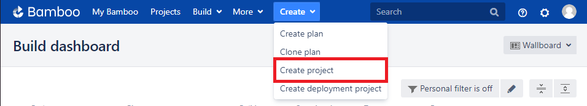
2. 프로젝트 명 입력 후 생성   
프로젝트 명을 입력 후, 생성해보겠습니다. (Test로 진행하였습니다)

3. 프로젝트 생성 성공!
Test 프로젝트가 성공적으로 생성되었습니다!
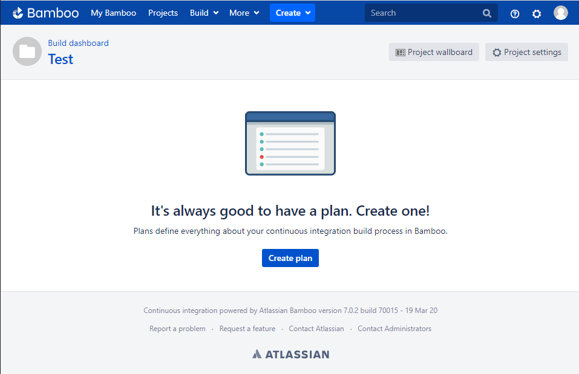

### Plan 만들기
작업 과정을 만들기 위해 다음으로 Plan을 만들어보겠습니다.
1. Plan 생성 하기
Plan은 Project와 동일한 방법으로 생성할 수 있습니다.
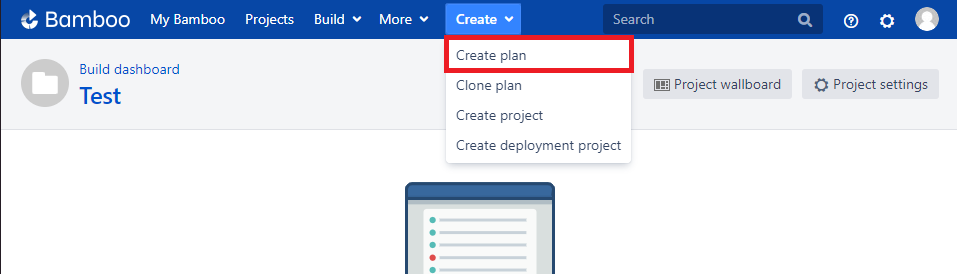
2. Plan 초기 설정
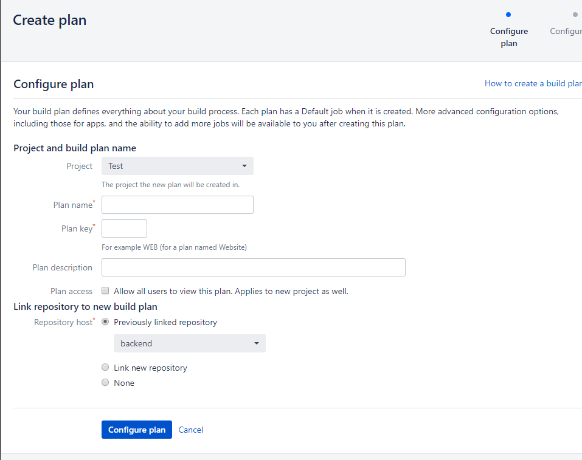
필요한 초기 설정 정보들을 입력합니다. 
- Project and build plan name   
    - Plan name : Plan 이름 설정
    - Plan Key : Plan Key 설정 (자동으로 입력됩니다.)
    - Plan Description : Plan 설명 가이드 입력
- Link repository to new build plan
    - 저장소 링크하기   

2-1. 저장소 링크 방법
Github에서 사용 중인 저장소를 Bamboo의 Plan과 링크해보겠습니다. 
- Link new repository 설정
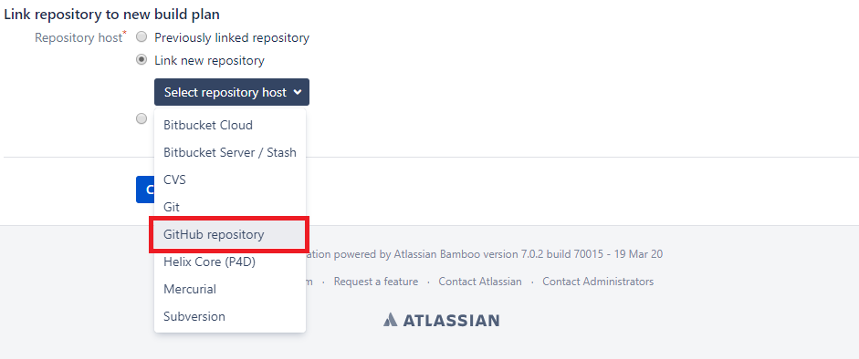
- Github 저장소 찾기
Github와 연결을 위해 계정과 패스워드 및 저장소 이름을 입력해주세요
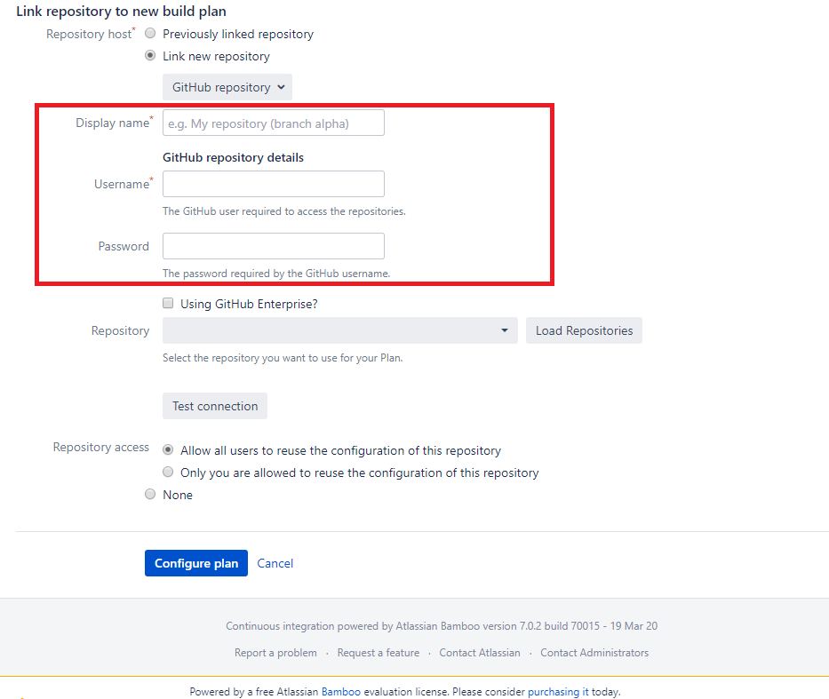
계정 입력 후, Load Repositories 버튼을 클릭하면 계정에 사용 중인 저장소 리스트를 가지고 올 수 있습니다.
- Github 저장소 입력 후 저장
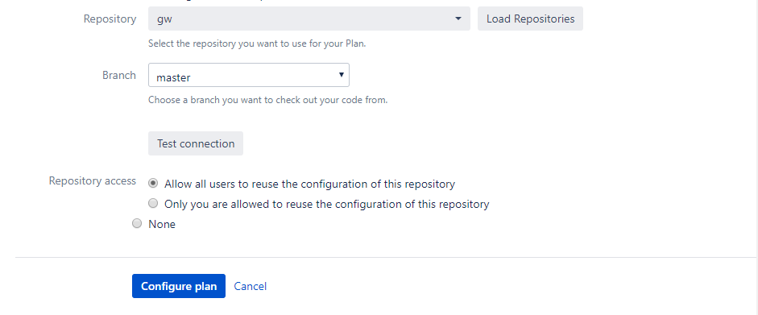   
저장소 설정 후, 저장 해주세요.

### Job 설정
Job은 Agent Environment 또는 Docker Container 환경에서 설정할 수 있습니다.
|이름|내용|비고|
|------|---|---|
|Agent Environment|Bamboo 실행 Host 환경||
|Docker Container|Bamboo 서버의 Docker Container 환경||   
이 환경 중에서 Agent Environment 환경을 사용해보겠습니다.   
1. Task 생성
Add Task 버튼을 클릭하여 원하는 작업을 생성해보겠습니다. 
npm을 사용하여 빌드를 진행하는 과정을 만들어보겠습니다.
- npm 과정 생성
Bamboo Plan으로 npm task type을 사용할 수 있습니다. npm으로 검색하여 눌러보세요!
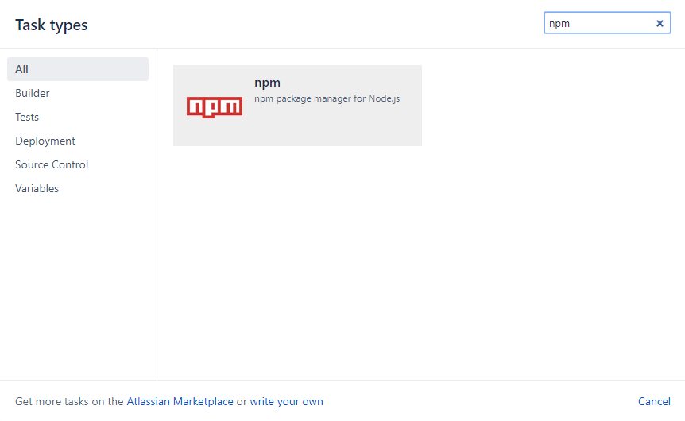   
- npm install
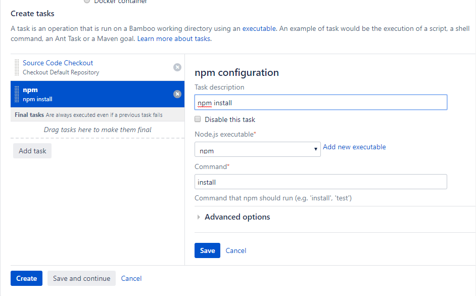   
- npm run build
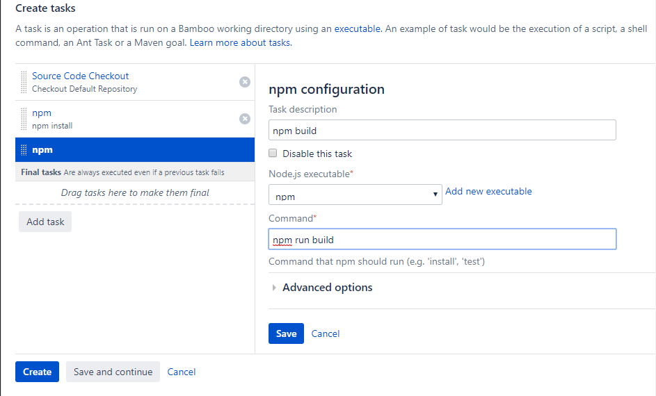   
- 작업 후, Save And Continue 버튼 클릭
Plan 초기 생성 작업이 완료되었습니다.

## Plan 돌려보기
Plan 설정이 완료되었으면, 설정한 작업대로 정상적으로 동작하는지 확인을 해봐야됩니다. 생성한 Plan은 enable이 되어있지 않은 상태이기 때문에 enable을 먼저 해주겠습니다.   
### Plan enable   
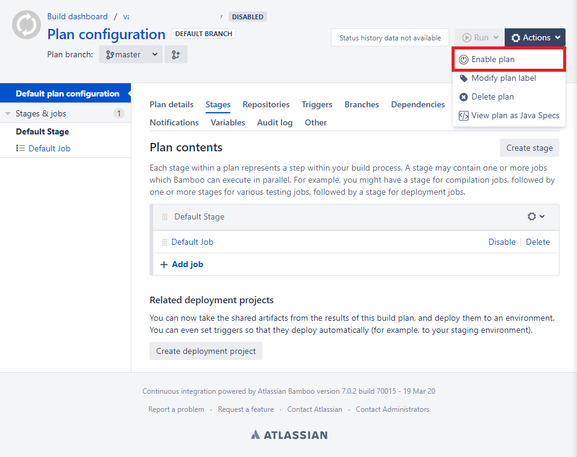   
enable을 클릭하면 Plan enable이 진행됩니다.

### Plan 동작하기 (Run)
이제 동작 (Run)할 준비가 모두 되었습니다. 이제 Run을 해보겠습니다.   
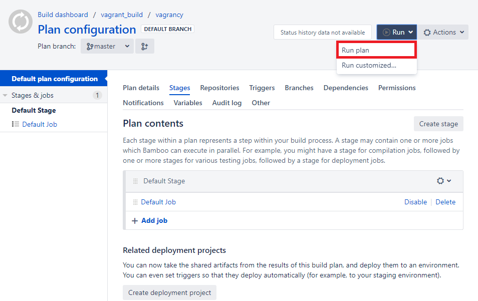 
Plan 시작
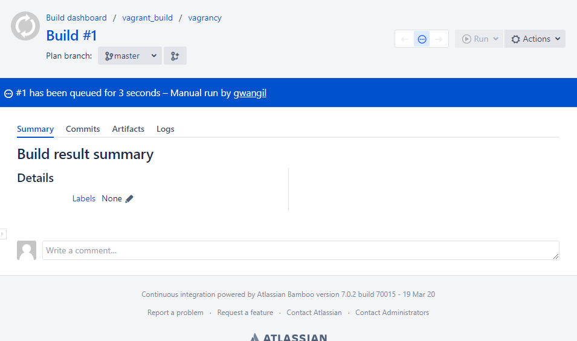 
Plan 성공 시
Plan 동작이 성공적으로 해냈습니다. 만약 실패했더라면 실패한 단계를 수정해주세요
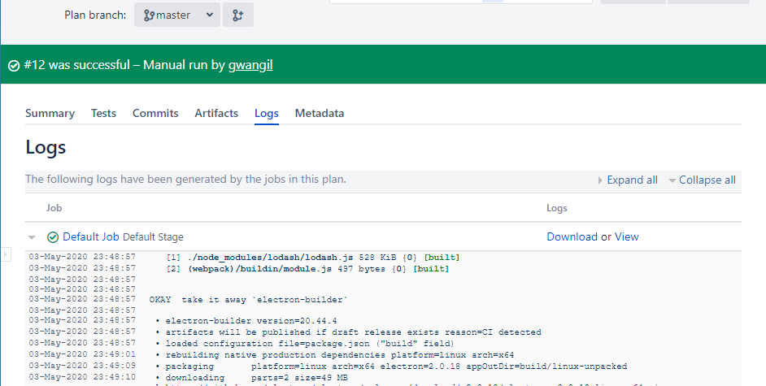 

