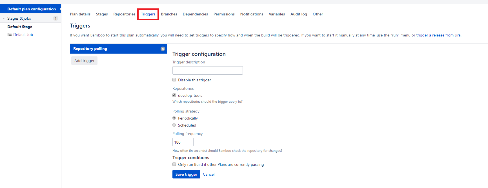
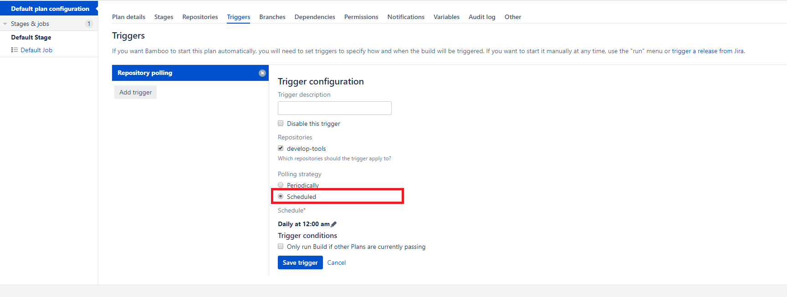
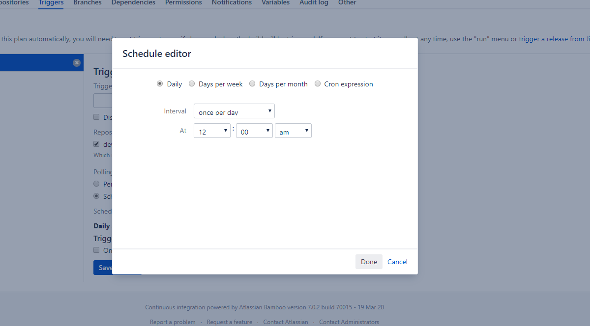
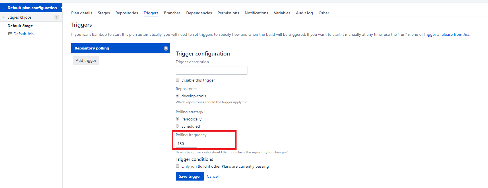

# Bamboo Plan Trigger 만들기
* * *

Bamboo의 Plan Trigger는 Plan의 동작을 시작하는 Trigger입니다. Trigger가 시작되는 조건은 설정한 시간마다 저장소의 수정 사항을 확인하며 수정된 사항이 있을 때 수정 사항된 사항을 가지고 와서 Plan 동작이 실행됩니다.      

## Trigger 설정하기
Plan의 Trigger는 디폴트로 3분 세팅되어 있습니다. 그래서 따로 설정하지 않으면 3분 주기로 변경 사항을 확인합니다.

### Trigger 수정
- 수정 페이지 들어가기   
Trigger은 여러개 만들어서 사용할 수 있습니다.

### 주기 설정하기
- 일주일에 한번 스케줄링하기   
Scheduled 라디오 버튼을 누르면 주 단위 한번 실행할 수 있습니다. 그 후 원하는 날짜 및 시간을 입력해주세요
    
    

- 시간 단위 스케줄링하기   
    