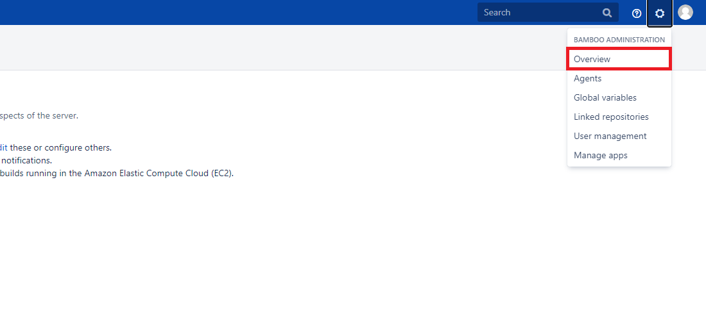
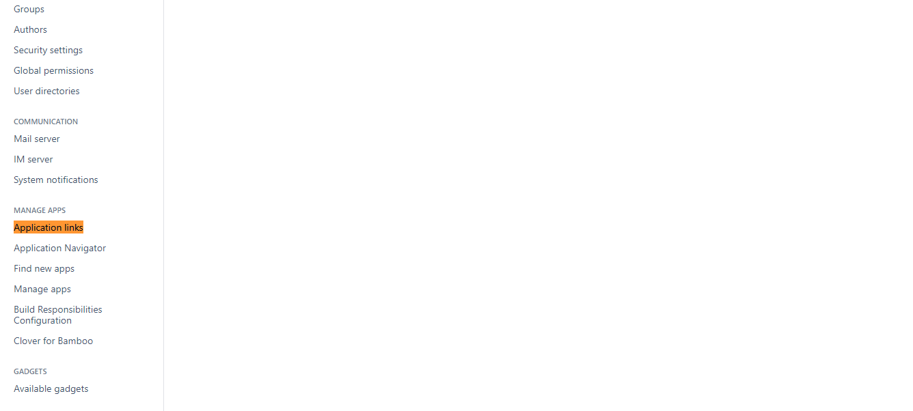
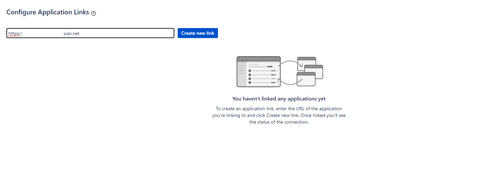
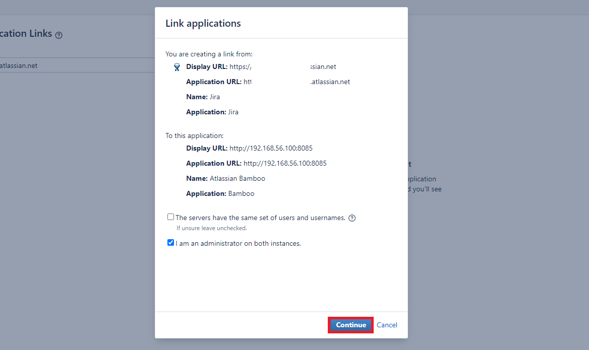
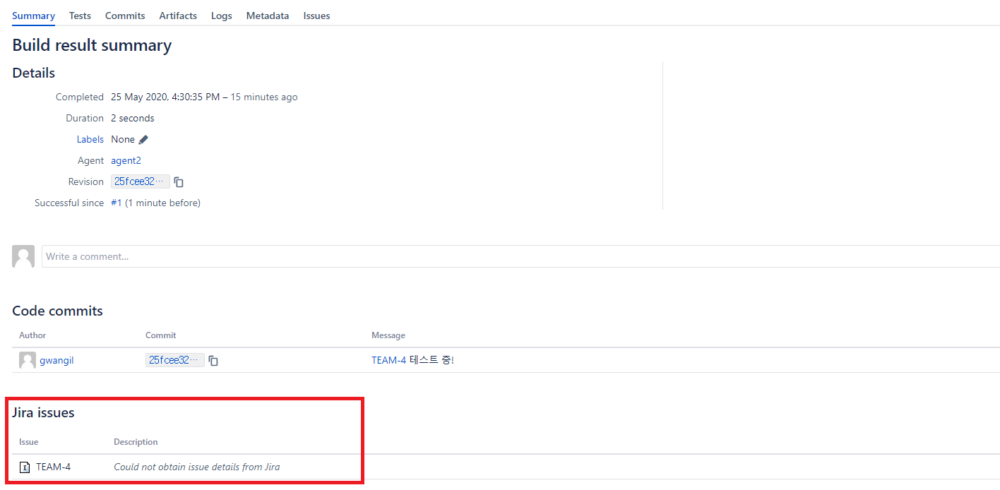
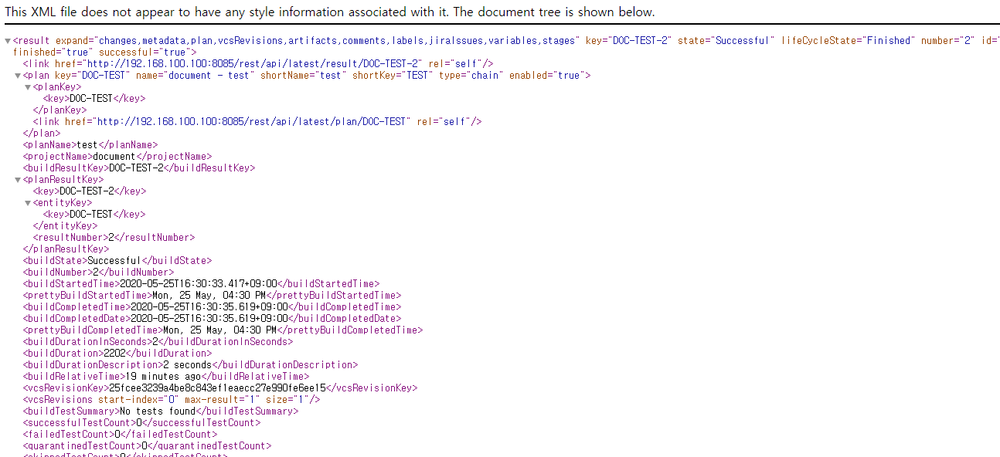

# Bamboo Plan 빌드 결과 가지고 오기
* * *

## **1. Getting Started**
Bamboo의 Plan에서 빌드를 마친 후, 빌드에 대한 정보를 가지고 와서 다른 곳에 필요로 하는 경우가 있을 수 있습니다. 데이터를 가지고 온 후, 파싱하는 방법까지 알아보겠습니다.   

## **2. Jira, Bamboo 연동 방법**
- Bamboo에서 설정 페이지로 이동

- 좌측의 Application Links 페이지로 이동합니다.

- 사용 중인 Atlassian 링크를 입력해줍니다.

- 연동 정보를 확인 후, 이상 없으면 Continue 버튼을 눌러주세요.


## **3. 사용 방법**
- 저장소에서 Jira의 Issue Key를 커밋을 해봅니다.
    ``` bash
    git commit -m "TEST-4 테스트 중!"
    ```
- Bamboo에서 빌드 시, TEST-4라는 지라 링크를 인식하여 저장하는 지 확인해주세요. 아래 빨간 박스와 같이 인식하면 성공입니다.

- 이제 Build 결과를 가지고 오겠습니다. 결과는 특정 URL을 통해 결과를 XML 포맷으로 가지고 올 수 있습니다.
    ``` bash
    ## URL 예시
    ## http://서버주소/rest/api/latest/result/Bamboo빌드 키?expand=jiraIssues
    http://192.168.100.100:8085/rest/api/latest/result/DOC-TEST-2?expand=jiraIssues
    ```
    

- Jira 관련 이슈 키를 가지고 오기 위해서는 jiraIssues 라는 것을 사용해야 합니다. 아래와 같이 이슈 키 리스트를 확인할 수 있습니다.
    ``` xml
    <jiraIssues start-index="0" max-result="1" size="1">
        <issue key="TEAM-4"/>
    </jiraIssues>
    ```

- URL에 접속 후, XML 파싱 후 이슈 리스트를 가지고 오는 코드를 짜보겠습니다.
<script src="https://gist.github.com/gwangildev/b64fd4c80833d477d18590e0cfa73e8c.js"></script>