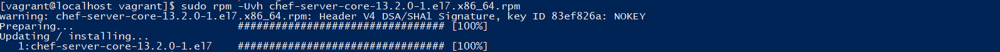
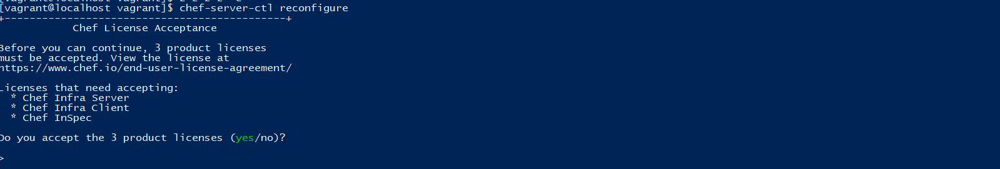
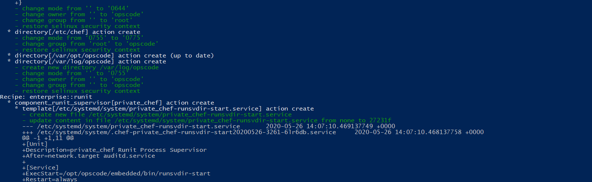
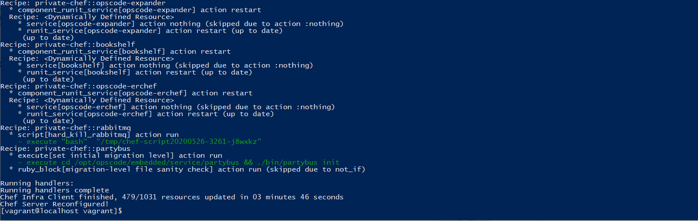
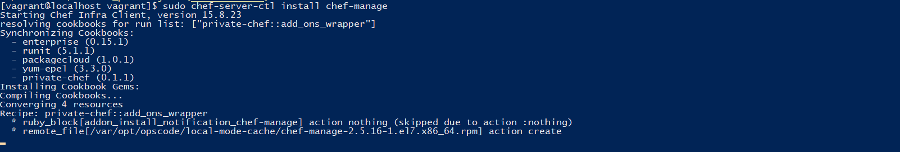
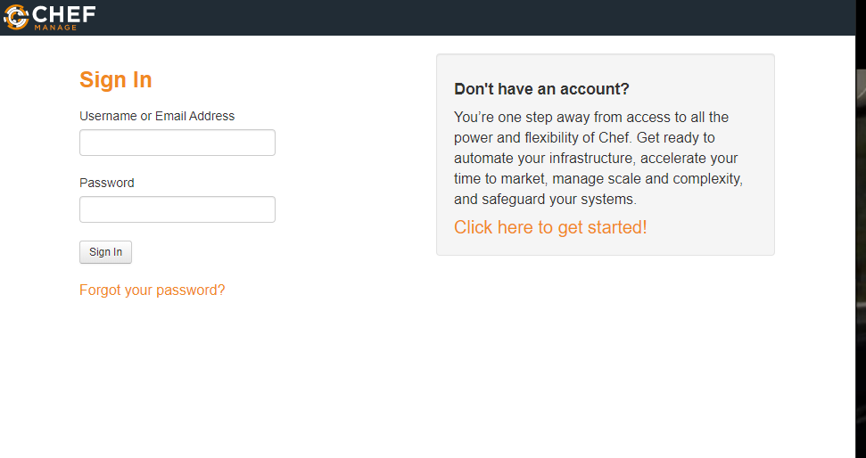
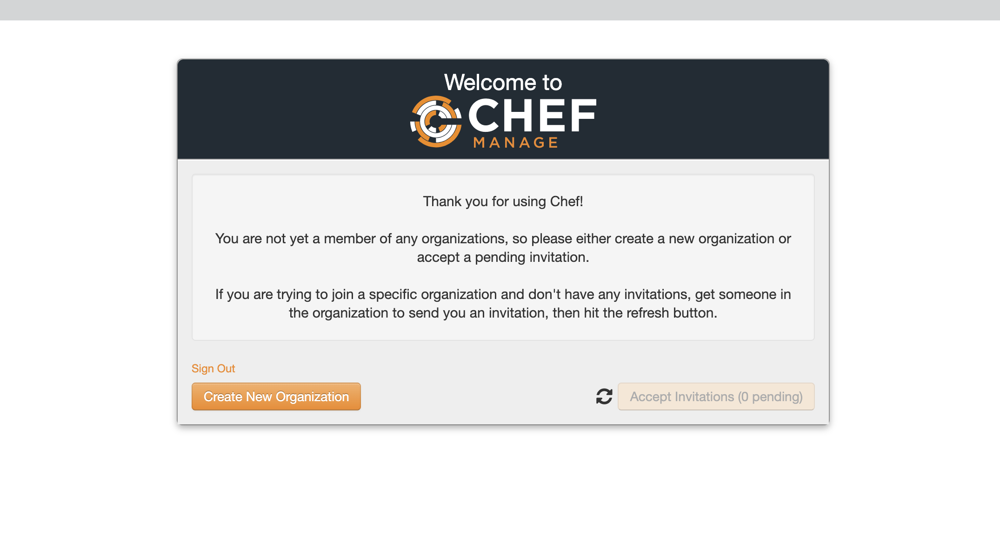
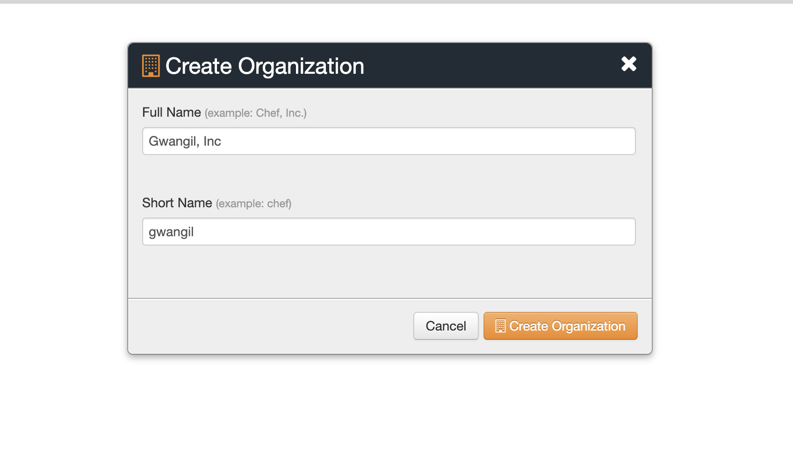

# Chef 서버 설치하기
* * *
## **1. Getting Started**
Chef 서버 환경을 구성하는 방법에 대해 알아보겠습니다.    


## **2. 설치 및 설정 방법**
#### 2-1. Chef 서버 설치 방법 (CentOS 7 기준)
- Chef Vagrantfile
    ``` ruby
    # -*- mode: ruby -*-
    # vi: set ft=ruby :

    # All Vagrant configuration is done below. The "2" in Vagrant.configure
    # configures the configuration version (we support older styles for
    # backwards compatibility). Please don't change it unless you know what
    # you're doing.
    Vagrant.configure("2") do |config|
    config.vm.box = "centos/7"
    config.vm.network "private_network", ip: "192.168.33.10"
    config.vm.provider "virtualbox" do |vb|
        vb.memory = "2048"
        vb.cpus = 2
    end
    
    config.vm.provision "shell", inline: <<-SHELL
        sudo yum update -y
        cnt=` sudo rpm -qa | grep chef-server`

        if [[ $cnt == 0 ]]; then
            sudo rpm -Uvh https://packages.chef.io/repos/yum/stable/el/7/x86_64/chef-server-core-13.2.0-1.el7.x86_64.rpm
        fi
        sudo chef-server-ctl user-create USER_NAME FIRST_NAME LAST_NAME EMAIL 'PASSWORD'
        echo "yes" | sudo chef-server-ctl reconfigure
        sudo chef-server-ctl install chef-manage
        sudo chef-manage-ctl reconfigure --accept-license
    SHELL
    end
    ```

- Chef 서버 다운로드
    - Chef 서버 설치 패키지를 다운받아주세요.
        ``` bash
        링크 : https://downloads.chef.io/chef-server/
        ```
    - 설치하기
        ``` bash
        sudo rpm -Uvh chef-server-core-13.2.0-1.el7.x86_64.rpm
        ```
        

- 설치 후, 서버 환경 세팅 명령 실행
    - 명령어
        ``` bash
        sudo chef-server-ctl reconfigure
        ```
    - 라이선스 선택 (Yes)
        
    - 설치가 진행된다.
        
    - 설치 완료!
        

#### 2-2. 초기 설정 방법
- Chef Manage 설치하기   
Chef Manage는 웹 GUI 기반 관리 도구이다.   
    - 설치 명령어
        ``` bash
        chef-server-ctl install chef-manage
        ```
                

- Chef 관리자 계정 생성
    ``` bash
    ## 예시
    chef-server-ctl user-create USER_NAME FIRST_NAME LAST_NAME EMAIL 'PASSWORD'
    ```
- Chef 그룹 생성
    ``` bash
    ## 예시
    chef-server-ctl org-create short_name '그룹 명'
    ```

- 초기 설정하기
    ``` bash
    sudo chef-server-ctl reconfigure
    sudo chef-manage-ctl reconfigure
    ```

- 웹 브라우저로 서버 접속 시, Chef Server로 접속 가능하다!
    - URL
        ``` bash
        https://192.168.33.20:443
        ```
                


#### 2-3. 웹 로그인 해보기
- 접속 방법
    - URL
        ``` bash
        https://192.168.33.20:443
        ```
           
    - 추가한 Admin 계정으로 로그인
    - 계정 로그인 시, Organization을 생성하라는 메시지가 나옴
       
    - Create New Organization 버튼 클릭 후, 원하는 이름을 넣어준다.
       
    - 생성 후, 정상 로그인이 된다.
       