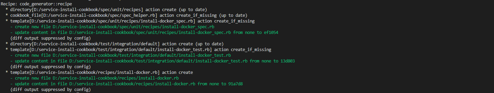

# Chef 프로젝트 시작하기
* * *
## **1. Getting Started**
Chef Cookbook을 만들어서 초기 시스템을 세팅하는 과정을 만들어보겠습니다.


## **2. 과정**
- 프로젝트 생성 명령어
    ``` bash
    chef generate cookbook <프로젝트 명>
    ```

- 레시피 만들기
    - 레시피 생성 명령
        ``` bash
        # chef generate recipe <레시피 명>
        chef generate recipe install-docker
        ```
           
    - 레시피 내용 추가   
    레시피 내용은 Docker를 설치하는 과정을 추가할 것입니다. 따라해보세요!
    

