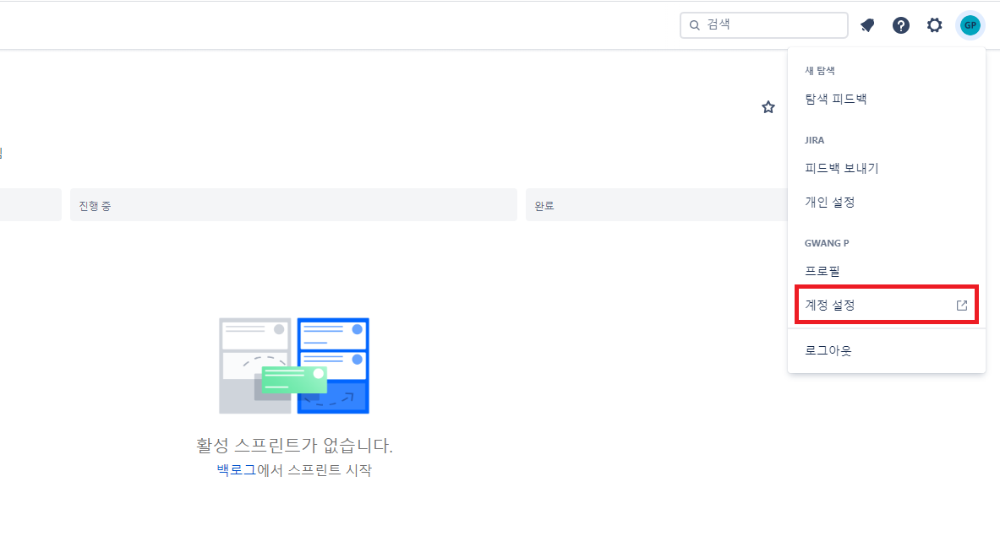
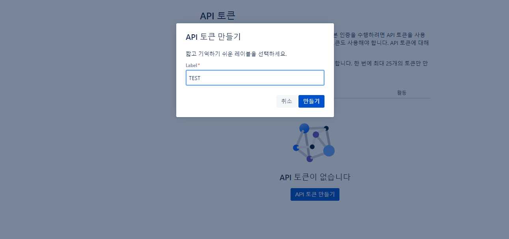
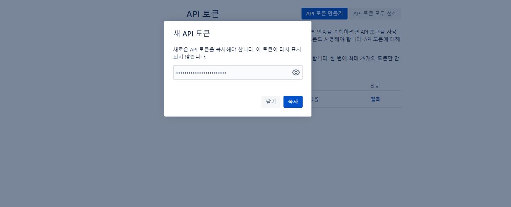
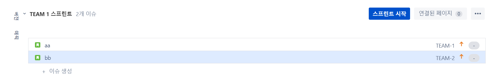
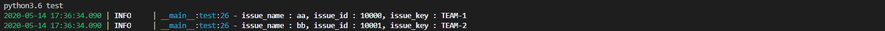

# JIRA API 토큰 발급
* * *
## **Getting Started**
JIRA에서 제공하는 API를 사용하기 위해서는 API 토큰을 먼저 발급받아야 합니다. 발급하는 과정과 발급한 API 토큰을 사용하여 테스트하는 방법에 대해 알아봅시다.

## **JIRA API 발급 방법**
1. JIRA API 토큰 발급을 위해, 프로필 페이지로 이동합니다.

2. 좌측의 보안 카테고리로 이동 후, API 토큰 생성 및 관리 링크로 이동해주세요.

3. API 토큰 라벨을 입력해줍니다.

4. API 발급이 되었습니다!
   
   
API 키는 발급 후, 다시 확인할 수 없으므로 따로 보관하도록 카피해주세요.

## **JIRA API 테스트**    
앞서 발급한 API 토큰을 사용하여, JIRA API 연동을 해보겠습니다. 테스트 코드는 스프린트의 지라 이슈 리스트들을 가지고 오는 코드입니다.   

0. 테스트를 위해 스프린트에 이슈들을 만들었습니다.   
    - Board ID: 1   
    - Sprint ID: 1   
    - 이슈 리스트
   
1. 테스트 코드 작성   
테스트 코드는 파이썬으로 작성하였습니다. Atlassian ID, 토큰, 보드 ID, Sprint ID는 사용하는 환경에 맞게 입력합니다.

    ```python
    # -*- coding:utf-8 -*-

    import optparse
    import requests
    from requests.auth import HTTPBasicAuth
    import json
    import sys

    auth = HTTPBasicAuth("<Atlassian Login ID>", "<API 토큰>")
    headers = {
        "Accept": "application/json",
        "Content-Type": "application/json",
        "charset":"utf8"
    }

    def test():
        response = requests.get("https://<Atlassian 주소>/rest/agile/1.0/board/{}/sprint/{}/issue".format(<보드 ID>, <Sprint ID>),
                                headers=headers, 
                                auth=auth)
            
        test = json.loads(response.text)
        for t in test["issues"]:
            issue_name = t["fields"]["summary"]
            print("issue_name : {}, issue_id : {}, issue_key : {}".format(issue_name, t["id"], t["key"]))
        
    def main():
        test()

    main()
    ```

1. 테스트 코드 실행
    - 명령어 실행   
        ``` bash
            python3.6 test
        ```
    - 성공   
           