# JIRA Github 연동하기
* * *
## **Getting Started**
JIRA와 Github과 연동하여 사용할 수 있는 기능에 대해 정리

## **Github와 연동 방법**
1. Github의 MarketPlace에서 JIRA 관련 플러그인 설치
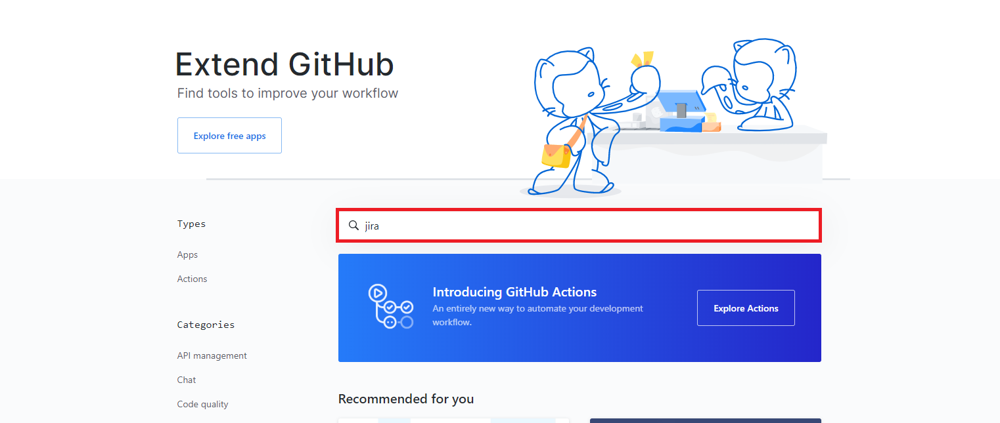
2. 설치할 것은 Jira Software + GitHub라는 앱이므로 해당 앱 클릭
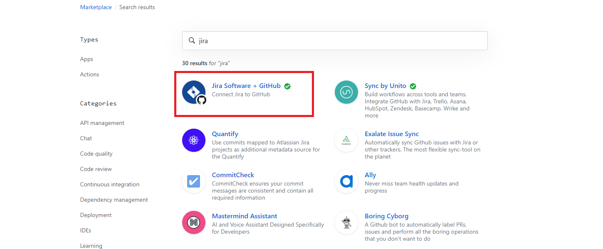
3. 아래로 내려가서 프로젝트를 선택한 후, 해당 프로젝트에 설치
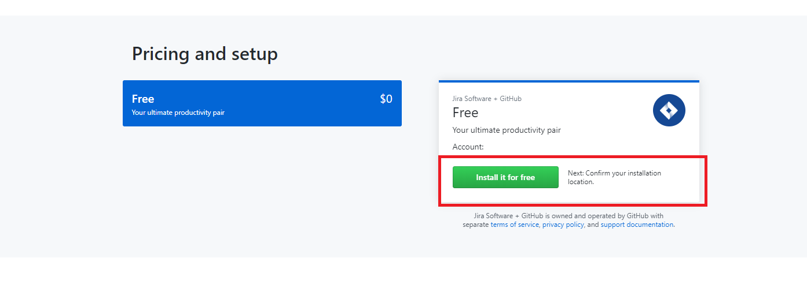
4. 최종 구매 버튼 클릭 (무료)
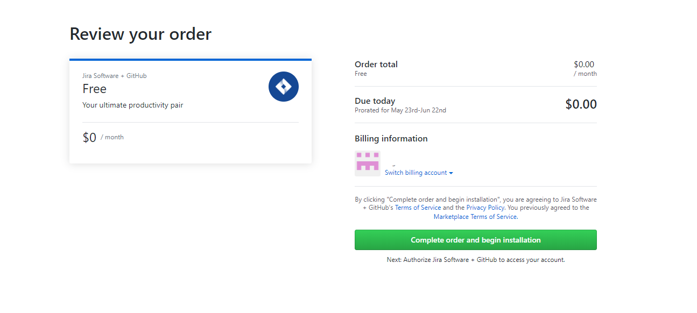
5. 연동할 저장소를 선택
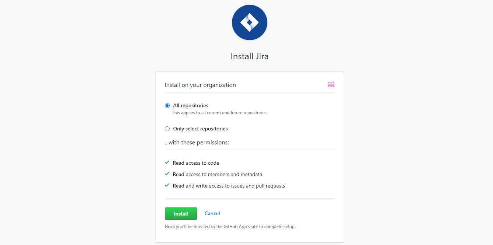
6. 위 과정이 끝나면, JIRA Github Plugin 설치 페이지로 리다이렉션된다. 플러그인을 설치하자

7. Get App 버튼을 눌러서 설치한다.
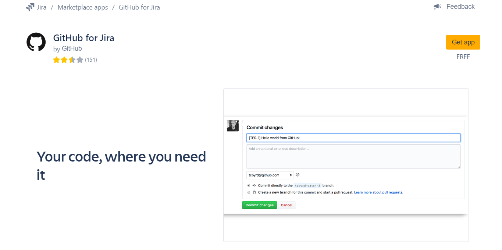
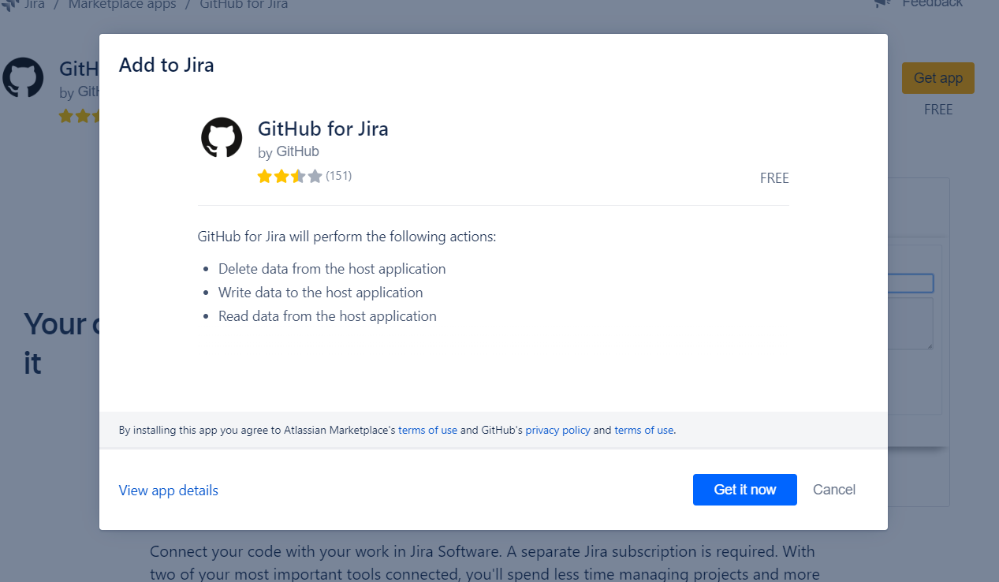
8. 오른쪽 상단에 성공 메시지가 뜨면 설치가 된 것이다. 추가로 Manage App 링크를 눌러서 들어가보자

9. 현재 JIRA에 설치되어있는 플러그인을 볼 수 있는 페이지이다. Github의 Get Started 버튼을 눌러 이동해보자
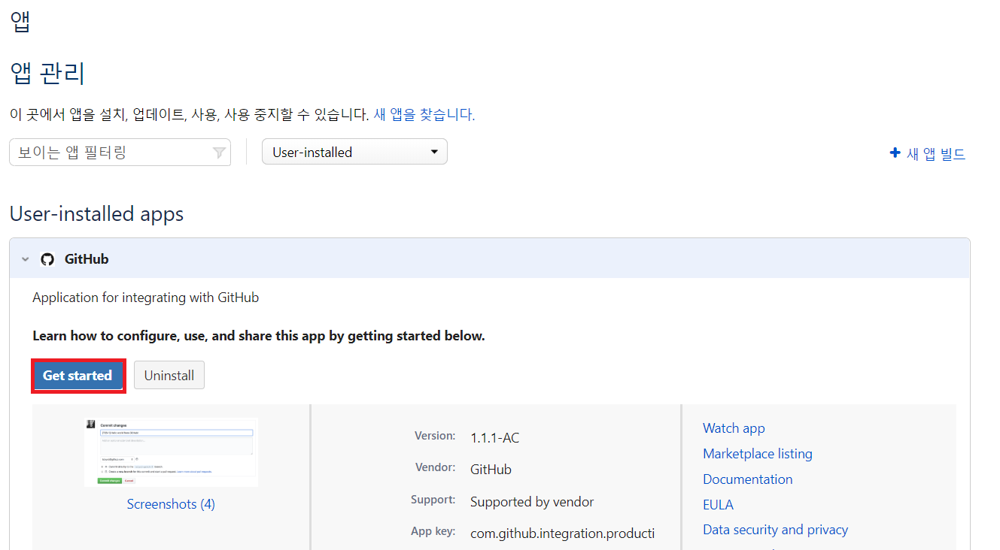
10. Github Organization과 연결한다
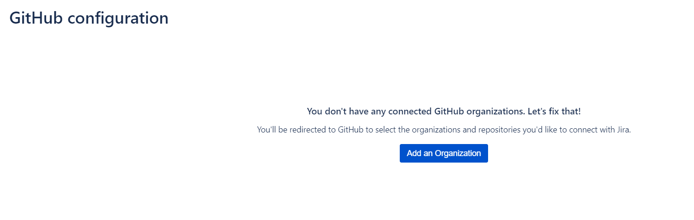
11. JIRA 플러그인을 Github와 연결할 수 있다.
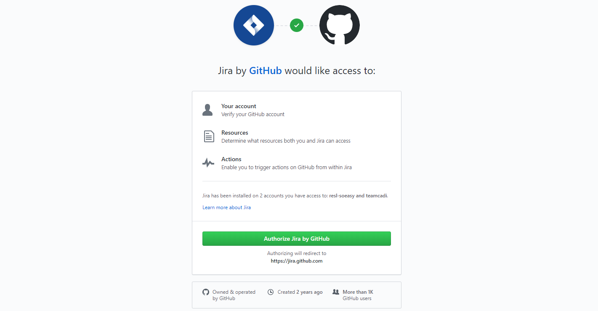

12. 설정을 모두 마쳤다!
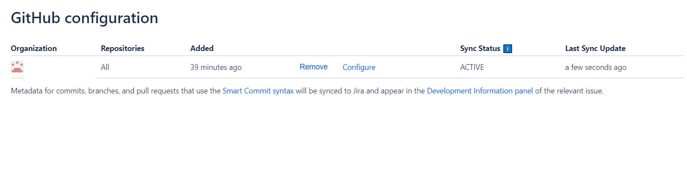

## **연동 기능 활용해보기**
1. 소스 커밋에 JIRA 이슈 번호 남기기
  - 커밋 예시
    ``` bash
    TEAM-4 테스트
    ```
2. JIRA 이슈에서 커밋 관련된 내용 확인하기
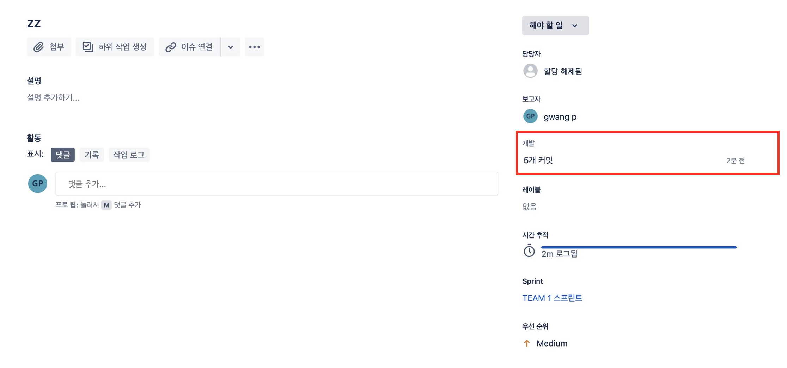

3. 아쉬운 점
  - Smart Commit 기능이 제대로 안된다.
    - 이 문제는 이슈로 문의를 해봐야될 것 같다.
  - Bitbucket의 연동 기능에 비해서는 기능이 약한 것 같다.