# 작업 로그 사용하기
* * *
## **Getting Started**
작업 로그 커스터마이징하는 방법에 대해 정리되어있습니다.

## **작업 로그**
작업 로그란 이슈의 담당자가 이슈에 대해 어떤 작업을 하는 것에 대한 로그이다. 담당자가 직접 몇 시간 혹은 몇 일동안 작업을 했는지 그리고 그 작업에 대해
상세하게 내용을 남길 수 있다.
### **설정 및 이용 방법**
1. 이슈 최초 예상 시간 설정하기
Jira 이슈의 항목에서 최초 예상을 클릭한다. (빨간 박스)
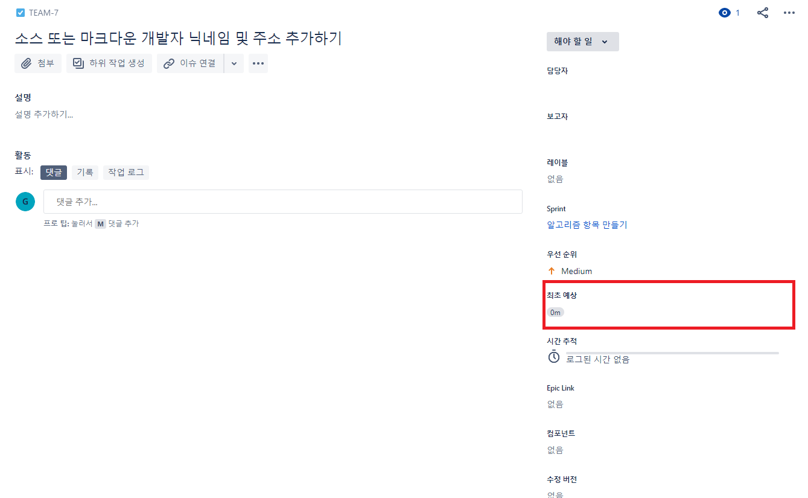
1-1. 담당자 혹은 보고자가 이슈 시작 전, 소요될 예상 시간을 입력한다. (3w, 3주 입력)
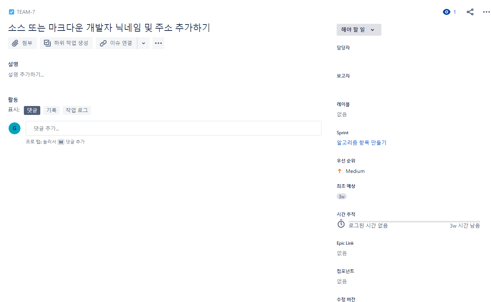
    - 최초 예상 시간을 입력하면, 시간 추적 항목에 3w 남아있다는 것을 확인할 수 있다.
    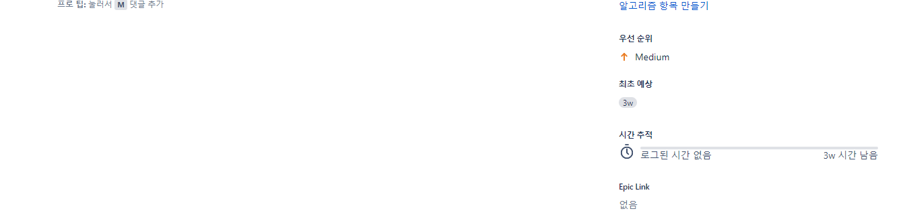
2. 작업 로그 이용하기
이슈의 담당자는 해당 이슈에 대해 작업이 이루어졌을 경우, 그 작업에 대해 기록을 남긴다. 기록을 남기는 방법은 다음과 같다.
2-1. 작업 로그 남기기
    - 시간 추적 클릭하기
    
    - 소요 시간 입력하기   
    최초 소요 예정 시간을 3주로 입력하였기 때문에, 그 시간을 기준으로 남은 시간이 계산된다.
    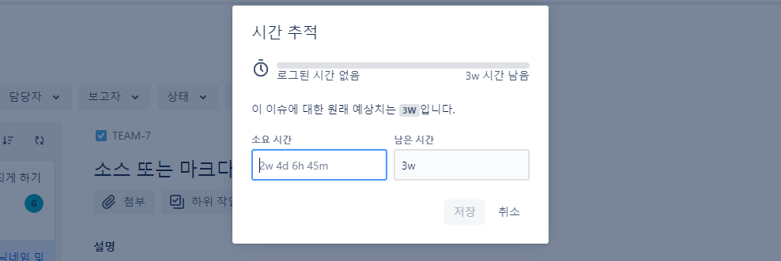
    - 작업 내용 입력 후, 저장하기
    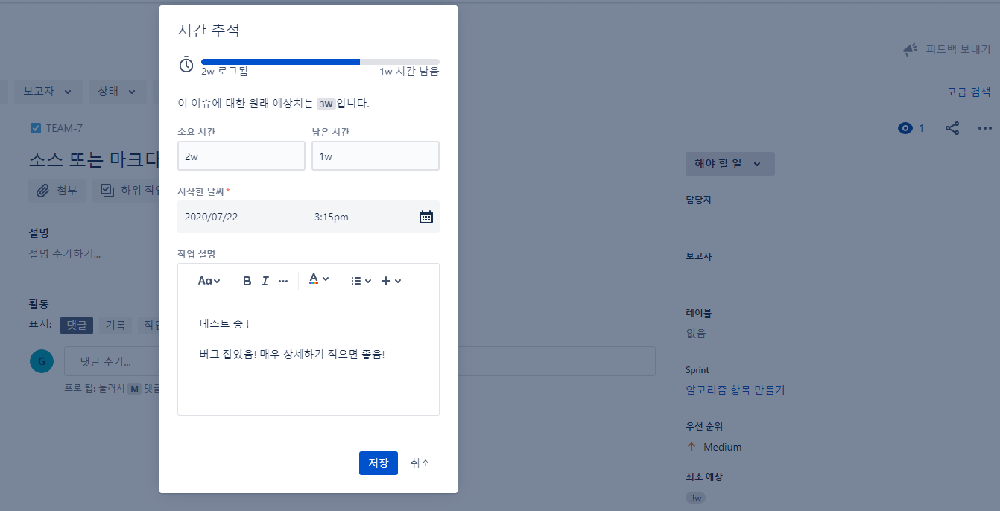
    - 저장 후, 이슈 내용이 업데이트된 것을 확인할 수 있다.
    
3. 작업 로그 내역 보기
    - 작업 로그 보기   
    작업 로그를 보기 위해 빨간 박스 버튼을 눌러본다.
    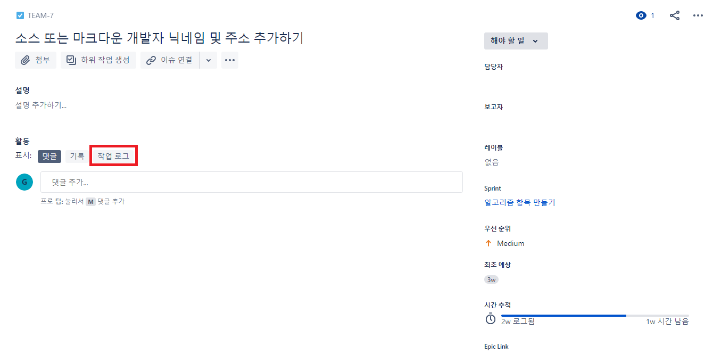
    - 로그 확인!   
    아까 남겼던 작업 로그를 확인할 수 있다.
    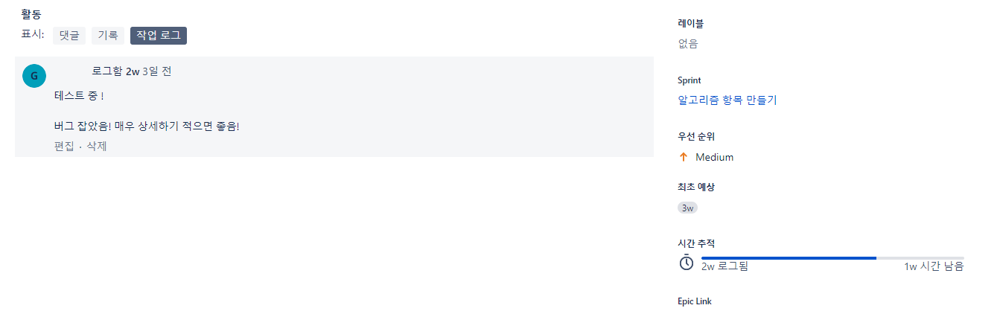

### **커스터마이징 하기**
다른 언어로는 어떠한지 모르겠는데, 우리나라 기준으로 Jira 기본 작업 시간이 8시간 (하루 업무 기준 인듯)으로 설정이 되어있다. 이 설정을 바꾸고자 한다면 아래와 같이 진행하면 됩니다.
- 우측 상단의 설정 버튼 (톱니바퀴) 클릭 후, 이슈 설정으로 이동
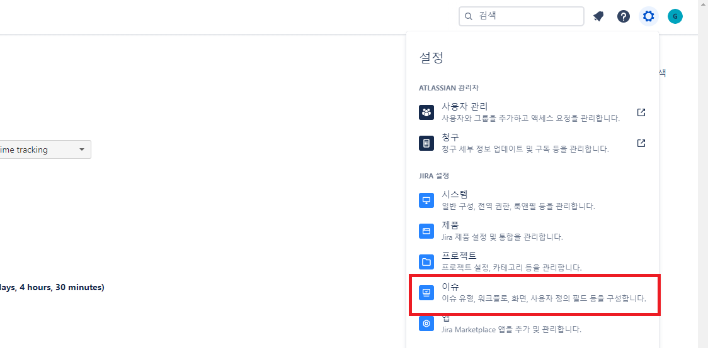
- 좌측 이슈 기능 항목의 시간 추적으로 이동
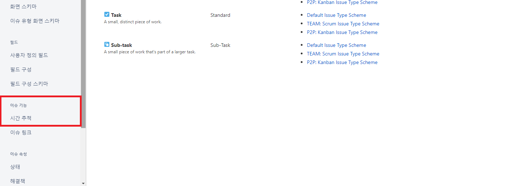
- 전역 설정 편집 클릭
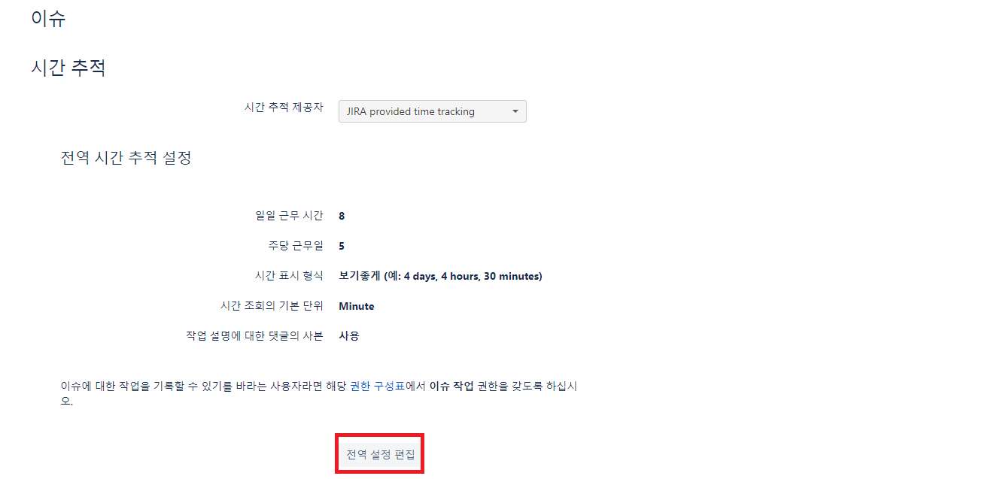
- 원하는 설정으로 수정하기 (일일 업무 시간을 23시간으로 설정해보았습니다.)
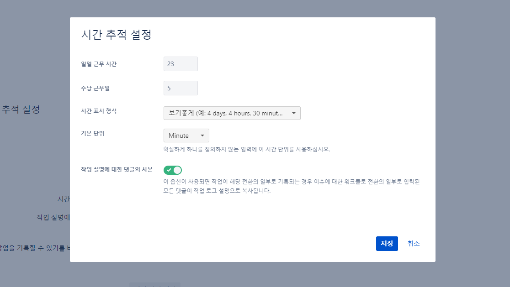
- 설정된 값에 따라 시간 추적 값이 변한 것을 확인할 수 있습니다.
    - 이전 값 (일일 업무 시간이 8시간 일 때)
        
    - 변경 값 (일일 업무 시간이 23시간 일 때)
        