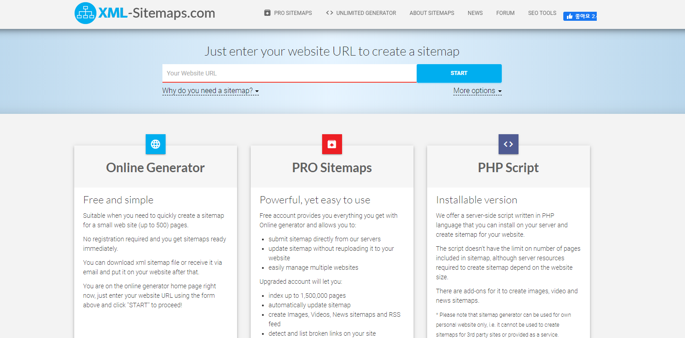
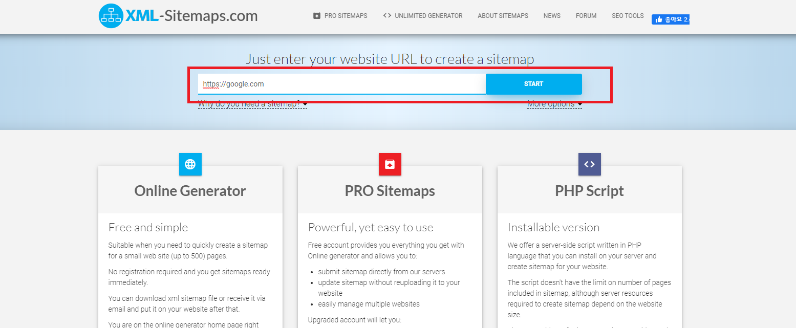
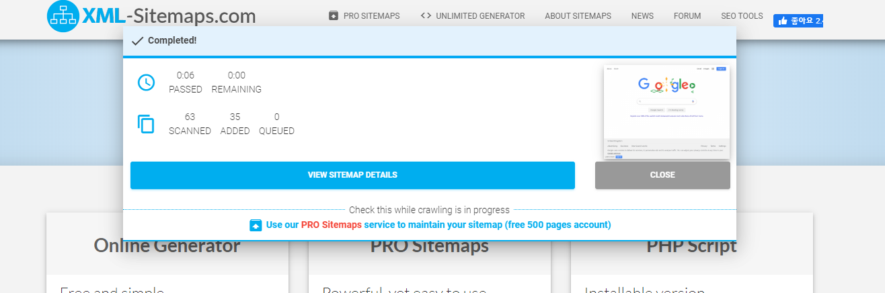
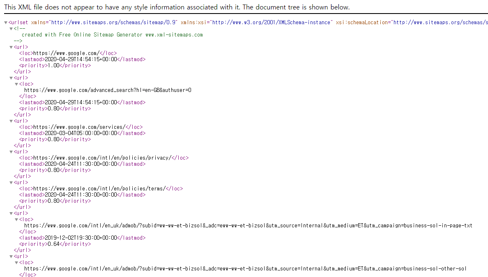

# Sitemap.xml 원리 및 사용 방법
> 포털 사이트 (네이버, 구글 등)에서 내 사이트를 어떻게 검색할 수 있을까?
## **Getting Started**
구글에서 내 사이트에 관련된 내용을 찾았을 때 구글에 리스트가 출력되는 원리와 Sitemap.xml를 만드는 방법에 대해 알아보겠습니다.

## **목차**
- [크롤링](#크롤링)
- [Sitemap.xml](#Sitemap.xml)
- [Sitemap.xml 만들어보기](#만들기)

## **크롤링**
구글과 같은 검색 사이트에서는 내 주소를 처음에 어떻게 알아서 검색하여 사용자에게 제공해줄까요? 검색 사이트에서는 데이터베이스에 등록된 사이트들을 크롤링하여 사이트에서 사용 중인 URL을 수집합니다. 대표적인 사이트 중의 하나인 Google을 예로 과정을 살펴보겠습니다.
> Google Search Console 등록 및 과정 (크롤러)

- 👯 웹 사이트 관리자
1. Sitemap.xml 파일 만들어서 도메인 상위에 넣기
2. 도메인을 Google Search Console에 등록하기 (Sitemap.xml 색인 생성)

- 🐱‍🏍 Google Search Console 크롤러
1. 도메인의 Sitemap.xml URL 탐색
2. Sitemap.xml에 등록되어 있는 URL 저장

Google에서 사이트가 검색되도록 하기 위해 Google Search Console에 먼저 등록을 해주어야 하며, Console에서 준비가 되었을 때 Google에서 검색이 됩니다. 다음은 Sitemap.xml 파일에 대해 알아보겠습니다.

## **Sitemap.xml**
Sitemap.xml은 사이트에 포함되어 있는 사이트들의 리스트를 보여주는 파일입니다. 내 도메인에 들어있는 사이트를 Google 혹은 Naver 사이트에게 제공해주는 역할을 합니다. 간단하게 한번 살펴보겠습니다. 아래는 Google의 상위 페이지 Sitemap.xml 내용입니다.   

- https://www.google.com/sitemap.xml
``` xml
<sitemapindex xmlns="http://www.google.com/schemas/sitemap/0.84">
<sitemap>
<loc>https://www.google.com/gmail/sitemap.xml</loc>
</sitemap>
<sitemap>
<loc>https://www.google.com/forms/sitemaps.xml</loc>
</sitemap>
<sitemap>
<loc>https://www.google.com/slides/sitemaps.xml</loc>
</sitemap>
...
```

내용을 잠깐 살펴보면, google.com에는 https://www.google.com/gmail, https://www.google.com/forms, https://www.google.com/slides 등의 URL에 포함되어 있다는 것을 알 수 있습니다. 검색 사이트에서는 xml 파일을 보고 아 여기에 어떤 페이지가 있다는 것을 알 수 있겠죠? 여기에 더 이어서 하위 sitemap.xml의 내용을 살펴보겠습니다.

- https://www.google.com/gmail/sitemap.xml
``` html
https://www.google.com/intl/am/gmail/about/ https://www.google.com/intl/am/gmail/about/for-work/ https://www.google.com/intl/am/gmail/about/policy/ https://www.google.com/intl/ar/gmail/about/ https://www.google.com/intl/ar/gmail/about/for-work/ https://www.google.com/intl/ar/gmail/about/policy/ https://www.google.com/intl/bg/gmail/about/
...
```
https://www.google.com/gmail 사이트맵에서 확인된 페이지를 확인 가능합니다. 이로써 검색 사이트에서는 페이지에서 사용 중인 Sitemap.xml을 통해 페이지를 크롤링하여 데이터를 저장합니다. 데이터가 저장되면 사용자는 페이지 검색 가능합니다.

## 만들기   
Sitemap.xml Generator을 사용하여 사이트맵을 직접 만들어보겠습니다. (💗 원하는 결과가 나오지 않을 수도 있음)

1. Sitemap.xml Generator 사이트 접속 (https://www.xml-sitemaps.com/)

2. https://google.com 입력 후, Start 버튼 클릭하기

3. 크롤링 정상 종료

4. 크롤링된 결과 확인 하기 (Sitemap.xml)


Sitemap Generator을 사용하여 Sitemap.xml 생성을 진행해보았습니다. 이렇게 간편하게 사용할 수 있습니다. 

## 참고 자료

* [Google SearchConsole](https://support.google.com/webmasters/answer/6062608?hl=ko&ref_topic=6061961)
