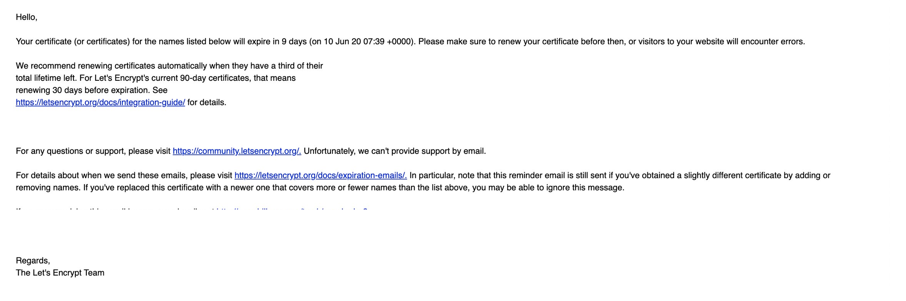
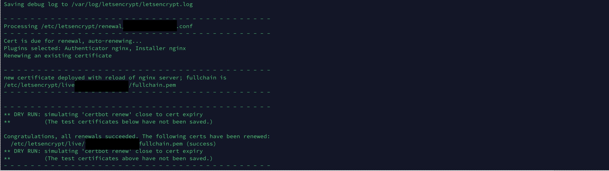
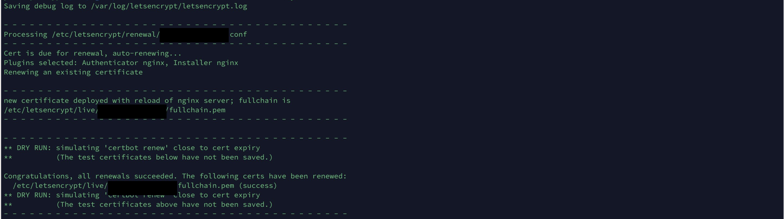
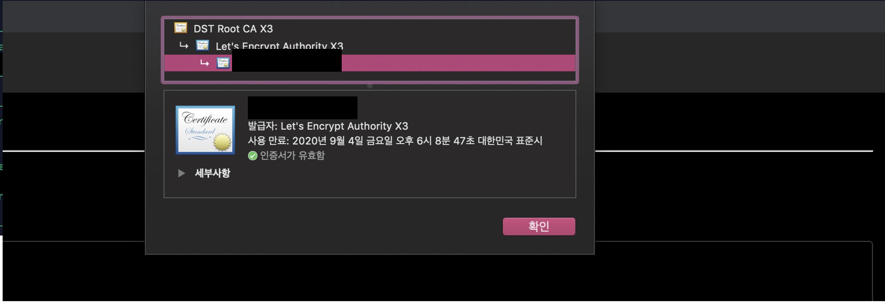

# Let's Encrypt 인증서 갱신하기
* * *
## **Getting Started**
Let's Encrypt를 이용하여 만든 인증서의 유효기간은 3개월입니다. 만료가 되기 전 인증서를 갱신하는 방법에 대해 알아보겠습니다. 

## **인증서 만료 전 알림**
인증서가 만료 되기 전 관리자에게 Let's Encrypt에서 알림 메일을 전송해줍니다. 전송되는 메일을 간단하게 살펴보면 6월 20일에 인증서가 만료되니 미리 갱신을 하라는 얘기이다. 자동으로 갱신하지 않고 수동으로 하려면 메일을 참고하여 갱신하면 된다.


## **인증서 갱신 방법**
- 인증서 갱신 테스트 (--dry-run 옵션)
    ``` bash
    sudo certbot renew --dry-run
    ```
    

- 인증서 갱신하기
    ``` bash
    sudo certbot renew
    ```
    

- 갱신 결과

