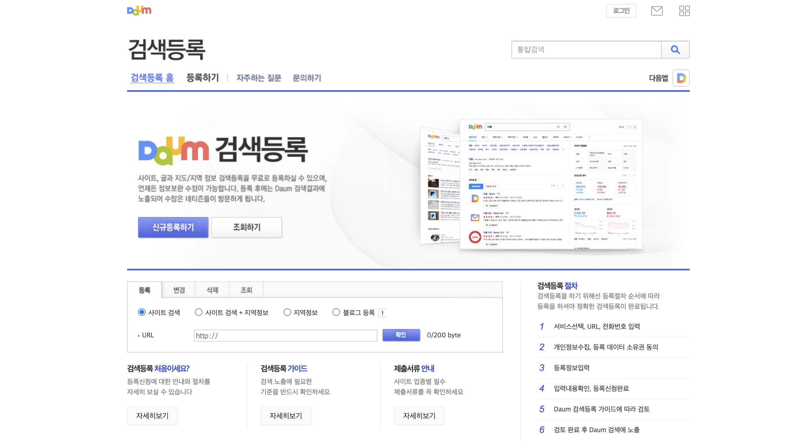
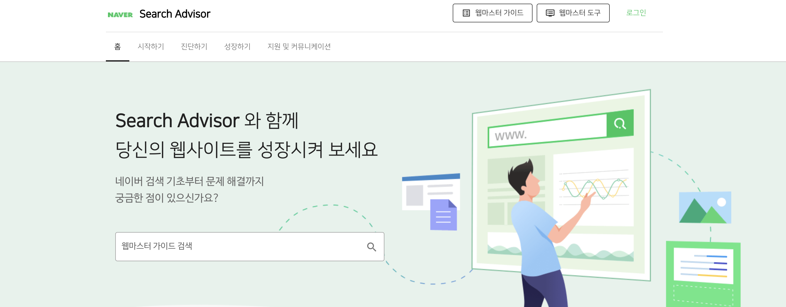
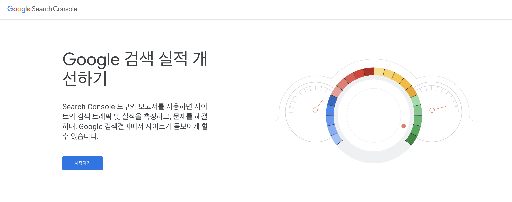
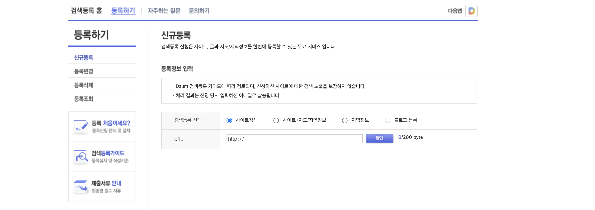
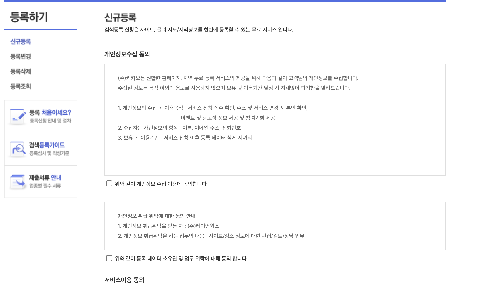
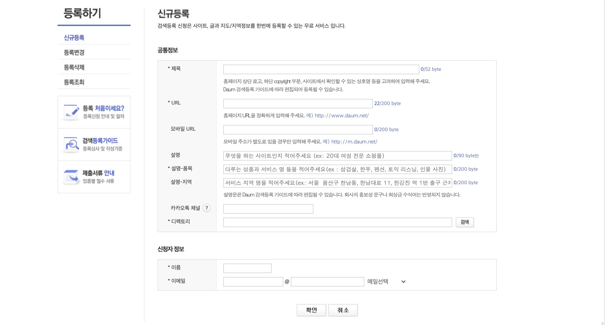
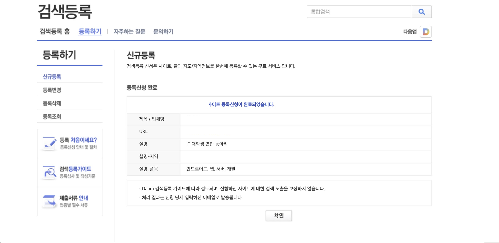
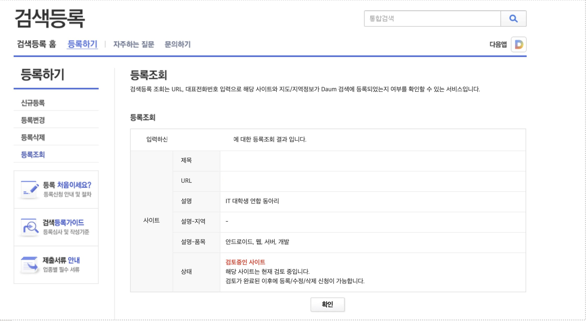

# 웹 포탈에서 사이트 검색되게 하기
* * *
## **Getting Started**
내가 만든 사이트가 네이버, 다음 및 구글에서 검색될 수 있도록 설정하는 방법에 대해 정리되어있습니다.   

## **알아야 할 것**

## **각 포탈의 검색 설정 방법**
각 포탈에서는 자사의 검색 도구에서 사이트가 검색될 수 있도록 도와주는 도구를 제공하고 있습니다. 설정 도구에서 정해진 양식에 맞게 설정 하여 내 사이트가 검색되도록 하는 것입니다. 
- 각 포탈의 도구들
    - 다음 : [다음 검색 도구](https://register.search.daum.net/index.daum)
    
    - 네이버 : [네이버 서치어드바이저](https://searchadvisor.naver.com/)
    
    - 구글 : [구글 서치 콘솔](https://search.google.com/search-console/about)
    

- 포탈 설정 방법
    - 다음
        - 다음 검색 등록 페이지에서 내 도메인을 입력해주자 (사이트의 특성에 맞게 설정)
        
        - 서비스에 대한 정보 이용 확인 버튼이다 서비스를 이용할 것이기 떄문에 모두 허용하자
        
        - 내 도메인에 대한 정보를 입력해주자
        
        - 등록 결과
            - 등록은 했는데 다음은 담당자가 검토 후 결과를 알려주는 방식인 것 같다.
            
        - 등록 상태 확인
            - 좌측에 등록 조회를 누르면 등록 심사 중인 상태를 확인할 수 있다. 등록 심사에 얼마나 걸리는지는 정확히 모르겠다.
            
    - 네이버

