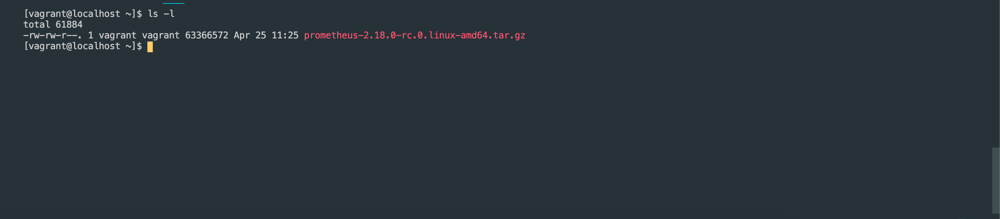
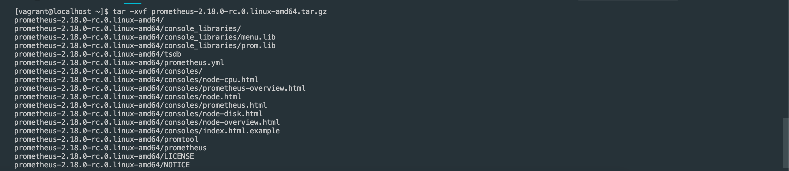
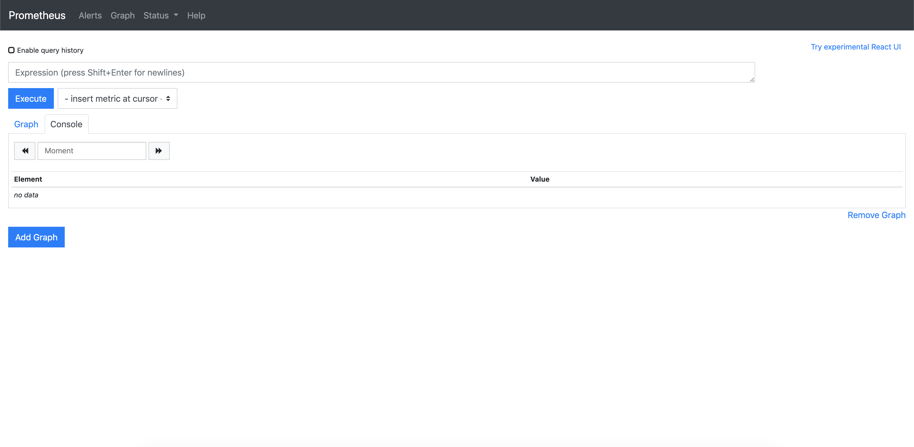

프로메테우스 설치하기
   
* * *      

### 1. 환경
- OS : CentOS 7

### 2. 설치 방법
- Prometheus 다운로드 (https://prometheus.io/download/)
환경에 맞는 파일을 다운로드 받습니다. 리눅스에 환경을 구성할 것이기 때문에, Linux 버전을 다운로드 했습니다.
``` bash
wget https://github.com/prometheus/prometheus/releases/download/v2.18.0-rc.0/prometheus-2.18.0-rc.0.linux-amd64.tar.gz
```

- 파일 압축 해제
``` bash
tar -xvf prometheus-2.18.0-rc.0.linux-amd64.tar.gz
```

- 압축 해제된 폴더로 이동 후, 프로그램 실행
``` bash
cd prometheus-2.18.0-rc.0.linux-amd64
./prometheus
```
서비스가 실행되었습니다.

### 3. 웹 접속하기
Prometheus 웹 서버를 사용하여 여러 기능들을 사용할 수 있습니다. Prometheus가 기본 사용하는 포트는 9090 포트입니다.
- http://<IP>:9090
