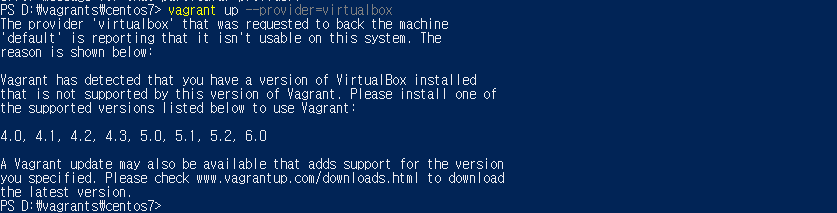
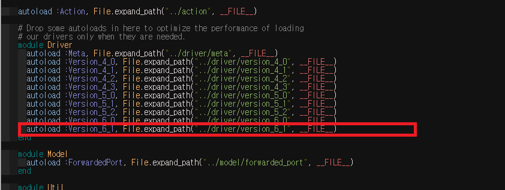
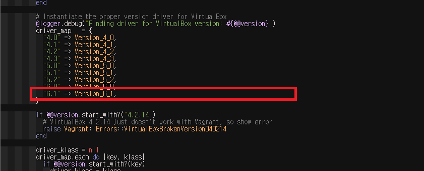
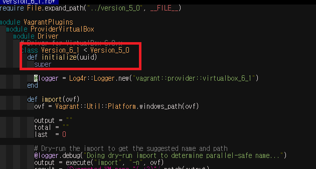
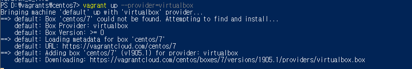

# vagrant virtualbox 6.1 호환 문제 수정하기
   
* * *      

virtualbox 6.1과 vagrant 최신 버전 기준 (v2.2.6, 2019-1024)으로 사용할 때, vagrant를 정상적으로 실행할 수 없습니다. 아래는 에러 메시지 인데 virtualbox 6.1 버전을 아직 지원하지 않는 것으로 보입니다.



Github Vagrant 관련 이슈를 검색해보니, 나말고 다른 사람도 이런 문제를 겪어서 올린 것 같습니다. 이슈 내용을 참고하여 정리해보겠습니다. 

- 이슈 링크 : https://github.com/oracle/vagrant-boxes/issues/178

수정 방법은 Vagrant의 설정 파일을 수정하는 것입니다. Virtualbox의 버전이 특정 설정 파일에 명시 되어있는데 해당 파일에 virtualbox 6.1 버전에 대한 내용을 추가하여 수정해보겠습니다.

### 1. Vagrant Virtualbox 플러그인 설정에서 6.1 버전 추가하기 (윈도우 기준)
- 첫번째 설정 파일
   - 경로      
   ``` bash
   d:\Vagrant\embedded\gems\2.2.6\gems\vagrant-2.2.6\plugins\providers\virtualbox\plugin.rb
   ```
   - Virtualbox 6.1 버전 항목 추가
   ``` bash
  autoload :Version_6_1, File.expand_path("../driver/version_6_1", __FILE__) 
   ```
  

- 두번째 설정 파일
  - 경로
  ``` bash
  d:\Vagrant\embedded\gems\2.2.6\gems\vagrant-2.2.6\plugins\providers\virtualbox\driver\meta.rb
  ```
  - Virtualbox 6.1 버전 항목 추가
  ``` bash
  "6.1" => Version_6_1,
  ```
  

### 2. Vagrant Virtualbox 6.1 메타 파일 복사 (윈도우 기준)
- 명령어 실행
``` bash
cp D:\Vagrant\embedded\gems\2.2.6\gems\vagrant-2.2.6\plugins\providers\virtualbox\driver\version_6_0.rb D:\Vagrant\embedded\gems\2.2.6\gems\vagrant-2.2.6\plugins\providers\virtualbox\driver\version_6_1.rb
```
- 복사한 파일을 열어서 내용 수정
``` bash
D:\Vagrant\embedded\gems\2.2.6\gems\vagrant-2.2.6\plugins\providers\virtualbox\driver\version_6_1.rb
```
- vim 기준 %s/6_0/6_1 실행하여 문자열 치환하기


### 3. Vagrant 실행해보기
``` bash
vagrant up --provider=virtualbox
```


성공!
