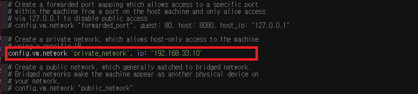
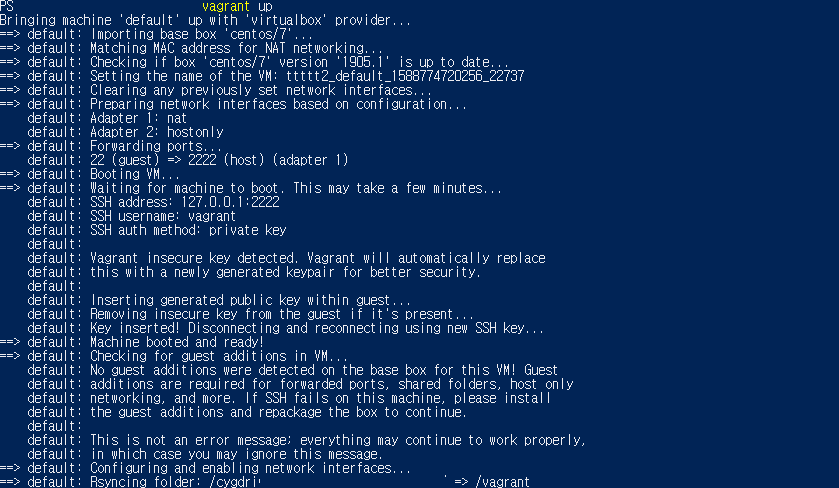
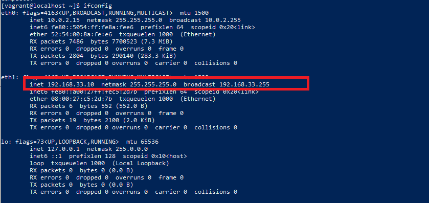
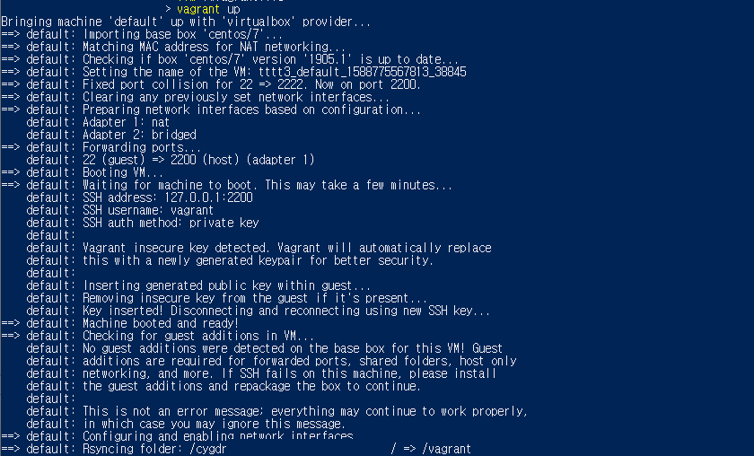
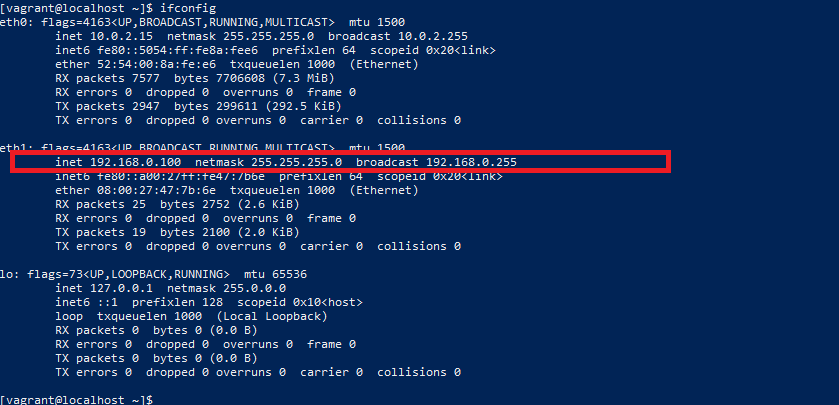

# vagrant IP 설정하기
   
* * *      

## 1. private network으로 IP 설정
- Vagrantfile 항목 추가 
  ``` ruby
  ### IP 192.168.33.10으로 할당
  config.vm.network "private_network", ip: "192.168.33.10"
  ```
  
- Vagrantfile 수정 후 저장
- Vagrant 실행
  ``` bash
  vagrant up
  ```
  
- 가상머신 ssh 접속
  ``` bash
  vagrant ssh
  ```
- 가상머신 IP 확인      
  

## 2. public network으로 IP 설정
- Vagrantfile 항목 추가 
  ``` ruby
  ### IP 192.168.0.100 으로 할당
    config.vm.network "public_network", ip: "192.168.0.100", netmask: "255.255.255.0", bridge: "Realtek PCIe GbE Family Controller" 
  ```
  
- Vagrantfile 수정 후 저장
- Vagrant 실행
  ``` bash
  vagrant up
  ```
  
- 가상머신 ssh 접속
  ``` bash
  vagrant ssh
  ```
- 가상머신 IP 확인      
  