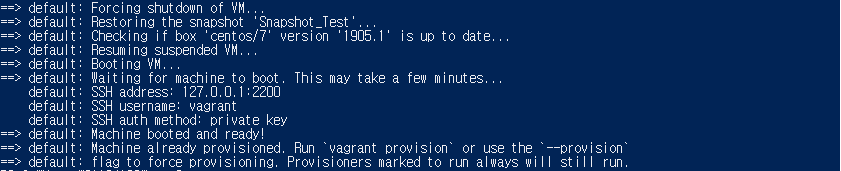

# Snapshot 만들기
   
* * *      

## 1. Snapshot 찍기
### 1-1. 현재 시간으로 Snapshot 찍기
- 명령어
    ``` bash
    vagrant snapshot push
    ```
    
### 1-2. Snapshot 이름 명명하여 찍기
- 명령어
    ``` bash
    # vagrant snapshot save '가상머신 ID' 'Snapshot 이름'
    vagrant snapshot save bf66842 'Snapshot_Test'
    ```
    

## 2. Snapshot List 확인
- 명령어
    ``` bash
    vagrant snapshot list
    ```
    

## 3. Snapshot 돌리기 (Restore)
- 명령어
    ``` bash
    vagrant snapshot restore <Snapshot ID>
    ```
    

