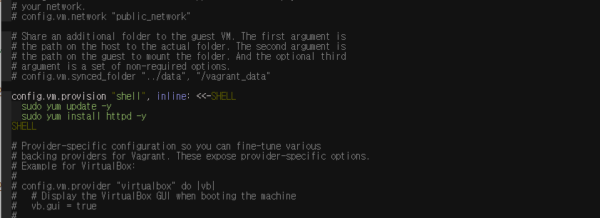
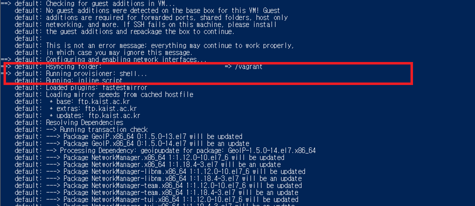

# Vagrantfile Shell Provision 추가
   
* * *      

## 1. Vagrantfile에 추가하기
- Vagrantfile
``` ruby
    config.vm.provision "shell", inline: <<-SHELL
        sudo yum update -y
        sudo yum install httpd -y
    SHELL        
```


## 2. Vagrant 재시작
``` bash
vagrant reload --provision
```
