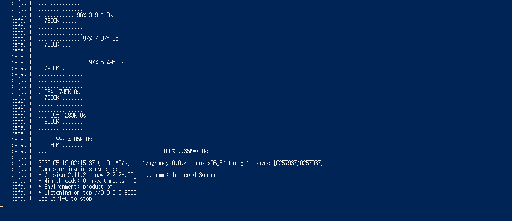
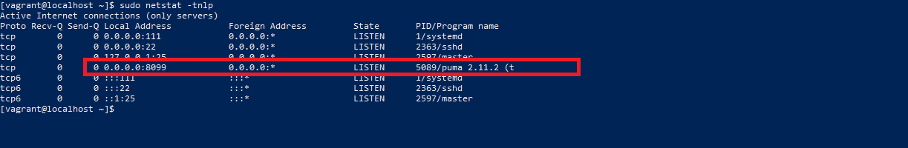
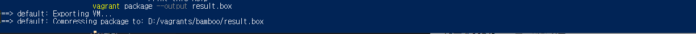

# Vagrancy 구성 방법
   
* * *      

## **1. Getting Started**
오픈 소스 툴인 Vagrancy를 사용하여, Vagrant Local Server를 구성하는 방법에 대해 알아보겠습니다.

## **2. 설치 방법**
2-1. Vagrancy를 사용할 가상 머신을 만들기 (Vagrant 이용)
- Vagrantfile
    ``` ruby
    # -*- mode: ruby -*-
    # vi: set ft=ruby :

    Vagrant.configure("2") do |config|
    config.vm.box = "centos/7"
    config.vm.network "private_network", ip: "192.168.33.10"
    config.vm.provision "shell", inline: <<-SHELL
        sudo yum install wget -y
        cd /vagrant
        wget https://github.com/ryandoyle/vagrancy/releases/download/0.0.4/vagrancy-0.0.4-linux-x86_64.tar.gz
        tar -xf vagrancy-0.0.4-linux-x86_64.tar.gz
        cd vagrancy-0.0.4-linux-x86_64
        ./vagrancy
    SHELL
    end
    ```
- Vagrant 시작하기
    ``` bash
    vagrant up --provision
    ```
    

- Vagrancy 서버 확인 방법 (8099 포트)
    ``` bash
    sudo netstat -tnlp
    ```
    

## **3. Box 업로드하기**
Vagrant Box를 업로드하기 위해, 나만의 Box를 먼저 만들어야합니다. Box를 만드는 방법은 다음과 같습니다.
3-1. Vagrant Box 만드는 방법
- Vagrant Box 만드는 명령어
    ``` bash
    # 명령어: vagrant package --output test.box
    # 상세 명령어는 vagrant package --help로 확인해주시기 바랍니다.

    ## vagrant 가상머신 Base 경로로 이동
    cd /vagrants/test
    vagrant package --output result.box
    ```
- 결과 (시간이 좀 걸릴 수 있습니다.)
    

3-2. Vagrant Box 업로드
이제 새로 만든 Box를 서버로 업로드해보겠습니다. Box를 서버로 업로드 하는 명령은 다음과 같습니다. Vagrancy Github에도 정의되어 있습니다.
- Box 업로드 명령어
    ``` bash
    curl http://192.168.33.10:8099/centos7/test/1.0.0/virtualbox result.box
    ```

- 업로드 성공 후, 서버에 저장된 리스트 확인
    - 명령어
        ``` bash
        curl http://192.168.33.10:8099/centos7/test
        ```
    - 결과
    