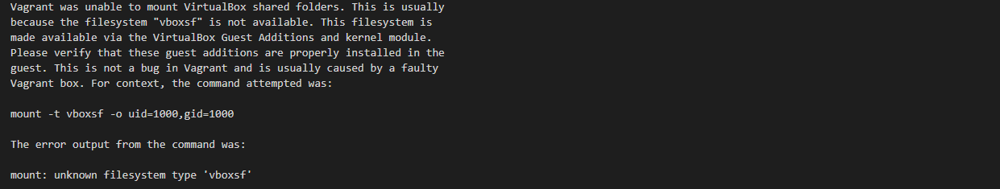
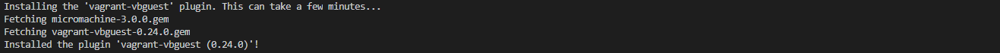
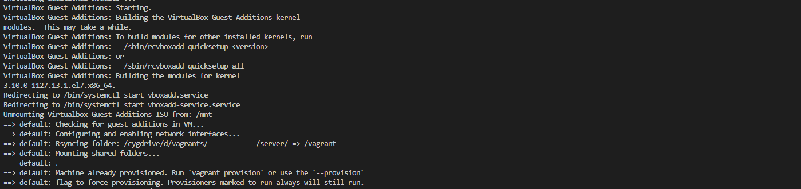

# synced_folder 에러 발생할 때
   
* * *      

## **1. Getting Started**
Vagrant Synced_folder 사용 시 에러 발생했을 때 처리하는 방법에 대해 정리되어 있습니다.

## **2. 에러 내용**
- Vagrant를 사용하여 synced_folder 사용하는데 마운트 에러가 발생할 때 (vboxsf 파일 시스템 타입이 없어서 마운트가 되지 않음)
    

## **3. 조치 방법**
- vagrant vagrant-vbguest plugin 설치
    - 설치 명령어
        ``` bash
        vagrant plugin install vagrant-vbguest
        ```
    - 설치 결과
    

    
- Vagrant 가상머신 재시작
    ``` bash
    vagrant reload
    ```
- 결과
    
