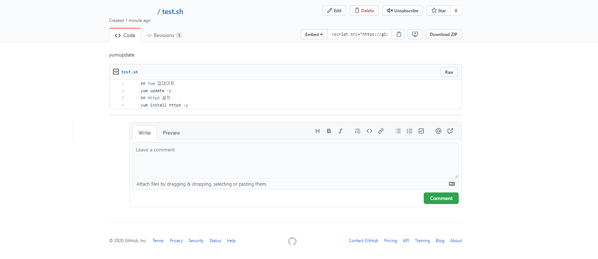
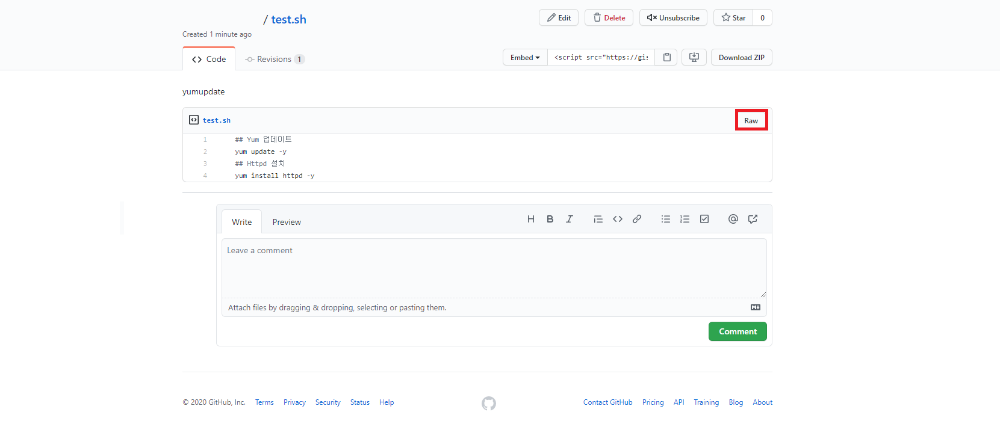
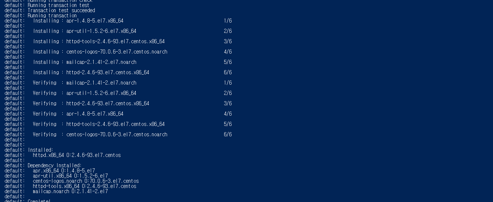

# Vagrantfile Shell 링크 사용하기
   
* * *      

## **1. Getting Started**
Vagrantfile Shell 스크립트를 Snippet에 작성된 스크립트로 사용하는 방법에 대해 정리되어 있습니다.

## **2. Snippet 스크립트 추가**
Github에서 제공하는 Github Gist를 사용하여 Shell에서 동작할 간단한 스크립트를 작성해보겠습니다.

- 스크립트
    ``` bash
    ## Yum 업데이트
    yum update -y
    ## Httpd 설치
    yum install httpd -y
    ```

- Github Gist에 새로운 스크립트로 추가해주세요. Public 이어야 https로 접속할 수 있습니다.
    

- 내가 만든 Github Gist 파일의 링크 알아내기
    - Raw 버튼을 눌러서 링크를 알아낼 수 있습니다. 눌러보세요!
    
    - 버튼을 누르면, 파일의 링크로 이동되어 원본 소스를 볼 수 있습니다.
        ``` bash
        ## 링크
        https://gist.githubusercontent.com/dev-gwang/d769e7660c9212e62a97911cd214b8d2/raw/f43362189e3e1110c712ea667b370d84b96815e7/test.sh
        ```

## **3. Vagrantfile Shell 추가**
Vagrantfile에서 제공하는 Shell의 Path 옵션을 사용하여, 링크를 넣을 수 있습니다.

- Vagrantfile
    ``` ruby
    config.vm.provision "shell", path: "https://gist.githubusercontent.com/dev-gwang/d769e7660c9212e62a97911cd214b8d2/raw/f43362189e3e1110c712ea667b370d84b96815e7/test.sh"
    ```
    
- vagrant 실행
위 shell 을 넣은 후, 한번 돌려보세요 원하는 동작을 모두 마친 후, 정상 동작하는 것을 확인할 수 있습니다.


