# GCP 프리 티어 사용하기
* * *      

## **1. Getting Started**
GCP 무료 등급에서 300 Credit을 사용하여 서비스를 활성화하는 방법에 대해 알아보겠습니다.


## **2. GCP 가입**
- GCP는 Google 계정을 통해 사용할 수 있습니다.
- 처음 사용하기 전, 카드 번호를 입력해야됩니다. 본인이 사용하고 있는 카드를 입력해주세요. (해외 결제 필수)
- 가입 후, 콘솔 페이지로 오면 상단에 남아 있는 금액과 상태를 간단히 확인할 수 있습니다.
    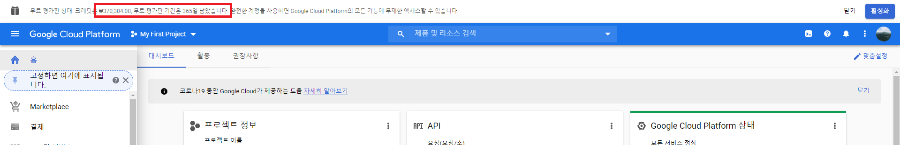


## **3. VM 머신 만들기**
이제 본격적으로 VM 머신을 만들어 보겠습니다. 하나씩 따라와주세요   
- Ubuntu VM 머신을 만들 것이기 때문에, 좌측 메뉴에서 Compute Engine의 VM 인스턴스 메뉴를 클릭합니다.
    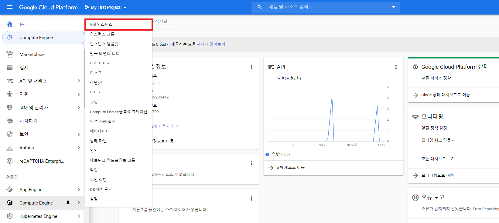
- VM 인스턴스 만들기 버튼을 눌러서 본격적으로 만들어보겠습니다.
    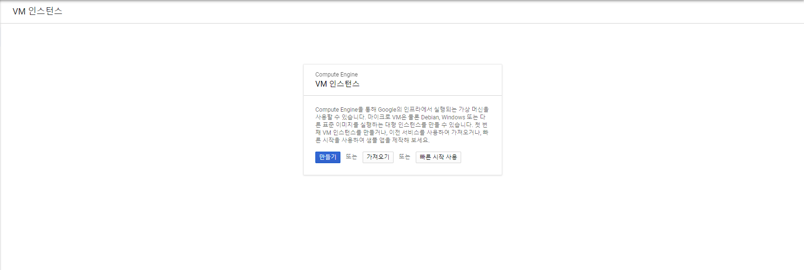
- VM 인스턴스 만들기 페이지에서는 인스턴스에 대한 각종 설정을 할 수 있습니다. 예측되는 비용을 참고하여 인스턴스를 만들 수 있습니다. 한 달에 20달러 미만을 목표로 하여 만들어볼 예정입니다.
    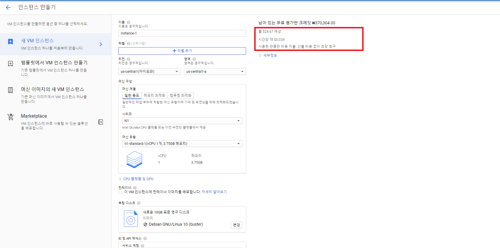
- 영역과 리전 설정
    
    - 영역은 우리나라에 서비스할 예정이기 때문에 서울로 설정하였습니다.
    - 머신은 2세대와 1세대 두 개로 나누어지는 데 2세대가 1세대보다 2배 정도 비쌉니다. (차이는 정확히 모름) 그래서 1세대로 구성합니다.
    - 머신 유형은 메모리 2기가와 4기가 둘 중에 고민하였는데, 2기가로 선택했습니다.
        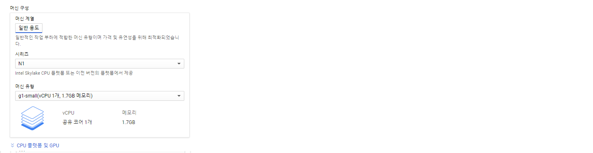

- 부팅 디스크 설정
    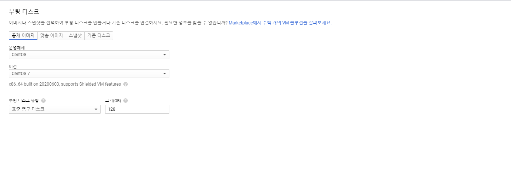
    - 부팅 디스크는 OS와 디스크 용량을 선택하는 항목입니다.
    - CentOS 7과 하드는 128기가를 선택했습니다.
    
- 만들기 버튼 눌러주세요!
- 인스턴스 생성 성공 !
    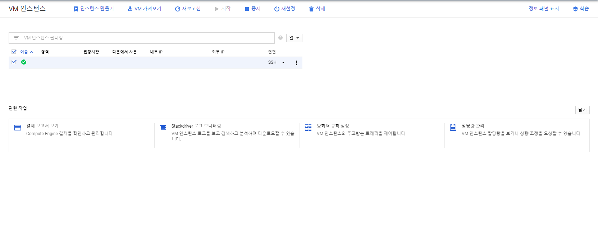

## **4. VM 머신 접속해보기**
- 웹으로 SSH 접속해보기
인스턴스 리스트에서 SSH 버튼을 클릭해보세요.
    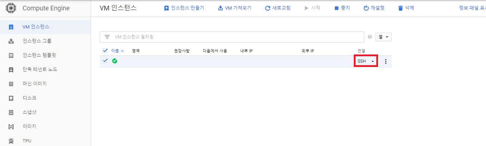
    - SSH 접속 후 명령어 치기
    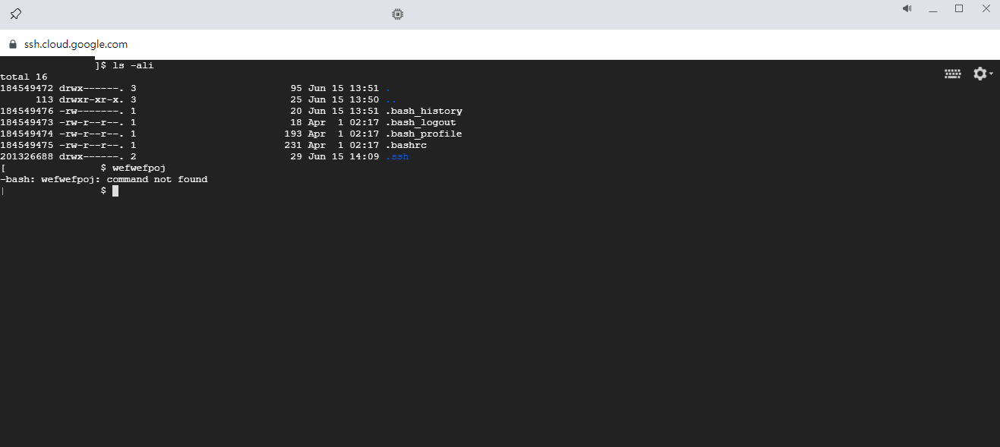

- 내 PC의 Shell 접속 도구를 사용하여 접속해보기
    - 내 PC에서 SSH 공개 키를 먼저 생성합니다.
        ``` powershell
        ssh-keygen -C <구글 계정>
        ```
        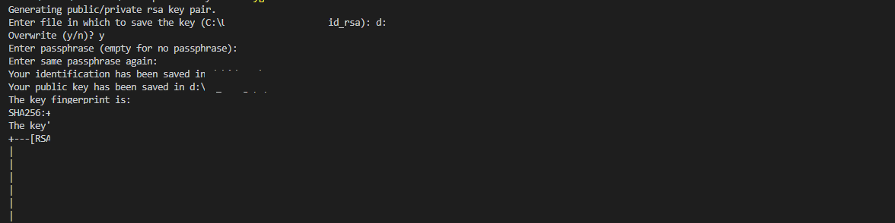
    - 추가한 공개 키를 GCP의 메타데이터에 등록해줍니다. (경로 생성 폴더 .pub 내용)
        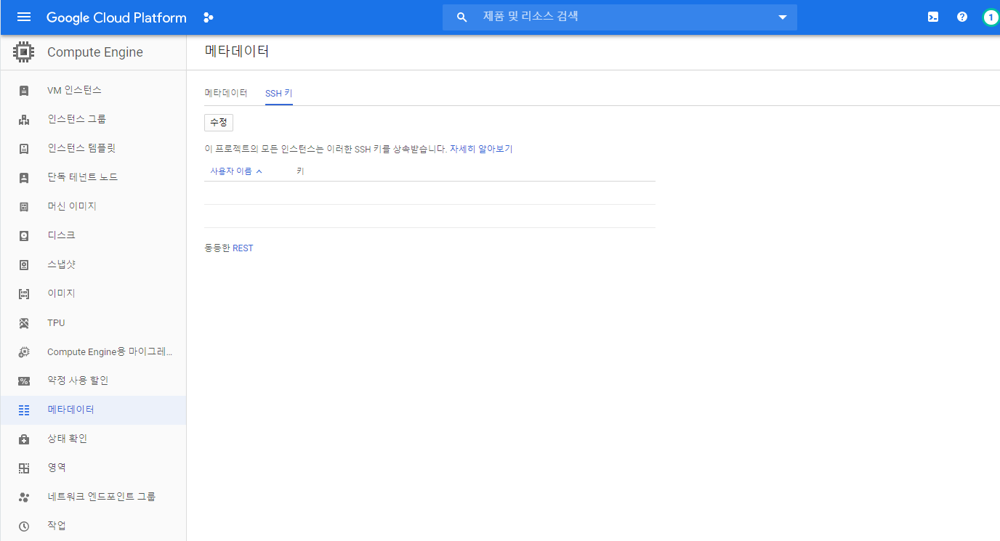
        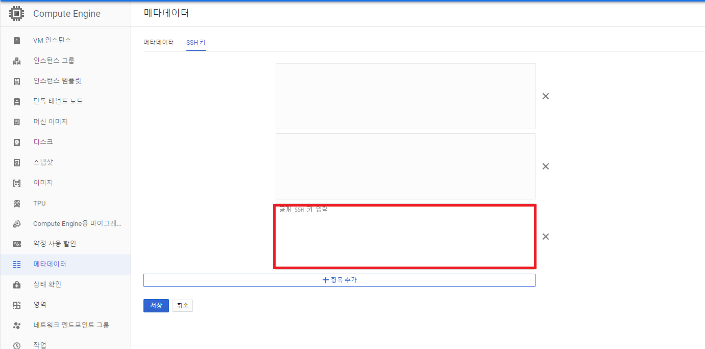

- 등록 후, SSH 접속을 해보겠습니다.
