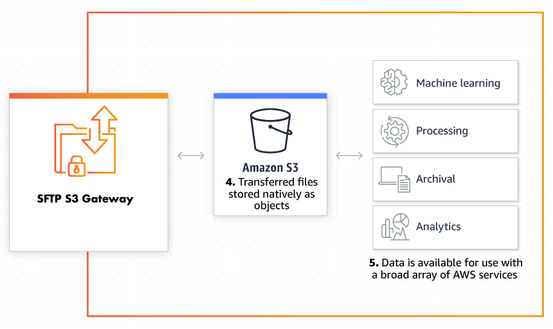

# 2. S3 SFTP 서비스 정리
* * *      

## **1. Getting Started**
AWS S3를 SFTP로 연동하기 위한 서비스에 대해 정리되어 있습니다.

## **2. 내용**
|서비스 이름|설명|캡처|
|---------------|---|---------------------|
|AWS Transfer|OS에서 Git 설치 과정| |
|Openbridge SFTP S3 Gateway|Git 사용자 정보 저장 방법| |

- 1) AWS Transfer
    - 장점
        1. 구성을위한 Amazon 콘솔의 편리함
        2. 완벽하게 관리되는 서비스이므로 자체 인프라를 실행할 필요가 없습니다.
        3. 전송은 내구성있는 Amazon S3 스토리지로 라우팅됩니다.
        4. 데이터를 저장할 S3 버킷을 선택하십시오. 다른 사용자는 다른 버킷에 쓸 수 있습니다.
        5. 선결제 비용은 없으며 서비스 사용에 대해서만 비용을 지불합니다.
    - 단점
        1. 공개 키 인증은 기본 인증 방법이며 다른 인증 방법은 사용자 지정 ID 공급자를 통해 상당한 노력이 필요합니다 . 기본적으로 pub key auth 이외의 다른 것이 
        2. 필요한 경우에는 "즉시"설치 및 구성이 아닙니다.
        3. 권한과 액세스는 IAM에 크게 의존합니다. 사용자를 특정 위치로 제한하거나 "감옥"하는 데 필요한 복잡한 정책 구조를 고려할 때 사용자 기반이 증가함에 따라 이는 번거로울 수 있습니다. 계정에 관리해야하는 100 개의 사용자 정책이있을 수 있다는 점에 유의해야합니다.
        4. 파일 형식 제한이 없습니다. 예를 들어, 누군가 win.exe 파일 또는 다른 파일 형식을 업로드 할 수 있습니다.
        5. 사용자 백업과 같은 대부분의 관리는 AWS CLI를 통해 이루어집니다
        6. 기존의 사용자 / 암호 인증은 사용할 수 없습니다. 많은 제 3자가이 기본 인증 모델을 사용합니다.
        7. AWS 서비스의 IP를 허용 목록에 추가 할 수 없습니다. 이는 아웃 바운드 연결을 허용해야하는 특정 IT 그룹에있어 획기적인 요인이 될 수 있습니다.
        8. 서비스 포트는 구성 할 수 없습니다. 즉, 아웃 바운드 포트 22 연결을 차단하는 회사 방화벽은 AWS 서비스에 도달 할 수 없습니다.
        9. 다른 사용자 / 그룹에 대한 할당량 지원이 없습니다.
        10. 바이러스 또는 맬웨어 검사가 없습니다.
        11. 로깅을 구성 할 수 없습니다. 예를 들어, 트랜잭션을 데이터베이스에 기록하려고한다고 가정하십시오. 또한 디버깅 로그에는 AWS 지원 티켓이 필요합니다.
- 2) Openbridge SFTP S3 Gateway
    - 구조   
    
    