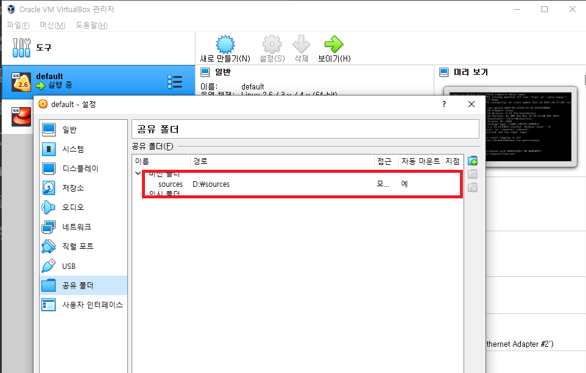
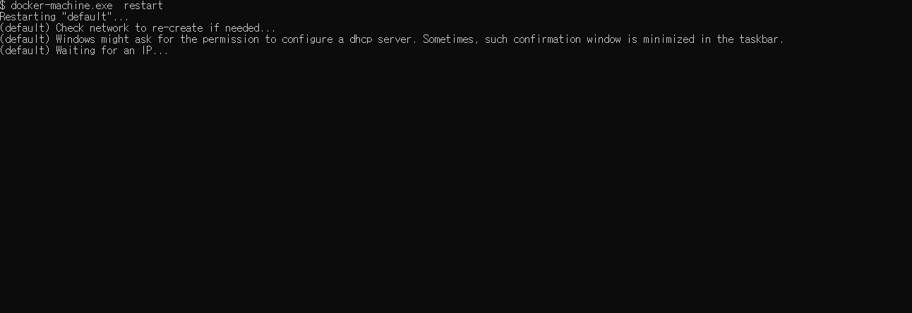
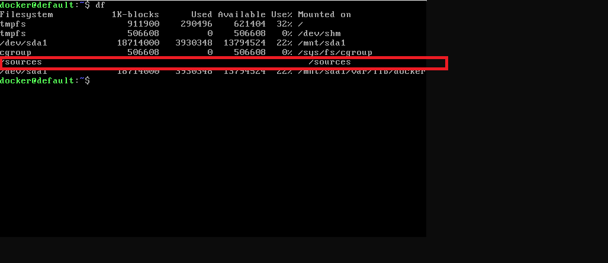
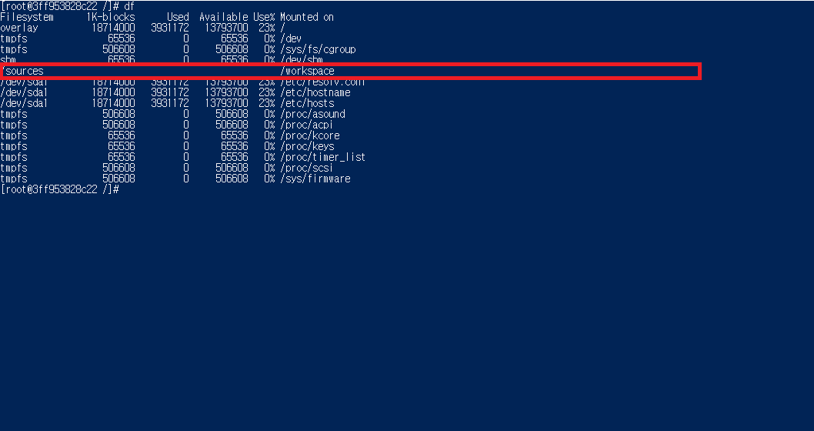

# Docker ToolBox Volume 마운트 하기
* * *
## **1. Getting Started**
Docker ToolBox Volume를 사용할 경우, 호스트와 폴더를 공유하는 방법이 조금 다릅니다. VirtualBox의 도커 머신에서 공유 폴더를 설정한 후 그 폴더를 마운트 하는 방식으로 진행해야 합니다. 방법부터 천천히 알아보겠습니다.      

## **2. 설정 방법**
#### 2-1. VirtualBox의 Docker Machine에서 원하는 공유 폴더 설정하기   
- Docker Container에서 사용할 원하는 폴더를 공유 폴더로 설정해줍니다.


- 설정을 마친 후, Docker Machine를 재시작해주세요.


- 재시작 후, Docker Machine에서 폴더가 마운트 되었는지 확인해주세요
      

#### 2-2. 설정 후, 컨테이너 실행하기
- Docker 컨테이너 실행 시, mount 옵션을 사용하여 실행합니다. /sources 폴더를 /workspace 폴더로 마운트하였습니다.
    ``` bash
    ### 도커 마운트 옵션 (-v) : -v 호스트폴더:컨테이너폴더
    docker run -v /sources:/workspace -i -t centos:6 /bin/bash
    ```
- 컨테이너가 정상적으로 실행되었으면, 폴더가 마운트되었는지 확인해주세요.


    공유 폴더가 마운트되었으면 성공입니다! 🎈🎈🎈🎈