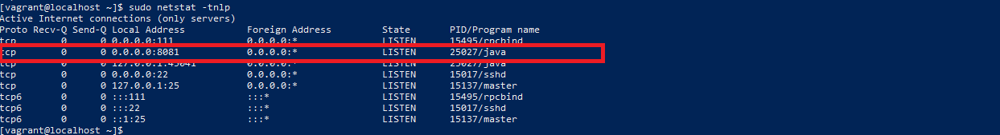
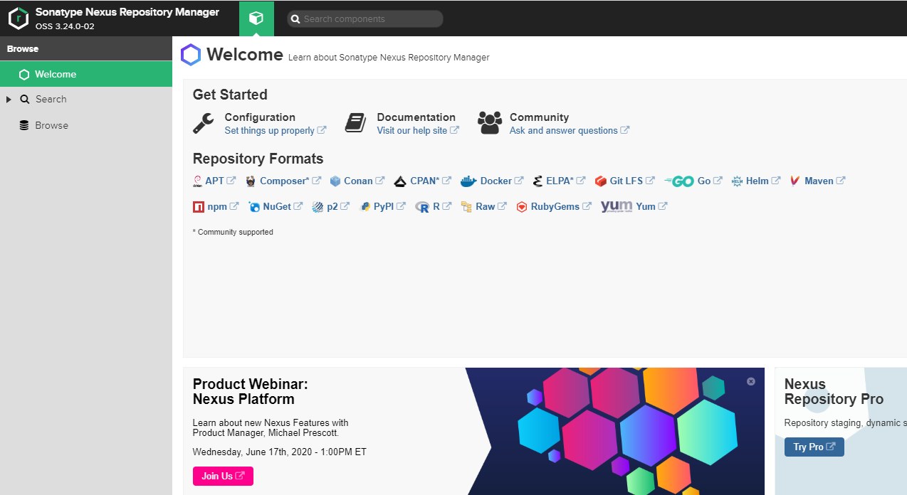
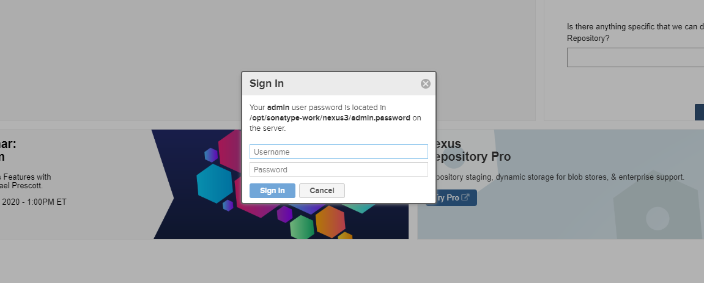
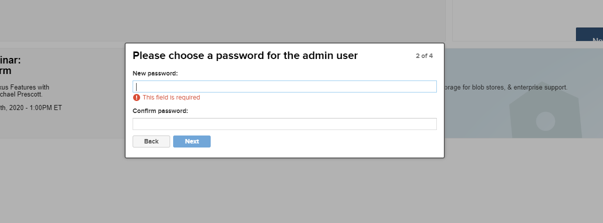
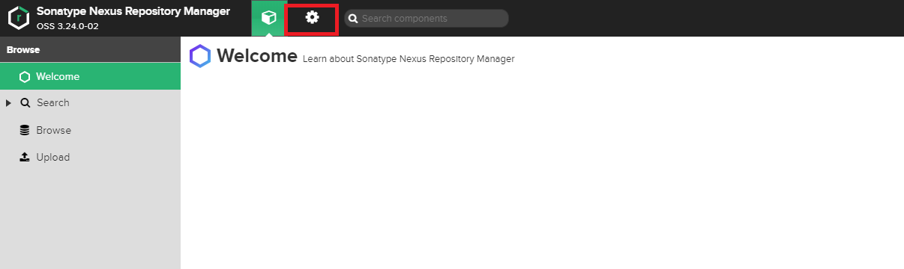
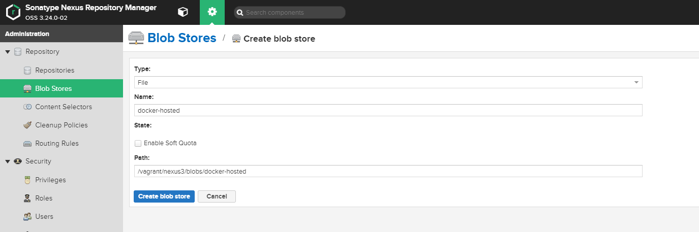
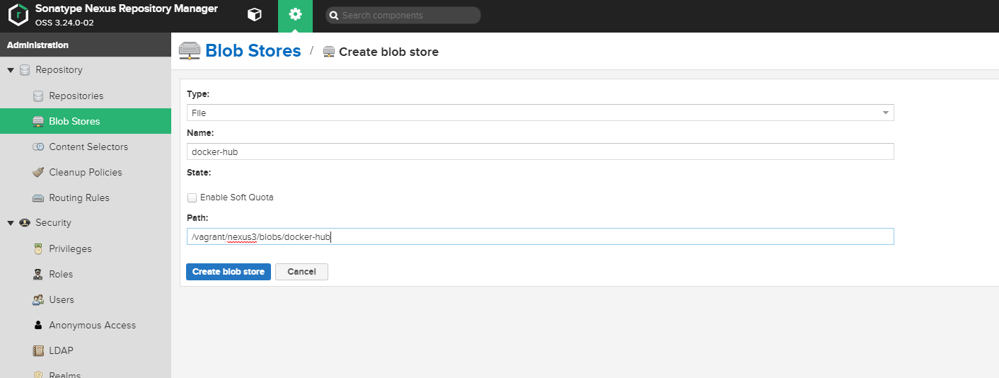
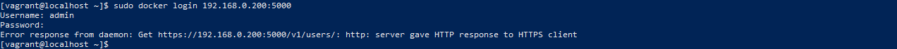
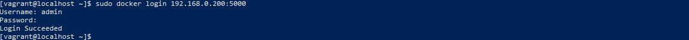

# Docker Private Registry 구성하기
* * *
## **1. Getting Started**
Nexus3을 사용하여 Docker Private Registry를 구성하는 방법에 대해 정리되어 있습니다.    

## **2. 환경**
- OS : CentOS 7

## **3. 설치 방법**
- yum update
    ``` bash
    yum update -y
    ```
- JDK 1.8 버전 설치
    ``` bash
    yum install java-1.8.0-openjdk-devel.x86_64
    ```
- Nexus3 최신 버전 다운로드 후, 압축 해제
    ``` bash
    ## 다운로드
    wget https://download.sonatype.com/nexus/3/latest-unix.tar.gz
    ## 압축 해제 (/opt 경로)
    tar -xvf latest-unix.tar.gz -C /opt
    ```
- Nexus3 실행하기
    ``` bash
    /opt/nexus-*/bin/nexus  start
    ```
- 시간이 조금 지나면, 8081 포트가 활성화된 것을 확인할 수 있음
    ``` bash
    sudo netstat -tnlp
    ```
    

## **4. 설정 방법**
### 4.1 웹 어드민 설정
- 웹 접속하기 (http://<서버IP:8081>)
    
- 우측 상단에 Sing in 버튼을 눌러 로그인 페이지로 이동한다.
- 최초 로그인 시, 메시지에 출력되는 파일을 참고하여 admin 패스워드를 사용한다.
    
- admin 패스워드 변경해주세요
    

### 4.2 Repository, Blob 설정
- 설정 페이지로 이동
    

- Blob Data 추가
    - Docker-Hosted
    
    - Docker-Hub
    


### 5. 테스트
- Private Repository로 로그인해보기
    ``` bash
    # docker login <IP:PORT>
    docker login 192.168.0.200:5000
    Username: admin
    Password:
    ```
    
    - 로그인이 되지 않을 때
        - /etc/docker/daemon.json 파일 수정
            ``` javascript
            { 
                "insecure-registries":[
                    "192.168.0.200:5000"
                ]
            }
            ```
        - Docker 서비스 재시작
            ``` bash
            service docker restart
            ```
        - 로그인 다시 시도 후, 성공 캡처
            

