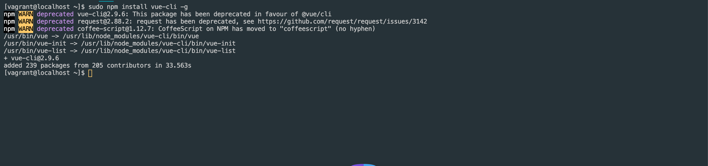
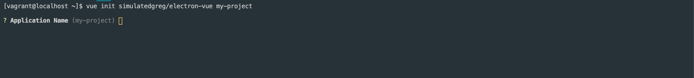
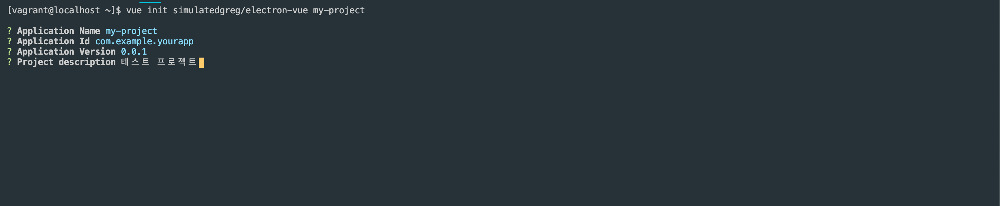
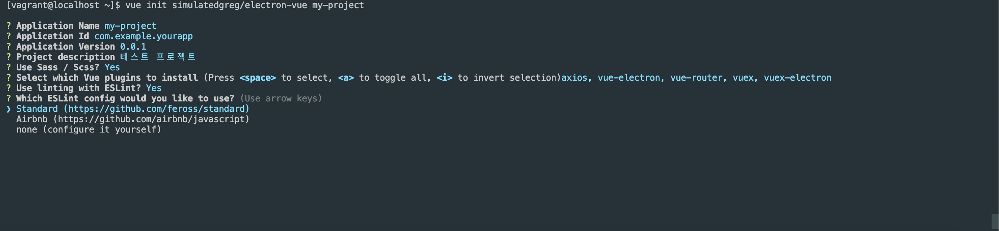
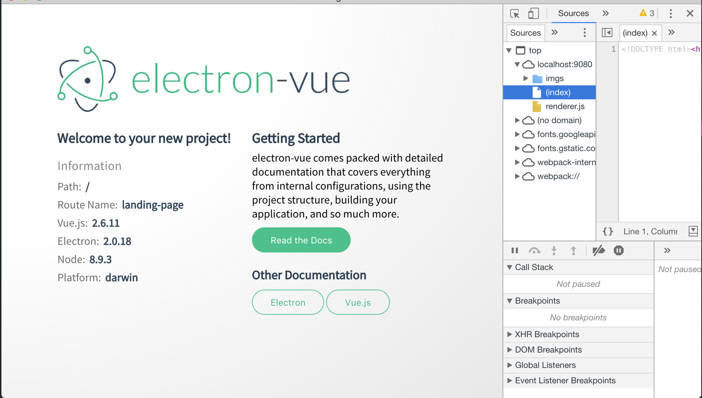

Electron-vue 설치하기
============   
* * *   
Electron-vue로 개발하기 위해 설치하는 방법에 대해 알아보겠습니다. 

### 1. Electron-vue 모듈 설치
1-1. vue-cli 모듈 설치
``` bash
## npm
sudo npm install vue-cli -g
```


1-2. 프로젝트 생성하기   
프로젝트 생성을 위해 아래 명령을 입력해줍니다. 다음으로 기본 설정 과정을 진행하게 됩니다.
``` bash
vue init simulatedgreg/electron-vue my-project
```
- 프로젝트 이름 설정하기

- Application ID 및 버전 설정
- 프로젝트 설명

- Sass / Scss 설정
- Vue 플러그인 설정 : 필요한 플러그인을 사용합니다

- ESLint 설정
Standard Lint를 사용하였습니다. 

- 유닛테스트 설정
- Builder 설정
Builder은 추후 개발된 프로젝트를 배포할 시 설치가 가능한 실행파일로 빌드해줍니다. Electron-Builder을 선택하였습니다.


1-3. 프로젝트 모듈 설치
프로젝트 구성을 마치기 위해 모듈 설치 명령을 실행해주세요
``` bash
## 프로젝트 경로 이동
cd my-project
## 모듈 설치
yarn install
```


설치가 모두 완료되었습니다! 모두 성공하셨죠?

1-4. 프로그램 개발 모드로 실행해보기
``` bash
yarn run dev
```

1-5. NodeJS 12 버전에서 발생하는 문제
NodeJS 12에서만 발생하는 문제로 아래 과정을 통해서 해결하러 가봅시다.  
- 참고 사이트   
1) https://github.com/SimulatedGREG/electron-vue/issues/871
2) https://seorenn.tistory.com/22

- 프로젝트 파일 수정
1) .electron-vue/webpack.renderer.config.js
2) .electron-vue/webpack.web.config.js

HtmlWebpackPlugin 키워드를 검색 후, templateParameters를 추가해주세요
``` javascript
new HtmlWebpackPlugin({
      filename: 'index.html',
      template: path.resolve(__dirname, '../src/index.ejs'),
      minify: {
        collapseWhitespace: true,
        removeAttributeQuotes: true,
        removeComments: true
      },
      // 아래 추가!
      templateParameters(compilation, assets, options) {
        return {
          compilation: compilation,
          webpack: compilation.getStats().toJson(),
          webpackConfig: compilation.options,
          htmlWebpackPlugin: {
            files: assets,
            options: options
          },
          process,
        };
      },
```

### 2. 프로젝트 실행해보기
2-1. 프로젝트 개발 버전으로 실행
``` bash
yarn run dev
```
실행이 성공적으로 아래와 같이 창이 뜨면 성공입니다.

