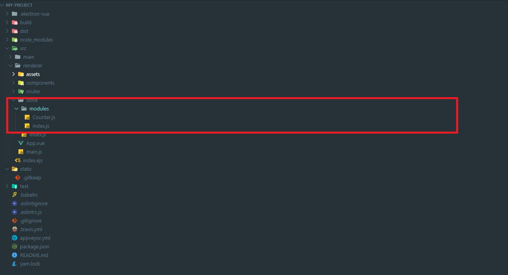

Electron에서 Vuex 사용하기
----------------------
Electron에서 Vuex 사용하는 방법에 대해 알아보겠습니다. electron-vue 프로젝트 생성 시, Vuex는 모듈이 기본으로 포함되어 있습니다. 
폴더 구조를 살펴보면, src/renderer/store 폴더에 Vuex 세팅이 되어 있으며, 필요 시 이를 활용하여 구성하면 됩니다.
Vuex에 대해 설명은 되어 있지 않으므로 Vuex를 이해하고자 할 경우 다른 자료를 참고 부탁드립니다.

### 1. 폴더 구조
electron-vue 프로젝트에서 사용되는 Vuex 관련 폴더 구조는 아래와 같습니다.

src/renderer/store 폴더에 Vuex 관련 설정을 할 수 있습니다. Counter이라는 Vuex Store 샘플이 포함되어 있습니다. 샘플에 대해 하나씩 알아보겠습니다.

#### 1-1. Vuex 플러그인
- ./src/renderer/store/index.js   
electron-vue 프로젝트에서는 createPersistedState, createSharedMutations 플러그인을 기본 적용하고 있습니다. 플러그인에 대해 간단하게 알아보면 다음과 같습니다.   
-- 설명   
|이름|설명|
|------|---|
|createPersistedState|Vuex Store로 관리하는 데이터를 지속적으로 파일에 저장하는 용도|
|createSharedMutations|Git 사용자 정보 저장 방법|

``` javascript
import Vue from 'vue'
import Vuex from 'vuex'

import { createPersistedState, createSharedMutations } from 'vuex-electron'

import modules from './modules'

Vue.use(Vuex)

export default new Vuex.Store({
  modules,
  plugins: [
    createPersistedState(),
    createSharedMutations()
  ],
  strict: process.env.NODE_ENV !== 'production'
})
```


#### 1-1. Counter Store
- Counter.js   
Counter.js 는 state.main 값을 증가 혹은 감소 시키는 기능을 가지고 있습니다. mutations 항목의 DECREMENT_MAIN_COUNTER 호출 시, main 값을 - 시키고 INCREMENT_MAIN_COUNTER 호출 시, main 값을 + 하는 역할을 가지고 있습니다.
``` javascript
const state = {
  main: 0
}

const mutations = {
  DECREMENT_MAIN_COUNTER (state) {
    state.main--
  },
  INCREMENT_MAIN_COUNTER (state) {
    state.main++
  }
}

const actions = {
  someAsyncTask ({ commit }) {
    // do something async
    commit('INCREMENT_MAIN_COUNTER')
  }
}

export default {
  state,
  mutations,
  actions
}
```