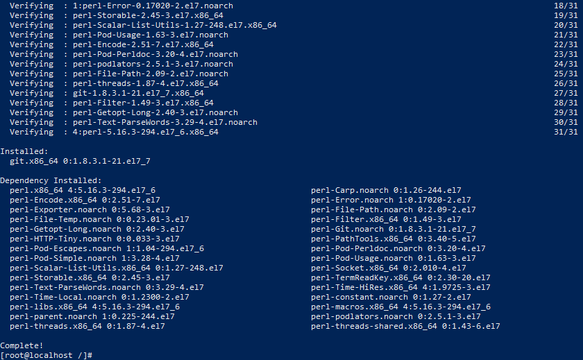
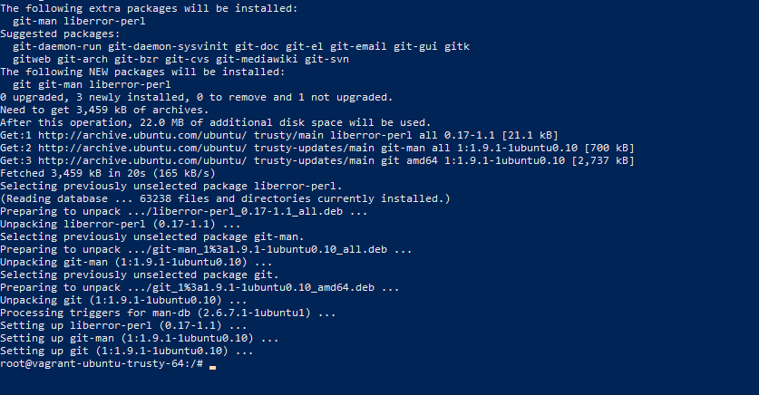
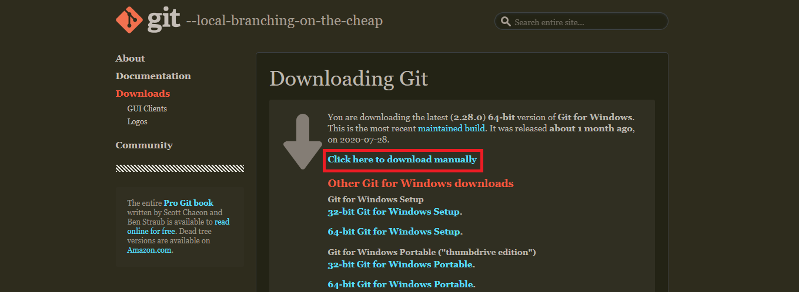
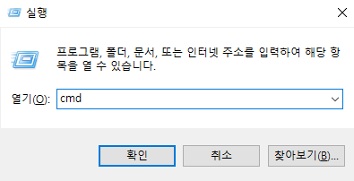
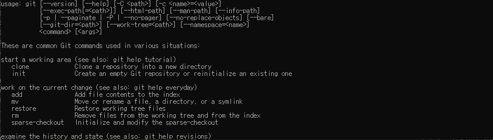
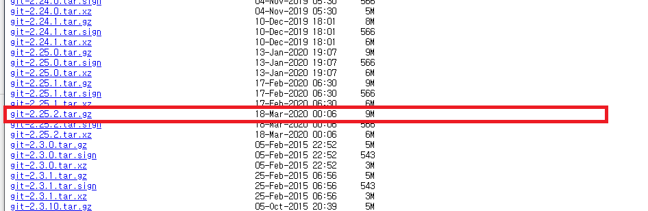
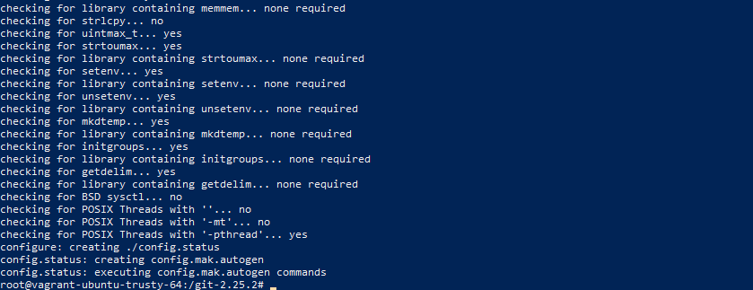
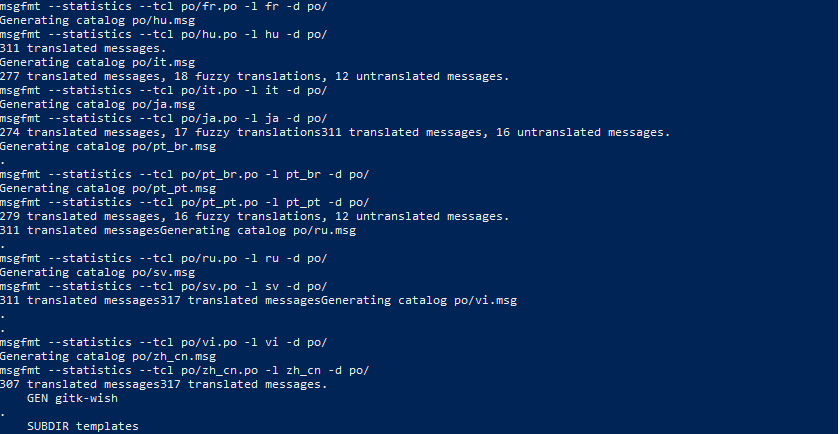
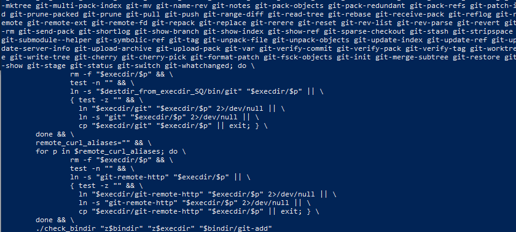

# Git 설치하기
* * *
[1. CentOS에서 Git 설치하기](#CentOS에서-Git-설치하기)   
[2. Ubuntu에서 Git 설치 방법](#Ubuntu에서-Git-설치하기)   
[3. Windows에서 Git 설치 방법](#Windows에서-Git-설치하기)   
[4. 소스를 사용하여 Git 빌드하기](#소스를-사용하여-Git-빌드하기)
   
## CentOS에서 Git 설치하기
- 설치 명령어
    ``` bash
    yum install git -y
    ```
- 설치 결과   
    


## Ubuntu에서 Git 설치 방법
- 설치 명령어
    ``` bash
    apt install git -y
    ```
- 설치 결과   
    

## Windows에서 Git 설치 방법
- 설치 파일 다운로드
    - 다운로드 페이지 : https://git-scm.com/download/win
    - "Click here to download manually" 링크 클릭하여 다운로드 시작하기
        
    - 다운로드한 파일 실행하기

- Git 테스트
    - 키보드에서 <b>윈도우 키 + r </b>을 눌러서 cmd에 들어가주세요   
        
    - git 명령이 실행되면 정상 설치됬습니다!
        ``` bash
        git --help
        ```
        

    
## 소스를 사용하여 Git 빌드하기
- [Git Mirrors](https://mirrors.edge.kernel.org/pub/software/scm/git/) 에서 원하는 최신 버전 다운로드하기

    ``` bash
    wget https://mirrors.edge.kernel.org/pub/software/scm/git/git-2.25.2.tar.gz
    ```
- 다운로드 후 압축 해제 후, 폴더 이동
    ``` bash
    ## 압축 해제
    tar -xvf git-2.25.2.tar.gz
    ## 압축 해제된 폴더로 이동
    cd git-2.25.2
    ``` 

- 빌드를 위해 configure 명령 실행
    ``` bash
    ./configure
    ```
    

- make 명령 실행
    ``` bash
    make -j4
    ```
    

- make install 명령 실행
    ``` bash
    make install
    ```
    

- 설치된 git 버전 확인하기
    ``` bash
    git --version
    ```
    