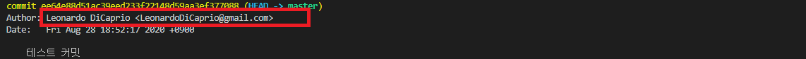

# Git 개발자 정보 저장하기
* * *      
Git을 사용하여 PC에서 개발하기 전 사용자가 누구인지에 대한 정보를 먼저 저장을 해주어야 합니다. 이 정보를 사용하여 commit할 때 commit을 작성한 사용자가 누군지에 대해 저장됩니다.

<br>

## 1. 사용자 정보 Global 설정
Global 설정은 로컬에서 사용 중인 모든 Repository에서 동일하게 사용되는 옵션입니다.
- 명령어
    ``` bash
    git config --global user.name "Leonardo DiCaprio"
    git config --global user.email "LeonardoDiCaprio@gmail.com"
    ```
<br>

## 2. 특정 저장소에서 사용자 정보 저장
Global 저장은 모든 Repository에서 동일하게 사용되는 옵션입니다.
- 명령어
    ``` bash
    # 예시
    git config --local user.name "Leonardo DiCaprio"
    git config --local user.email "LeonardoDiCaprio@gmail.com"
    ```
<br>

## 3. 커밋 후, 커밋된 내용 보기
- 명령어
    ``` bash
    git log
    ```
    
