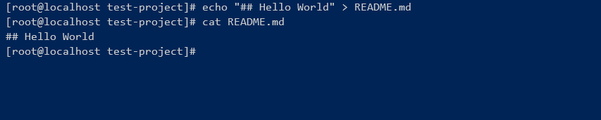
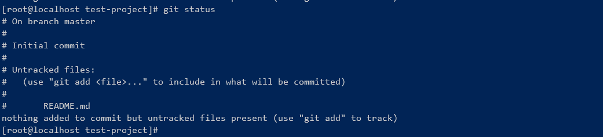
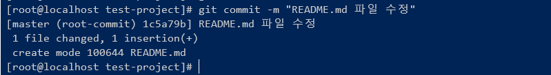
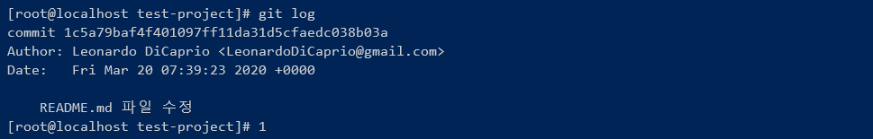

# Git 프로젝트 시작하기
* * *      
Git을 사용하여, 로컬에 저장소를 사용하는 방법에 대해 알아봅시다.   
<br>

## 1. 프로젝트 시작할 폴더 구성 후, git 시작
- Git 테스트 프로젝트 작업을 위한 폴더를 생성 후, 폴더로 이동
    ``` bash
    ## 폴더 생성
    mkdir test-project
    ## 폴더 이동
    cd test-project
    ```
- 생성한 폴더에서 Git을 시작하기 위해 init 명령을 실행합니다. git init을 실행한 폴더내에서 git을 적용하여 구성할 수 있습니다.
    ``` bash
    git init
    ```   

<br>

## 2. 파일 추가 후, 커밋하기
- README.md 파일 추가 (내용은 임의로 작성해도 됩니다)
    ``` bash
    echo "## Hello World" > README.md
    ```
    

<br>

## 3. git status 명령 실행해보기  
git status는 사용 중인 프로젝트의 git 상태를 확인할 수 있는 명령입니다.   
``` bash
git status
```
현재 프로젝트에서 README.md 파일을 새로 생성하였기 때문에, README.md 파일이 Untracked Files 상태로 남아있습니다.


- untracked file을 stage로 등록하기   
Commit 하기 위해서는 먼저 Untracked File을 Stage로 등록해야됩니다. Stage로 등록하기 위해서는 git add 명령어를 사용하면 됩니다. 앞서 작성한 README.md 파일을 Stage로 등록해보겠습니다.
    ``` bash
    git add README.md
    ```
- git status로 현재 상태 확인해보기


## 4. 커밋하기
git 커밋할 때는 메시지와 함께 남겨주면 됩니다. 아래와 같이 한번 시도해보세요!

``` bash
## git commit -m "<수정 메시지>"
git commit -m "README.md 수정"
```



<br>

## 5. 커밋 후, 상태 확인하기
git 이전에 등록한 커밋의 히스토리를 확인하기 위해서 git log 명령어를 사용할 수 있습니다. 
``` bash
git log
```

