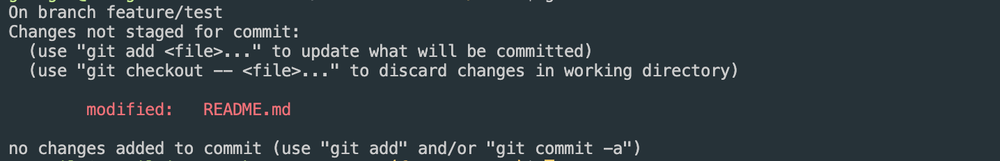
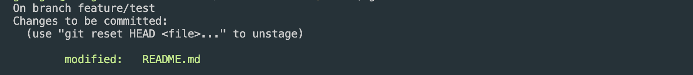
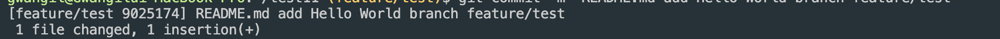

# Git 저장소 Branch 구성하기
* * *      
### 1. Git Branch 생성하기
#### 1-1. Git Branch 생성 명령어
``` bash
## git branch <새로 만들 브랜치 이름>
git branch feature/test
```
#### 1-2. 생성한 Branch로 Checkout하기

``` bash
git checkout feature/test
```

### 2. 새로 생성한 Branch에서 작업 후 커밋하기

#### 2-1. README.md 파일을 추가 후 저장합니다. (내용은 임의로 작성해도 됩니다)
``` bash
echo "## feature/test branch Hello World!!" >> README.md
```

#### 2-2. git status 명령 실행해보기  
git status는 사용 중인 프로젝트의 git 상태를 확인할 수 있는 명령어이다.   
``` bash
git status
```
현재 프로젝트에서 README.md 파일을 수정하였기 때문에, README.md 파일이 not staged for commit 상태로 변경되었습니다.



#### 2-3. not staged for commit 파일 커밋하기
Commit하기 위해서는 수정한 파일을 등록해주어야 합니다. 
``` bash
git add README.md
```
- git status로 현재 상태 확인해보기


#### 2-4. 커밋하기
git 커밋할 때는 메시지와 함께 남겨주면 됩니다. 아래와 같이 한번 시도해보세요!

``` bash
## git commit -m "<수정 메시지>"
git commit -m "README.md add Hello World branch feature/test"
```

