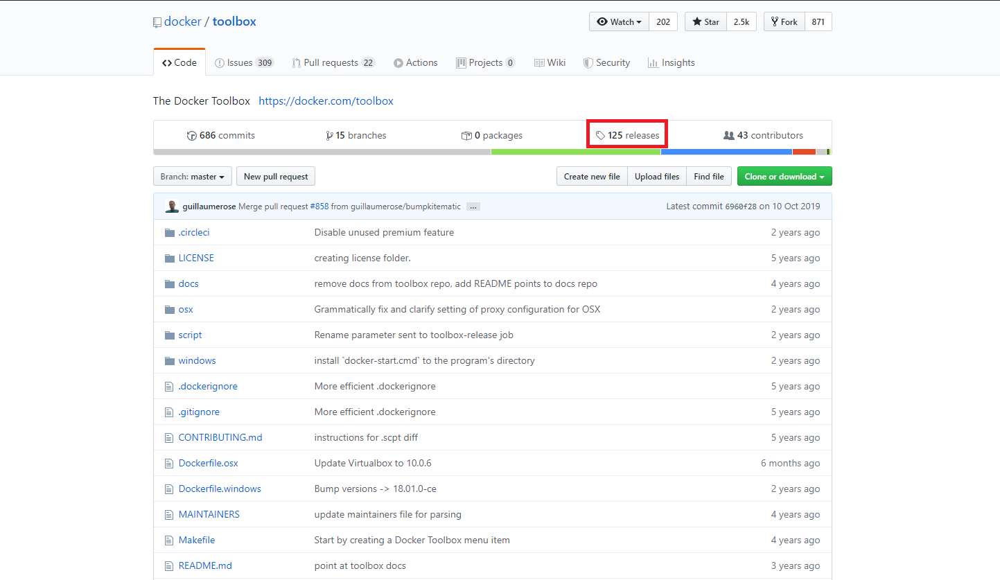
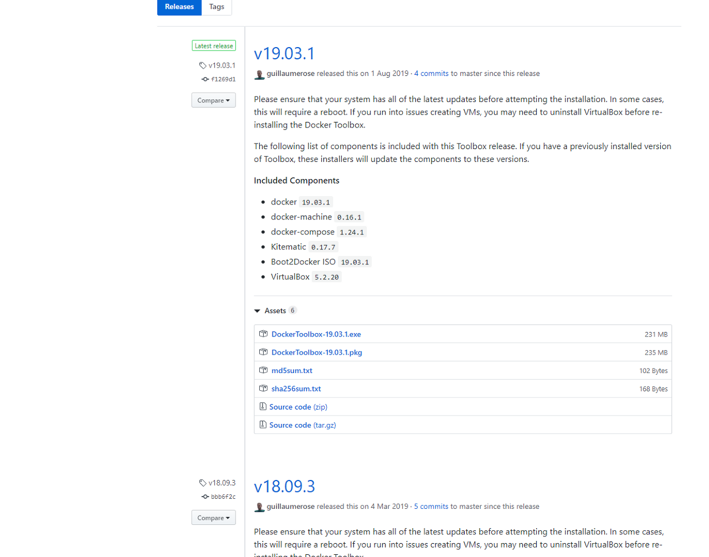
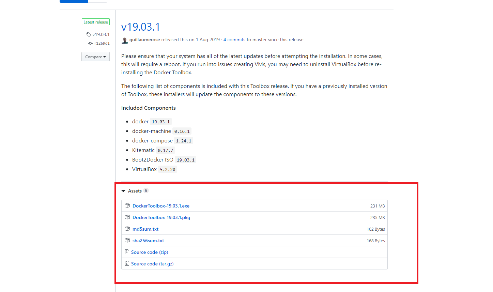
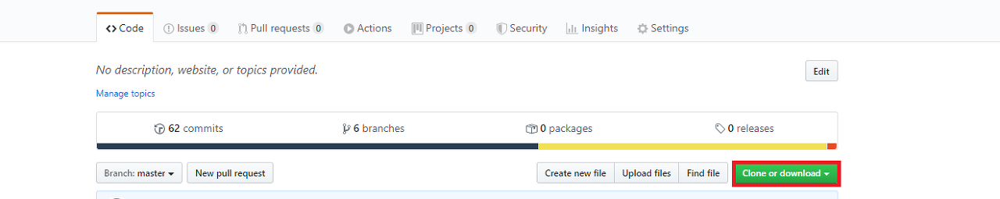
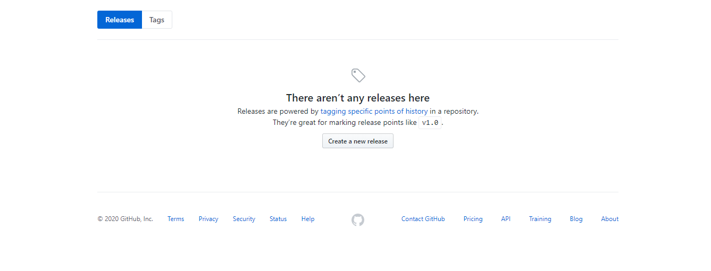
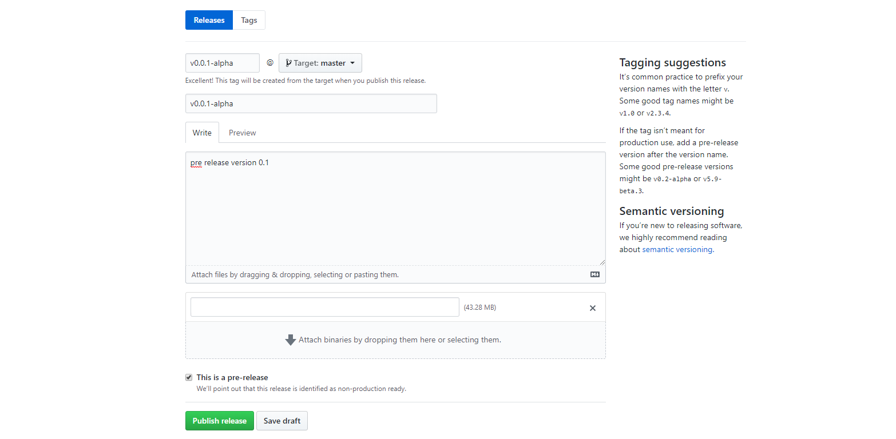
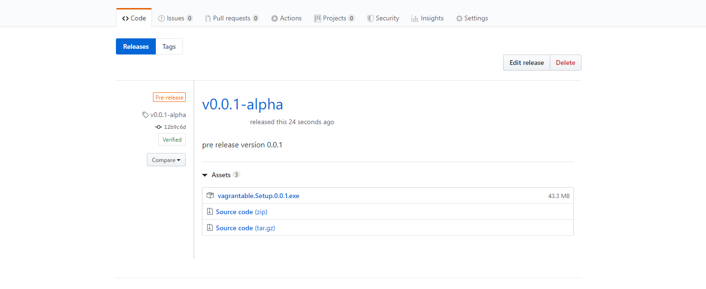

# Git 프로젝트 패키지 배포 방법
* * *      
> 개발 중인 혹은 개발이 완료된 프로젝트를 배포하는 방법에 대해 알아보도록 합니다.   
 메이저 버전 혹인 알파 버전으로 배포하는 방법이 있습니다.      
    
 
## 패키지 배포 예시   
Github에서 패키지를 배포하고 사용자가 어떻게 이용을 하는지에 대해 먼저 알아보자. Github로 배포 중인 대부분의 프로젝트에서 다음과 같은 방법으로 사용 중이다.

[예시 Docker ToolBox](https://github.com/docker/toolbox).

### 1. Github 저장소 Release 확인 방법
1-1. 메인 페이지   

아래 캡처 화면은 Docker Toolbox의 Github 저장소 메인 페이지 캡처화면이다. 우측 상단을 보면 releases라는 버튼이 있는데 이곳이 바로 Docker Toolbox의 릴리즈 노트를 확인할 수 있는 곳이다. (125 releases이기 때문에 총 125개의 패키지가 릴리즈 되었다는 의미임)

   

1-2. release 페이지   
releases 페이지로 들어가보면 현재까지 릴리즈된 패키지의 버전과 수정 내역을 확인할 수 있다.

   

1-3. release된 파일 다운로드   
releases 페이지로 들어가보면 현재까지 릴리즈된 패키지의 버전과 수정 내역을 확인할 수 있다.

   

### 2. Github 저장소 Release 만들기
2-1. 릴리즈를 위해 저장소의 Releases 페이지 이동   

   

2-2. 페이지에서 Create a new release 버튼 선택   
릴리즈된 버전이 없을 경우 아래와 같이 출력되며, Create a new release를 누르면 릴리즈할 항목을 선택할 수 있다.   

   

2-3. 릴리즈 항목 입력   
   

입력을 모두 마친 후, Publish release 버튼을 눌러보자!   

2-4. 릴리즈 배포 결과   

   

패키지를 직접 배포해보니, 업로드한 바이너리 파일에서 소스 코드가 자동으로 첨부되어 올라가는 것으로 보인다. 