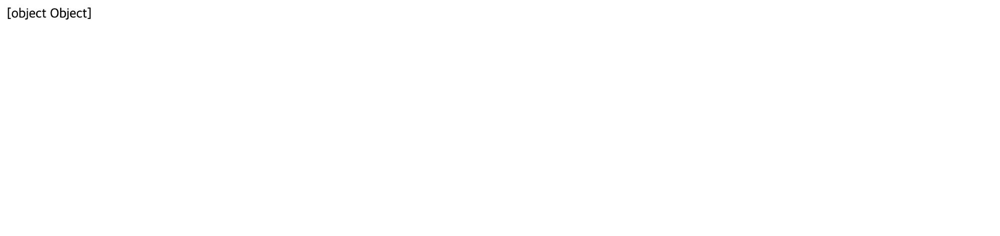
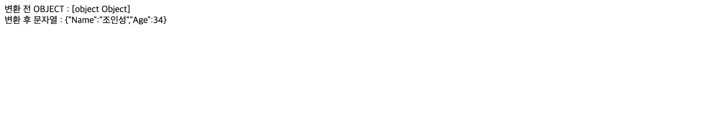
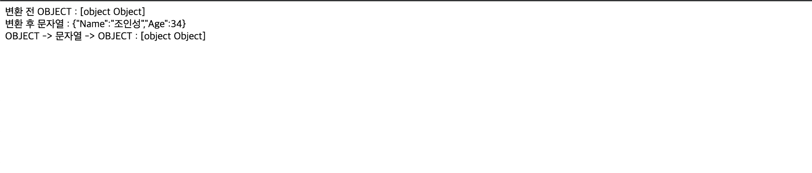

JSON 포맷 핸들링하기
============   
* * *   

### 0. JSON 포맷을 핸들링하지 않을 경우
- Javascript에서 JSON 포맷 데이터를 핸들링하지 않고 그대로 출력할 경우, 원하는 데이터를 얻어내지 못 한다. JSON 포맷 데이터가 Object 객체이기 떄문이다.
``` javascript
<script>
  var variable = {
    Name: "조인성",
    Age: 34
  }

  document.write(variable)
</script>
```



### 1. JSON 포맷을 문자열로 변환하기
- JSON 포맷을 문자열로 변환하기 위해 JSON.stringify 함수를 사용하여 변환합니다. Object를 문자열로 그대로 변환하여 반환합니다.
``` javascript
<script>
  var variable = {
    Name: "조인성",
    Age: 34
  }

  var convert = JSON.stringify(variable)

  document.write(`변환 전 OBJECT : ${variable} <br>`)
  document.write(`변환 후 문자열 : ${convert}`)
</script>
```



### 2. 문자열을 JSON 포맷으로 변환하기
- JSON 포맷을 가진 문자열을 JSON Object로 변환할 수 있습니다. JSON.parse 함수를 사용하여 변환해보겠습니다.
``` javascript
<script>
  var variable = {
    Name: "조인성",
    Age: 34
  }

  var convert = JSON.stringify(variable)

  document.write(`변환 전 OBJECT : ${variable} <br>`)
  document.write(`변환 후 문자열 : ${convert} <br>`)

  convert = JSON.parse(convert)
  document.write(`OBJECT -> 문자열 -> OBJECT : ${convert}`)
</script>
```
