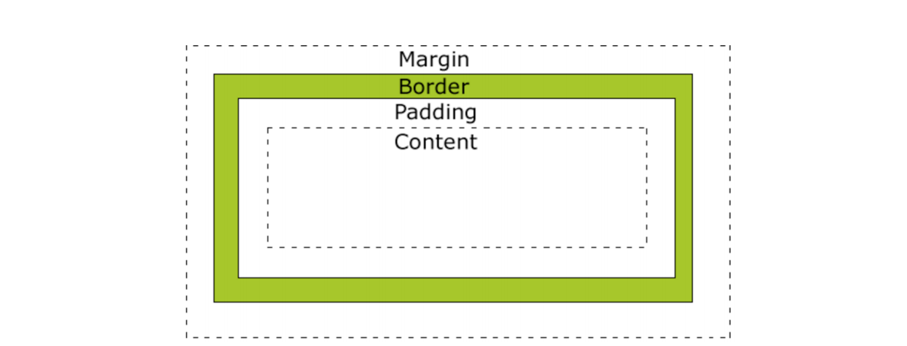

# CSS
* * *      
## **1. Getting Started**
CSS에 대해 한번 알아보겠습니다.   

## **2. CSS란**
HTML로 만들어진 문서의 텍스트 색상 및 전반적인 디자인 요소를 표현하는 언어입니다.


## **3. CSS 표현 방식**
CSS 표현 방식에는 총 3가지 방식이 있다. 

- inline 방식
    ``` html
    <div style="border:1;">
        <hr>
        <font style="color:purple;">
            <b>CSS - inline 방식</b>
        </font>
        <hr>
    </div>
    ```
    <div style="border:1;">
        <hr>
        <font style="color:purple;">
            <b>CSS - inline 방식</b>
        </font>
        <hr>
    </div>

- 내부 CSS Style 사용하는 방식
    ``` html
    <style>
        .test{
            color:blue;
        }
    </style>

    <div style="border:1;">
        <hr>
        <font class="test">
            <b>CSS - inline 방식</b>
        </font>
        <hr>
    </div>
    ```
    <style>
        .test{
            color:blue;
        }
    </style>

    <div style="border:1;">
        <hr>
        <font class="test">
            <b>CSS - inline 방식</b>
        </font>
        <hr>
    </div>

- 외부 CSS Style 사용하는 방식
    - style.css
    ``` html
    <style>
        .test{
            color:blue;
        }
    </style>
    ```

    - main.html
    ``` html
    <link rel="stylesheet" type="text/css" href="style.css">
    <div style="border:1;">
        <hr>
        <font class="test"><b>CSS - inline 방식</b></font>
        <hr>
    </div>
    ```

## **4. CSS 사용 방법**
- CSS Selector
    ``` css
    // 예시
        selector {
            property1: value;
            property2: value;
            property3: value;
        }
    
        h1 {
            color: blue;
            font-size: 12px;
        }
    ```

- CSS 선택자
    - ID 선택자
        ``` css
        #ID {
            color:blue;
            font-size:12px;
        }
        ```
    - TAG 선택자
        ``` css
        Tag {
            color:blue;
            font-size:12px;
        }
        ```
    - Class 선택자
        ``` css
        .class {
            color:blue;
            font-size:12px;
        }
        ```

- CSS 하위 선택자
    ``` html
    <ul id="navigation">
        <li> list 1 </li>
        <li> list 2 </li>
        <li> list 3 </li>
    </ul>
    <ul>
        <li> list 1 </li>
        <li> list 2 </li>
        <li> list 3 </li>
    </ul>
    <style>
        #navigation li { color:red; }
    </style>
    ```
    <div>
    <hr>
    <ul id="navigation">
        <li> list 1 </li>
        <li> list 2 </li>
        <li> list 3 </li>
    </ul>
    <ul>
        <li> list 1 </li>
        <li> list 2 </li>
        <li> list 3 </li>
    </ul>
    <hr>
    <style>
        #navigation li { color:red; }
    </style>
    </div>

- CSS 여러개 선택자
    ``` html
    <ul id="navigation">
        <li> list 1 </li>
        <li> list 2 </li>
        <li> list 3 </li>
    </ul>
    <ul id="navigation2">
        <li> list 1 </li>
        <li> list 2 </li>
        <li> list 3 </li>
    </ul>
    <style>
        #navigation li, #navigation2 li { color:red; }
    </style>
    ```
    <div>
    <hr>
    <ul id="navigation">
        <li> list 1 </li>
        <li> list 2 </li>
        <li> list 3 </li>
    </ul>
    <ul id="navigation2">
        <li> list 1 </li>
        <li> list 2 </li>
        <li> list 3 </li>
    </ul>
    <hr>
    <style>
        #navigation li, #navigation2 li { color:red; }
    </style>
    </div>

- CSS 자식 선택자
    ``` html
    <ul id="navigation33">
        <li> list1 </li>
        <li> 
            list2
            <ul>
                <li> list 2-1 </li>
                <li> list 2-2 </li>
            </ul>
        </li>
        <li> list 3 </li>
    </ul>

    <style>
        #navigation33 > li { border:1px solid red; }
    </style>
    ```
    <div>
    <hr>
    <ul id="navigation11">
        <li> list1 </li>
        <li> 
            list2
            <ul>
                <li> list 2-1 </li>
                <li> list 2-2 </li>
            </ul>
        </li>
        <li> list 3 </li>
    </ul>

    <hr>
    <style>
        #navigation11 > li { border:1px solid red; }
    </style>
    </div>

## **5. CSS 심화**
- 박스 모델링   
HTML의 엘리먼트들은 박스의 형태를 가지고 있는데 이것을 가르켜서 박스 모델이라고 합니다.


