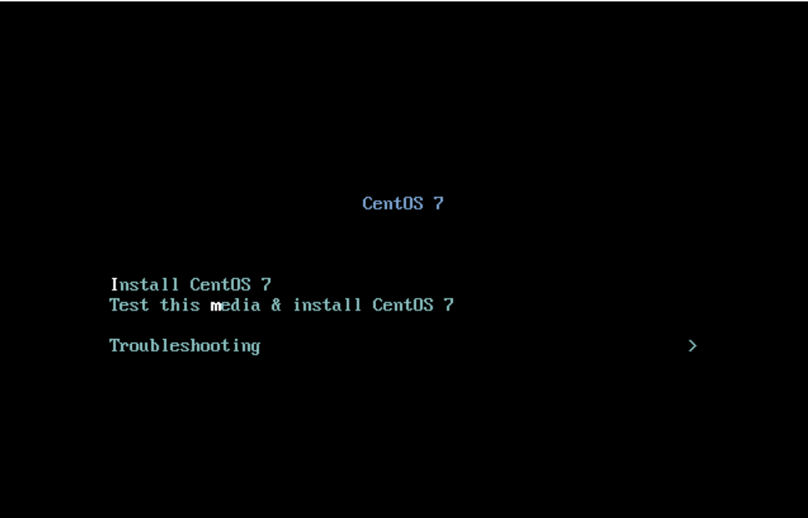
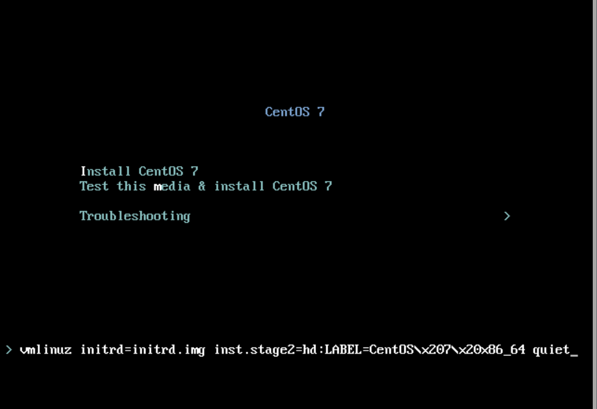
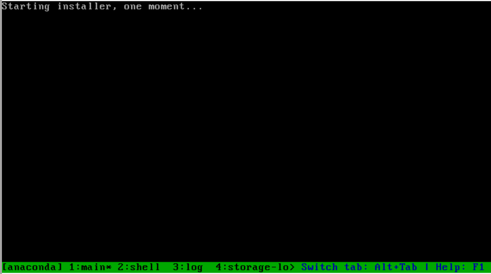
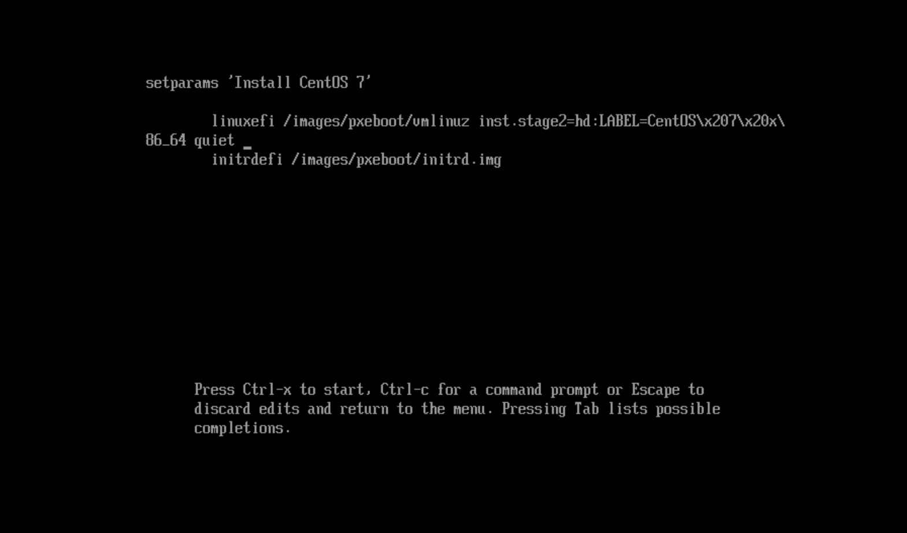
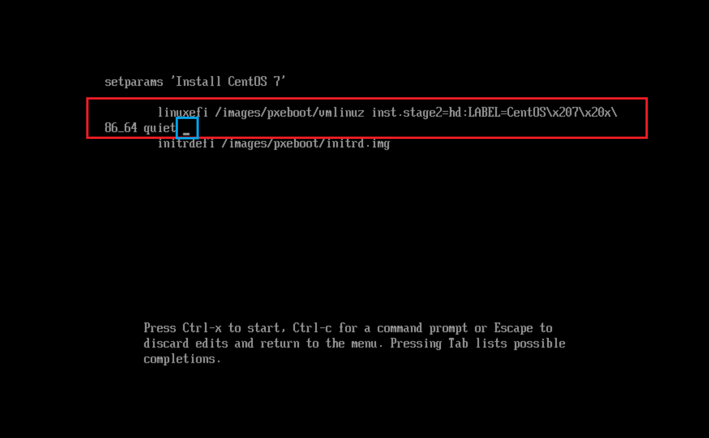

CentOS Kickstart FTP 서버 통해 설치하기
----------------------

KickStart을 사용하여 설치하는 방법에 대해 정리합니다. 설치 방법은 레거시 BIOS 모드, UEFI 모드 2 종류로 나누어집니다. 순서대로 진행해보겠습니다.
그리고 설치를 진행하지 전에 네트워크가 연결되어 있어야지 FTP 서버를 사용하여 설치할 수 있습니다.

### 1. 레거시 BIOS 모드에서 설치 방법
- 레거시 모드 설치 메뉴화면

- 설치 메뉴 화면에서 키보드의 tab 버튼을 눌러서, boot cmdline 모드로 진입해보세요

- NIC 설정을 위해, NIC 설정 명령을 입력 후 엔터 버튼을 눌러봅니다.
``` bash
## 정적 IP 할당할 경우
ip=<정적IP> netmask=255.255.255.0 gateway=<게이트웨이> inst.ks=ftp://<서버 IP>/kickstart.cfg
## NAT 사용할 경우
inst.ks=ftp://<서버 IP>/kickstart.cfg
```
- 엔터를 누르면 다음 설치 과정을 진행하게 되는데, 문제 (네트워크 오류 등)가 없을 경우 설치를 정상적으로 진행합니다.


- 자동으로 설정 후, 설치 진행함


### 2. UEFI 모드에서 설치 방법
- UEFI 모드 설치 메뉴 화면

- 설치 메뉴 화면에서 커서를 Install CentOS 7 으로 이동 후, 키보드의 e 버튼을 클릭합니다. e 버튼을 클릭하면 boot command line 수정 가능합니다.

- NIC 설정을 위해, 수정 커서를 linuxefi 줄로 이동 시킨다.

- 아래 줄을 추가 후, ctrl + x를 눌러주세요.
``` bash
## 정적 IP 할당할 경우
ip=<정적IP> netmask=255.255.255.0 gateway=<게이트웨이> inst.ks=ftp://<서버 IP>/kickstart.cfg
## NAT 사용할 경우
inst.ks=ftp://<서버 IP>/kickstart.cfg
```