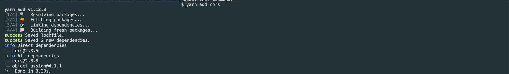
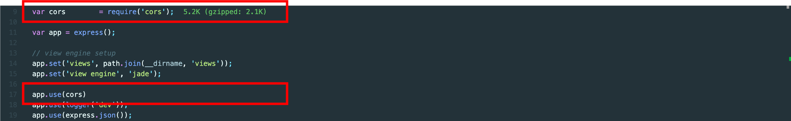

CORS 모듈 적용 방법
* * *      


           


       
- 참고 사이트
  - https://developer.mozilla.org/ko/docs/Web/HTTP/CORS   
  - https://ko.wikipedia.org/wiki/%EA%B5%90%EC%B0%A8_%EC%B6%9C%EC%B2%98_%EB%A6%AC%EC%86%8C%EC%8A%A4_%EA%B3%B5%EC%9C%A0


### 1. CORS 모듈 설치하기

``` bash
yarn add cors
```



### 2. CORS 모듈을 미들웨어로 등록하기

CORS 모듈은 Express에서 미들웨어로 사용할 수 있습니다. 미들웨어에 등록하여 요청을 CORS 모듈로 허용할 수 있도록 수정해보겠습니다.

#### 2-1. 프로젝트 app.js 수정

app.js 파일에 코드를 추가해주세요

``` javascript
// 아래 추가
var cors        = require('cors');
//////?//////////////
var app = express();

// view engine setup
app.set('views', path.join(__dirname, 'views'));
app.set('view engine', 'jade');

// 아래 추가
app.use(cors)
//////??/////////////
app.use(logger('dev'));
app.use(express.json());
app.use(express.urlencoded({ extended: false }));
```



#### 2-2. app.js 수정 후 프로젝트 실행

``` bash
yarn start
```

#### 2-3. 데이터 요청하기

이제 데이터 요청 시, 도메인에 관계 없이 데이터를 요청할 수 있습니다