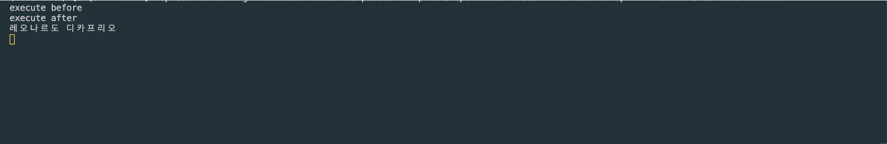
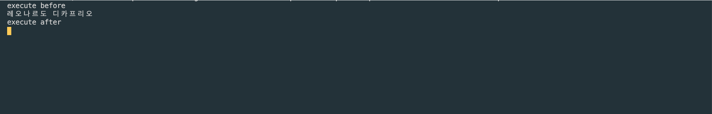

Sequelize FindAll 동기 적용 방법
----------------------
async, await을 사용하여 비동기를 동기식으로 조회하는 방법에 대해 알아봅니다.

### 1. 기존 코드 (비동기식 소스)

비동기식으로 동작하기 때문에, 원하는 순서대로 실행되지 않습니다.

``` javascript
router.get('/test', function(req, res, next) {
  console.log('execute before')
  models.user.findAll({
  }).then(result => {
    console.log(result[0].name)
  })

  console.log('execute after')
});
```



### 2. async, await으로 동기로 조회하기

async, await 키워드를 사용하여 동기로 조회해보겠습니다.
``` javascript
router.get('/test', async function(req, res, next) {
  console.log('execute before')
  await models.user.findAll({
  }).then(result => {
    console.log(result[0].name)
  })

  console.log('execute after')
});
```

