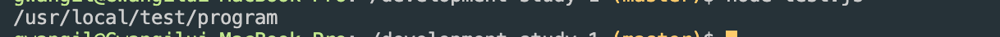

# Path 경로 설정 방법 (Path 모듈 사용)
* * *      
NodeJS에서 여러 운영체제 (MacOS, Windows 등)를 고려하여 경로를 설정하는 방법에 대해 정리되어있습니다. Path 모듈을 사용하여, 파일 및 폴더의 경로를 만드는 것에 대해 알아보겠습니다.

### 1. Path 모듈 사용

``` javascript
const path = require('path')
const test_path = '/usr/local/test'

var result = path.join(test_path, 'program')

console.log(result)
```

### 2. 결과
