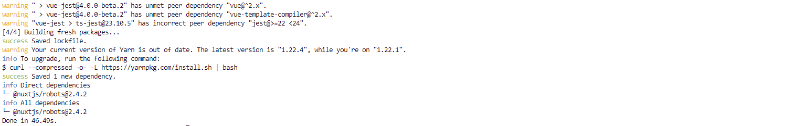

# NuxtJS Robots.txt 만들기
* * *

## 1. 설치 방법
### 1-1. yarn 패키지 모듈 설치
``` bash
yarn add @nuxtjs/robots
```


### 1-2. NuxtJS에 적용하기
- nuxt.config.js 파일에 모듈 추가하기
``` javascript
  /*
  ** Nuxt.js modules
  */
  modules: [
    '@nuxtjs/robots'
  ],
```
- 옵션 추가하기 (모듈 옵션 정보는 공식 홈페이지 참고)
``` javascript
export default {
  modules: [
    '@nuxtjs/robots'
  ],
  robots: {
    UserAgent: '*',
    Allow: '/'
  }
}
```
## 2. 서비스 실행
- 서비스 실행
``` bash
yarn run dev
```
- 페이지 접속해보기 (http://<>/robots.txt)

