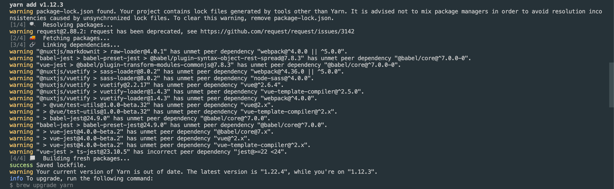

# JSON-LD 적용하기
* * *
## **1. Getting Started**
NuxtJS 프로젝트에 JSON-LD 모듈을 적용하는 방법에 대해 정리되어있습니다.


## **2. 설정 방법**
- 모듈 설치하기 (nuxt-jsonld)
    ``` bash
    yarn add nuxt-jsonld
    ```
    

- 모듈 적용하기
  - Plugins 폴더 내에 jsonld.js 파일을 생성합니다.
    - 파일 위치   
    
    - 파일 내용 추가
      ``` javascript
      // plugins/jsonld.js
      import Vue from 'vue';
      import NuxtJsonld from 'nuxt-jsonld';

      Vue.use(NuxtJsonld);

      // you can set the indentation
      Vue.use(NuxtJsonld, {
        space: process.env.NODE_ENV === 'production' ? 0 : 2, // default: 2
      });
      ```
    - nuxt.config.js 파일에 Plugin 정보 추가하기
      ``` javascript
      /*
      ** Plugins to load before mounting the App
      */
      plugins: [
        ['~/plugins/jsonld']
      ],
      ```