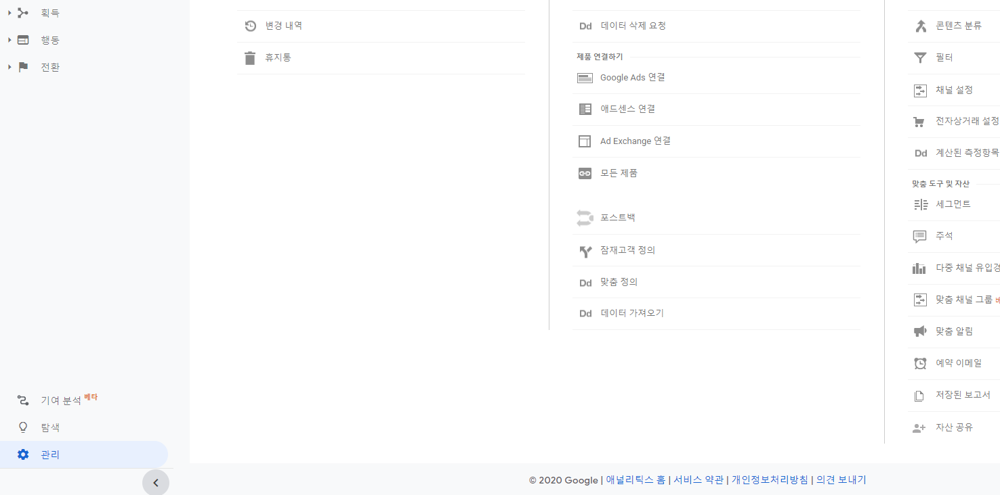
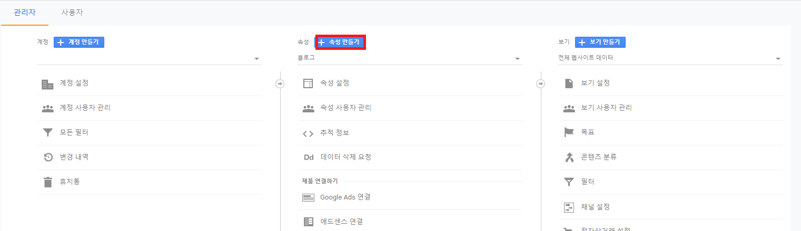
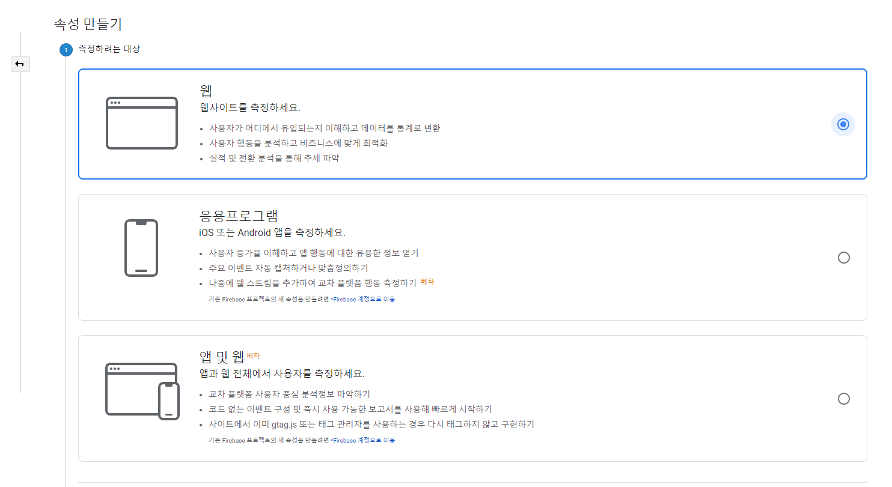
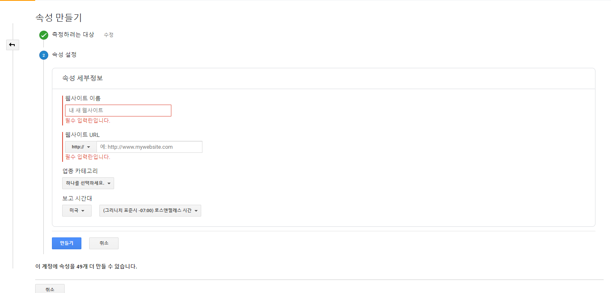
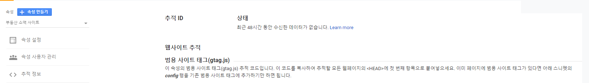
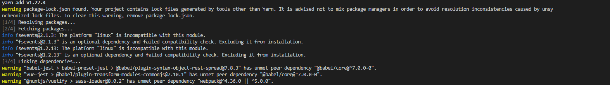

# Google Analytics 추가하기
* * *

## 1. Google Analytics 속성 추가하기
- Google Analytics 홈페이지에서 속성 추가
  - 좌측 하단의 관리 버튼 클릭
  
  - 가운데 속성 추가 버튼 클릭
  
  - 추가할 서비스의 타입에 대해 선택해주세요
  
  - 도메인 정보를 입력 후, 생성합니다.
  
  - 성공적으로 생성되면, 추적 ID 값을 얻을 수 있습니다. 이 추적 ID 값으로 애널리틱스 서비스 사용 가능
  

## 2. NuxtJS 프로젝트에 Analytics 모듈 추가하기
- @nuxtjs/google-analytics 모듈 추가
  - 명령어
    ``` bash
    yarn add @nuxtjs/google-analytics
    ```
    

- nuxt.config.js 파일 수정하기
  - buildModules 항목 추가
    ``` javascript
    buildModules: [
      '@nuxtjs/google-analytics'
    ],
    ```
  - googleAnalytics 키 추가
    ``` javascript
    googleAnalytics: {
      id: '<추적 ID>'
    },
    ```
  - 빌드 후 서비스를 돌려보세요!