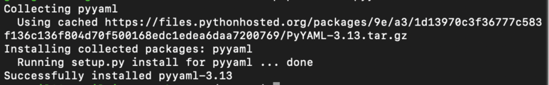

파이썬 pyyaml 모듈 사용하기
============   
* * *  

pyyaml은 파이썬에서 yaml 양식을 가진 파일을 다룰 때 사용하는 모듈이다. 공식 사이트는 Python - PyYaml Module 이며, 사용 가이드 및 버전 정보를 제공해주고 있다.


### 1. 소스 사용 방법
모듈을 사용하기 위해서는 사용하고자 하는 환경에 모듈을 설치해주어야 합니다. pypi를 사용 중이라면 pip 명령어를 사용하여 모듈을 간단하게 설치할 수 있습니다.

``` python
## python2.7
pip install pyyaml
## python3.5
pip3.5 install pyyaml
## python3.7
pip3.7 install pyyaml
```


설치가 정상적으로 종료되었으면, 설치된 모듈을 사용하여 테스트를 먼저 해보겠습니다!   
Python의 Dict 자료형 타입으로 저장된 데이터를 Yaml 데이터 타입으로 저장하는 프로그램을 만들어보겠습니다.


### 2. 테스트 코드 짜보기 (Dict 자료형 데이터를 Yaml 데이터로 저장하기)

``` python
## python
import yaml
array = {"테스트 1": "테스트 1 Value", "테스트 2": "테스트 2 Value"}
with open("array.yaml", 'w', encoding="utf-8") as outfile:
	yaml.dump(array, outfile, default_flow_style=False)
```

스크립트를 실행하면, array.yaml 이라는 파일로 yml 형식으로 저장되는 것을 확인할 수 있습니다. Yaml 데이터 포맷으로 정상 저장된 것을 확인할 수 있습니다. 


### 3. 파일로 저장 시, 한글 문제 수정
테스트 코드로 진행했을 때 파일 저장 시, 한글이 제대로 저장되지 않았다는 것을 확인할 수 있습니다. yaml로 저장 시, unicode를 사용한다는 옵션이 있으며 이를 사용해주면 정상적으로 한글을 사용할 수 있습니다. (https://stackoverflow.com/questions/10648614/dump-in-pyyaml-as-utf-8)

dump 시 allow_unicode=True 속성 추가 후 실행해보세요!

``` python
## python
# -*- coding: utf-8 -*-
import yaml
test = {"테스트 1": "테스트 1 Value", "테스트 2": "테스트 2 Value"}
with open("test.yaml", 'w', encoding="utf-8") as outfile:
	yaml.dump(test, outfile, default_flow_style=False, allow_unicode=True)
```

