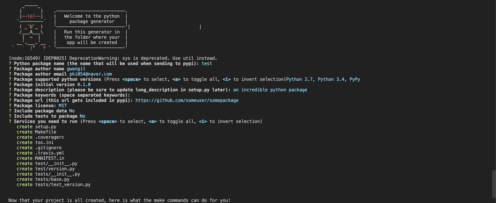

파이썬 패키지 만들기 (generator-python-package)
============   
* * *  

파이썬 패키지 만드는 방법 정리!

파이썬 패키지 직접 만드는 방법에 대해서는 다른 블로그를 참고해주길 바라며.. 나는 Package Generator을 사용하여 패키지를 만드는 방법에 대해 정리하려고 한다. 아쉽게도 파이썬에서 제공하는 Generator는 없는 듯하다. 그래서 누군가가 만들어준 Generator을 사용하여 패키지를 만드는 방법에 대해 정리해보겠다.  
https://github.com/heynemann/generator-python-package


### 1. 구성 방법
#### 1-1. npm 패키지 매니저로 yo 패키지 설치
``` bash
sudo npm install -g yo
```


#### 1-2. generator-python-package 설치
``` bash
sudo npm install -g generator-python-package
```


### 2. 패키지 만들기
```bash
yo python-package
```

