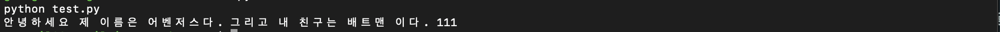
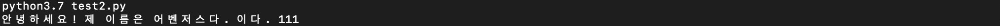
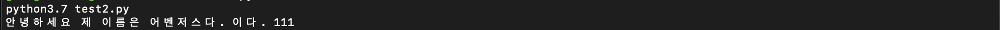

# 문자열 Format 방법
* * *      

### 1. 문자열끼리 더해서 만들기
- '+' 키워드를 사용하여 문자열을 만들 수 있다. 정말 쉽고 기본적인 방식이다. 아래 소스를 바로 확인해보자
- 예제 코드 1
``` python
print("안녕하세요 : " + "제 이름은 " + "반갑습니다.")
```
- 예제 코드 2
``` python
content1="안녕하세요"
content2="제 이름은"
content3="어벤저스다."
content4="이다."

print(content1 + content2 + content3 + " 그리고 내 친구는 배트맨" + content4)
```

### 2. 문자 형식 키워드 사용하여 문자열 만들기
``` python
content1="안녕하세요"
content2="제 이름은"
content3="어벤저스다."
content4="이다."
content5=111

print("%s %s %s 그리고 내 친구는 배트맨 %s %d" %(content1, content2, content3, content4, content5))
```


### 3. f-string 사용하기 (python 3.6 버전 이상)
f-string을 사용하면 변수명을 문자열 상에 포매팅할 수 있다. Python3.6 버전부터 해당 기능을 제공한다.
``` python
#-*- coding: utf-8 -*-

content1="안녕하세요"
content2="제 이름은"
content3="어벤저스다."
content4="이다."
content5=111

result=f'안녕하세요! {content2} {content3} {content4} {content5}'
print(result)
```



### 3. format () 메소드 사용하기
``` python
#-*- coding: utf-8 -*-

content1="안녕하세요"
content2="제 이름은"
content3="어벤저스다."
content4="이다."
content5=111

print("{0} {1} {2} {3} {4}".format(content1, content2, content3, content4, content5))
```


