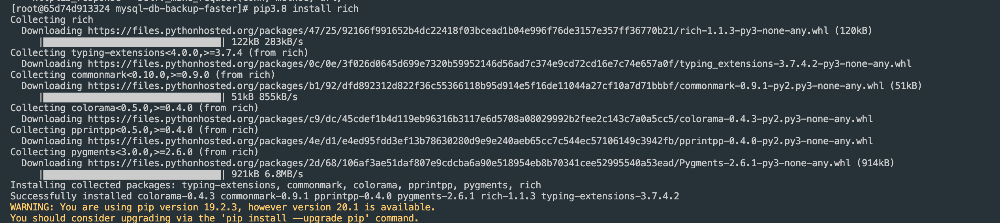
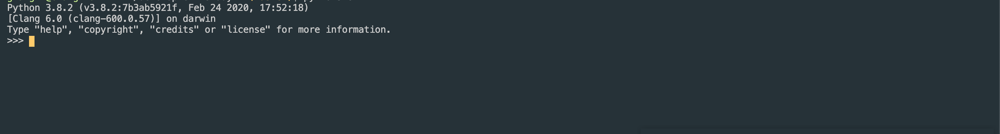
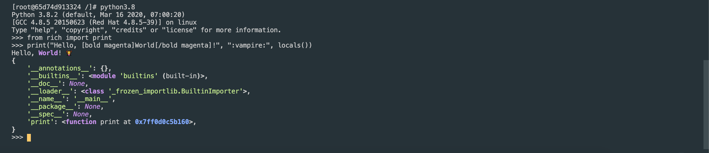
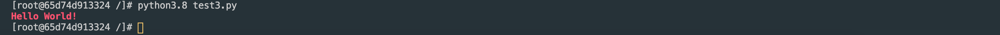
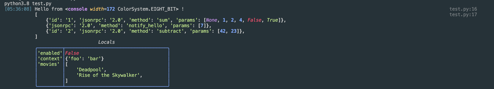
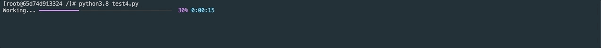

# rich 모듈 사용하기
* * *
## **1. Getting Started**
rich 모듈은 이쁜 텍스트를 터미널에 렌더링하기위한 Python 라이브러리입니다.


## **2. rich 모듈 설치하기**
rich 모듈을 프로젝트에 적용하기 위해서는 pip 명령어로 간단히 설치하면 됩니다.

- pip 설치 명령어
  ``` bash
  pip3.8 install rich
  ```
  

- pip 설치 결과 테스트   
1. 설치 후, 결과를 확인하기 위해 import를 해봅니다. python 명령을 실행하여 shell에 접속해주세요.
  
2. 예제 소스를 넣어보겠습니다.   
    ``` python
    from rich import print

    print("Hello, [bold magenta]World[/bold magenta]!", ":vampire:", locals())
    ```
3. 예제 소스를 넣은 후 엔터를 눌러보세요. 작성한 코드가 실행됩니다. 
  
  위처럼 실행되면 성공! 모듈이 정상적으로 설치되었습니다.

## **3. rich 모듈 적용하기**
- 색깔 이쁘게 출력하기
  ``` python
  from rich.console import Console
  console = Console()

  console.print("Hello", "World!", style="bold red")
  ```
  


- 콘솔 기능 사용하기
  ``` python
  from rich.console import Console
  console = Console()

  test_data = [
      {"jsonrpc": "2.0", "method": "sum", "params": [None, 1, 2, 4, False, True], "id": "1",},
      {"jsonrpc": "2.0", "method": "notify_hello", "params": [7]},
      {"jsonrpc": "2.0", "method": "subtract", "params": [42, 23], "id": "2"},
  ]

  def test_log():
      enabled = False
      context = {
          "foo": "bar",
      }
      movies = ["Deadpool", "Rise of the Skywalker"]
      console.log("Hello from", console, "!")
      console.log(test_data, log_locals=True)


  test_log()
  ```
  

- ProgressBar 기능 사용하기
  ``` python
  from rich.progress import track
  import time
  
  
  for step in track(range(100)):
    time.sleep(1)
  ```
  

  