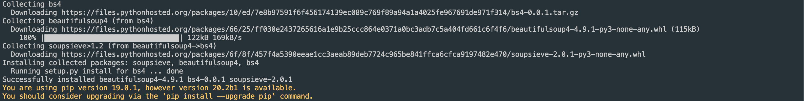
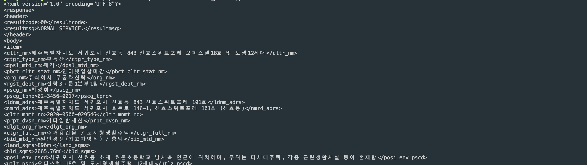

# 데이터 크롤링하기
* * *
## **1. Getting Started**
데이터 크롤링하는 방법에 대해 정리되어있습니다.


## **2. 모듈 설치하기**
- 파이썬으로 데이터 크롤링을 위해 BeautifulSoup4를 설치해줍니다.
    ``` bash
    pip3.7 install bs4
    ```
    

## **3. 테스트 코드 돌려보기**
- 데이터 크롤링을 할 사이트 URL을 넣은 후 한번 돌려보세요. 테스트는 공공 데이터 API를 사용했습니다.
  - 테스트 코드
    ``` python
    from urllib.request import urlopen
    from bs4 import BeautifulSoup

    html = urlopen("URL을 넣어주세요")  
    bsObject = BeautifulSoup(html, "html.parser") 
    print(bsObject)
    ```
  - 테스트 코드 결과    
    데이터를 가지고와서 출력한 결과입니다.
    
