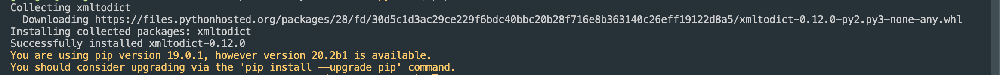
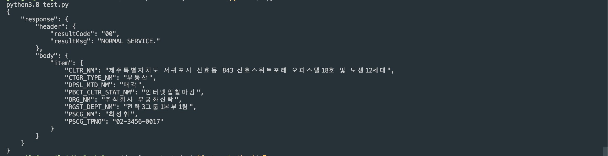

# XML 데이터를 Dict로 변환하기
* * *
## **1. Getting Started**
XML 데이터를 Dict로 변환하는 방법에 대해 정리되어 있습니다.


## **2. 모듈 설치하기**
- XML 데이터를 Dict로 변환하기 위한 xmltodict 모듈을 설치해줍니다.
    ``` bash
    pip3.7 install xmltodict
    ```
    

## **3. 테스트 코드 돌려보기**
- XML 데이터를 Dict 포맷으로 변환하는 테스트 코드입니다. 한번 따라해보세요
  - 테스트 코드
    ``` python
    import json
    import xmltodict

    ### XML 데이터는 공공 데이터 API에서 제공해주는 예시입니다.
    TEST='''
    <response>
      <header>
        <resultCode>00</resultCode>
        <resultMsg>NORMAL SERVICE.</resultMsg>
      </header>
      <body>
        <item>
          <CLTR_NM>제주특별자치도 서귀포시 신효동 843 신효스위트포레 오피스텔18호 및 도생12세대</CLTR_NM>
          <CTGR_TYPE_NM>부동산</CTGR_TYPE_NM>
          <DPSL_MTD_NM>매각</DPSL_MTD_NM>
          <PBCT_CLTR_STAT_NM>인터넷입찰마감</PBCT_CLTR_STAT_NM>
          <ORG_NM>주식회사 무궁화신탁</ORG_NM>
          <RGST_DEPT_NM>전략3그룹1본부1팀</RGST_DEPT_NM>
          <PSCG_NM>최성휘</PSCG_NM>
          <PSCG_TPNO>02-3456-0017</PSCG_TPNO>
        </item>
      </body>
    </response>'''

    jsonString = json.dumps(xmltodict.parse(TEST), indent=4, ensure_ascii=False)
    print(jsonString)
    ```
  - 테스트 코드 결과    
    데이터를 가지고와서 출력한 결과입니다.
    

- 테스트 코드에서 Dict Key 값을 직접 가지고 출력해볼게요
  - 코드
    ``` python
    import xmltodict
    import json

    TEST='''
    <response>
      <header>
        <resultCode>00</resultCode>
        <resultMsg>NORMAL SERVICE.</resultMsg>
      </header>
      <body>
        <item>
          <CLTR_NM>제주특별자치도 서귀포시 신효동 843 신효스위트포레 오피스텔18호 및 도생12세대</CLTR_NM>
          <CTGR_TYPE_NM>부동산</CTGR_TYPE_NM>
          <DPSL_MTD_NM>매각</DPSL_MTD_NM>
          <PBCT_CLTR_STAT_NM>인터넷입찰마감</PBCT_CLTR_STAT_NM>
          <ORG_NM>주식회사 무궁화신탁</ORG_NM>
          <RGST_DEPT_NM>전략3그룹1본부1팀</RGST_DEPT_NM>
          <PSCG_NM>최성휘</PSCG_NM>
          <PSCG_TPNO>02-3456-0017</PSCG_TPNO>
        </item>
      </body>
    </response>'''

    jsonObject = xmltodict.parse(TEST)
    print(jsonObject["response"]["body"]["item"]["CLTR_NM"])
    ```
  - 코드 결과
    
