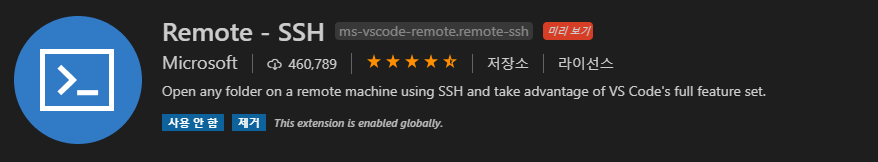
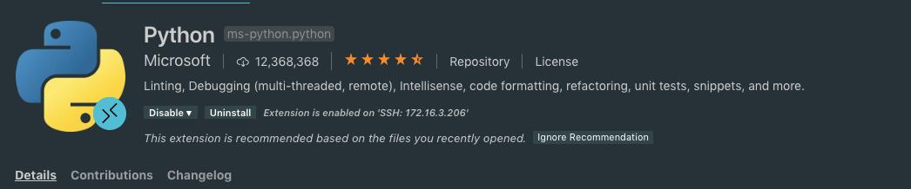
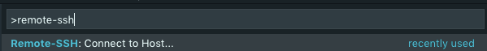
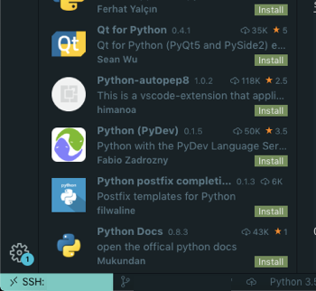
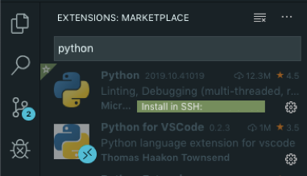
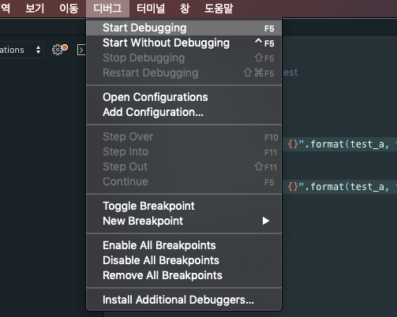
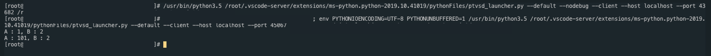
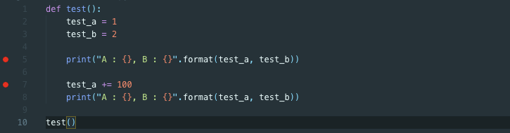
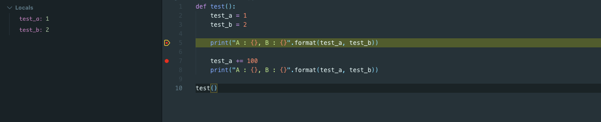
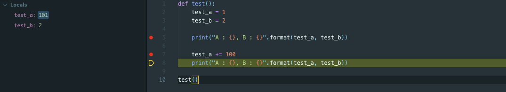

# 파이썬 원격 개발 환경 만들기
* * *      
vscode에서 docker 리눅스를 사용하여 개발 환경을 편하게 만들기 위해서는 Docker 플러그인을 사용하여 개발 환경을 구성하면 된다. 이번 포스팅의 목표는 Docker와 플러그인을 사용하여 CentOS6 파이썬 개발 환경을 만들어보는 것이다. 하나씩 하나씩 정리해보겠다.


### 1. 환경 (환경마다 다를 수 있습니다)
- 로컬 개발 환경 : MacOS
- 원격 개발 환경 : CentOS 7


### 2. 필수 준비물 및 설치 방법
Docker VScode를 사용하여 개발하기 위해서는 먼저, Docker을 사용하여 컨테이너를 구성해주어야 한다. 컨테이너를 만들고 사용하는 방법에 대해서는 링크를 참고하면 된다.

|플러그인 이름|설명|캡처|
|---------------|------|---------------------|
|Remote-SSH|SSH 프로토콜 기반으로 원격 서버에 연결하여 폴더 및 터미널 연결 후 개발 작업을 원활하게 할 수 있도록 기능을 제공하는 플러그인이다.| |
|Python|Python 개발에 필요한 기능들을 제공하며 Python 개발 시, 필수적으로 필요한 플러그인이다.|  |


### 3. 설치 방법
플러그인은 
- Remote-SSH
- Python 

순서대로 설치한다.

#### 3-1. remote-ssh 플러그인으로 원격 서버 접속하기

- remote-ssh: Connect to Host... 커맨드 실행하여, 원격 서버로 접속한다. 
좌측 카테고리에서 빨간색 박스 (Docker)를 선택하면 현재 사용 중인 컨테이너 리스트 (파란색 박스)를 확인할 수 있다.


- 원격 서버로 접속 성공 시, vscode 표시는 다음과 같다. 아래와 같이 출력되면 성공한 것임!!


- 오케이 이제 원격 서버로 접속은 모두 준비됬고, 이제 파이썬 플러그인을 설치해보자
- 플러그인을 python으로 검색하면 python 개발 관련 모듈을 설치할 수 있다. 우리는 여기서 Python 모듈을 설치할 것이다.  
정상적으로 SSH 접속이 되었고 설치할 준비가 되었으면 아래와 같이 뜰 것인데 여기서 SSH 원격 설치를 진행한당  


### 4. 테스트
#### 4-1. 테스트 코드 작성하기

테스트를 위한 코드로 간단한 변수 저장하고 출력하는 소스를 만들었다. 소스는 아래와 같음!

``` python
def test():
    test_a = 1
    test_b = 2

    print("A : {}, B : {}".format(test_a, test_b))

    test_a += 100
    print("A : {}, B : {}".format(test_a, test_b))

test()
```
소스 작성 후, start debugging을 실행하면, 원격에서 직접 실행한 결과가 터미널에 출력된다.
- start debugging
- 문제 캡처  
vscode 에러 메시지를 확인해보면, 원격 확장 호스트 서버에 연결하지 못했습니다. 라는 메시지가 출력된다.


- 터미널 실행 결과

매우 실행이 잘 된것을 확인할 수 있다

#### 4-2. Breakpoint를 사용하여 디버깅해보기
소스 디버깅에 항상 핵심적인 것은 Breakpoint를 사용하여 중간 지점마다 디버깅을 해보는 것이다. 이 플러그인을 사용하여 가능할지 한번 확인해보겠다.

먼저, 소스 상에서 Breakpoint를 2개 설정하였다.


그리고 다시 Start Debugging을 실행해보자!! 그러면 매우매우매우매우매우 기다리고 있던 결과를 확인할 수 있다.


옆에 보면 현재 사용 중인 변수의 값들까지 확인할 수 있으며, 중단점에 정확하게 걸려서 Break 걸린 모습을 확인할 수 있다. 그리고 우리가 평소에 알던, F11 (Step Into)를 사용하여 소스를 내려갈 수 있으며 test_a += 100을 지남에 따라 로컬 변수 값이 101로 변한 것까지 확인할 수 있었다.

