# 윈도우 WSL2 사용하기
* * *      

## **1. Getting Started**
윈도우 10에서 WSL2를 사용하는 방법에 대해 알아보겠습니다. 시작하기 전, 2020.05.27에 릴리즈된 Windows 10 2004 버전으로 업데이트 해야합니다.


## **2. WSL 2 세팅 방법**
- Powershell을 관리자 권한으로 실행해주세요
- 다음 명령을 입력합니다. 명령어는 Windows 가상 머신 활성화 과정입니다.
    ``` powershell
    Enable-WindowsOptionalFeature -Online -FeatureName VirtualMachinePlatform
    ```
    

- 그리고 WSL2로 전환을 위해 다음 명령으로 전환해줍니다.
    ``` powershell
    wsl --set-version Ubuntu 2
    ```
    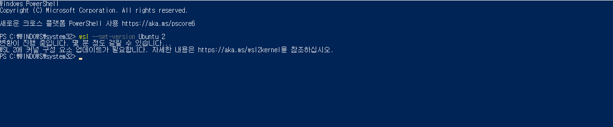
    
    - 명령이 진행되지 않을 때  
        - WSL 2에 커널 구성 요소 업데이트가 필요합니다. 다음 사이트에서 패치 파일을 다운받아 진행합니다. (wsl_update_x64.msi)  
        https://docs.microsoft.com/ko-kr/windows/wsl/wsl2-kernel#download-the-linux-kernel-update-package
        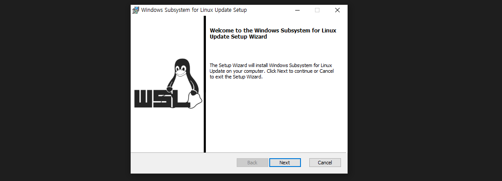
        - 설치 후, WSL2 전환 명령을 다시 실행해주세요. 정상적으로 진행이 됩니다.
        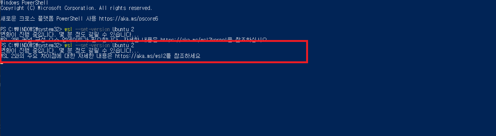
        - 시간이 상당히 오래 걸린다.
        - 몇 분 (한 20분 정도?) 기다리면 완료됩니다.
        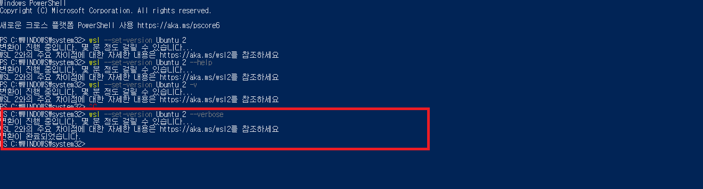

- 정상적으로 됬는지 확인 위해, 아래 명령어로 확인해주세요.
    ``` powershell
    wsl -l -v
    ```
    Version 2로 출력되면 성공입니다.
    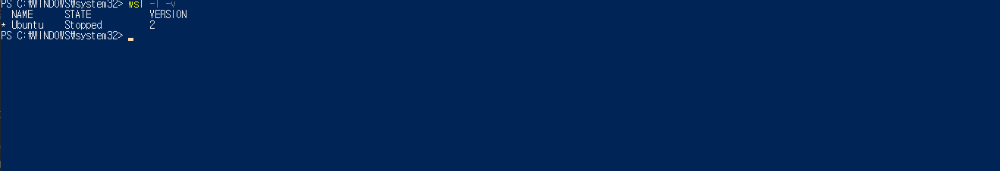

## **3. Docker**
- 설치 방법
    - Docker 공식 홈페이지에서 Docker 설치 파일을 다운로드 받습니다.
        - 링크 : https://hub.docker.com/editions/community/docker-ce-desktop-windows/
        - 캡처
        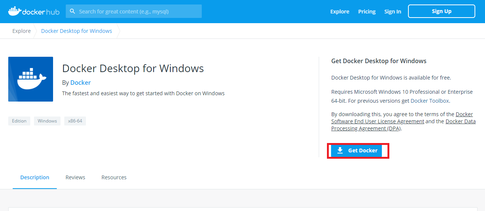
    - 실행 파일을 실행하여, 설치를 진행합니다.
    - 설치 중, 체크박스가 있는데 여기서 WSL 2 Enable를 체크 후 OK 버튼을 눌러주세요.
    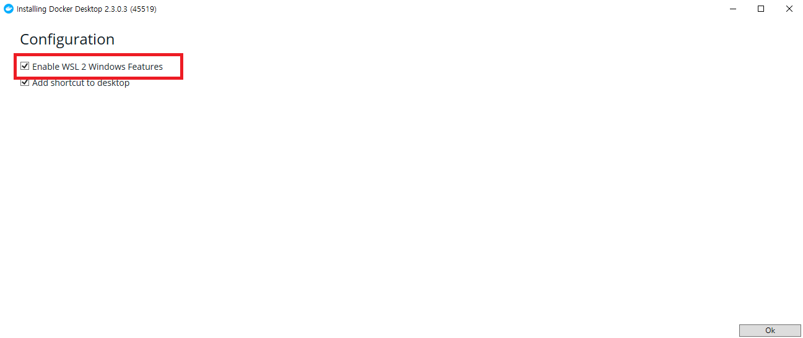
    - 설치 끝!
    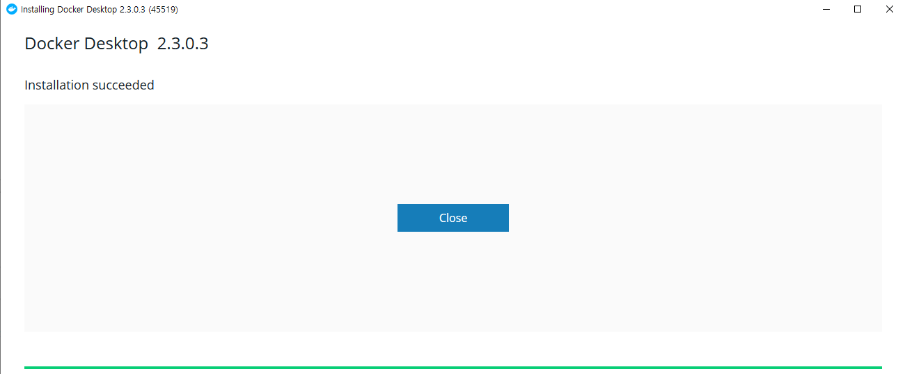
    - 그리고 Docker Desktop을 실행하면 Docker 서비스가 실행된다.
    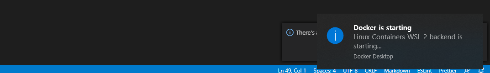
    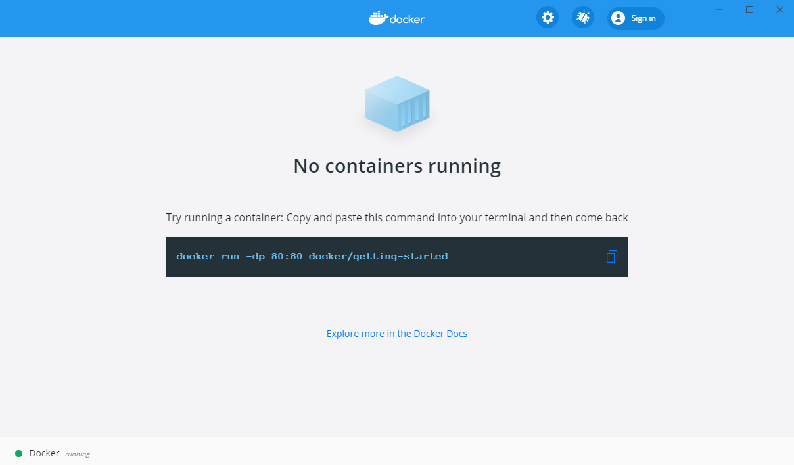

- WSL 2에서 CentOS7 컨테이너를 만들어보자
    - CentOS7 이미지 다운로드
        ``` bash
        sudo docker pull centos:7
        ```
        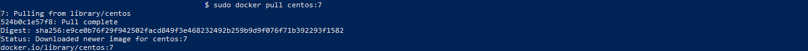
    - CentOS7 컨테이너 실행하기
        ``` bash
        sudo docker run -i -t centos:7 /bin/bash
        ```
        
    - Docker Desktop에서도 컨테이너가 실행된 것을 확인 가능합니다. 😊
    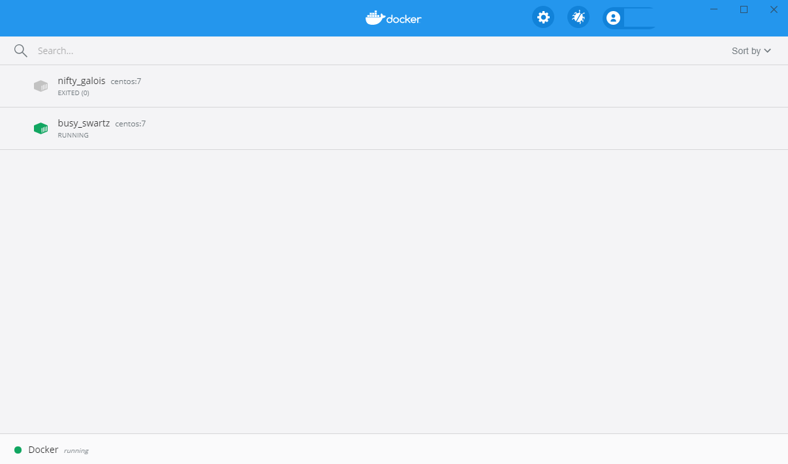

